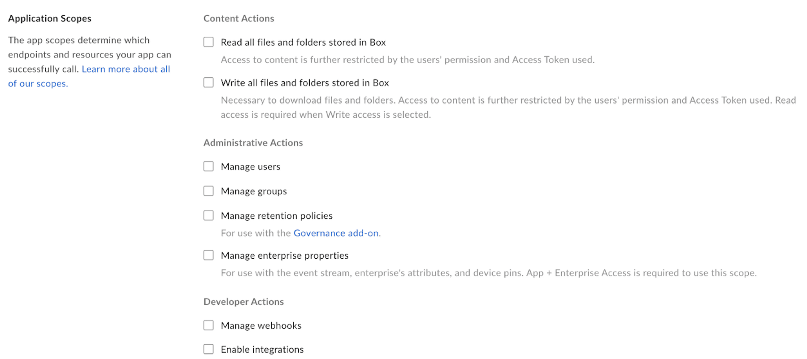
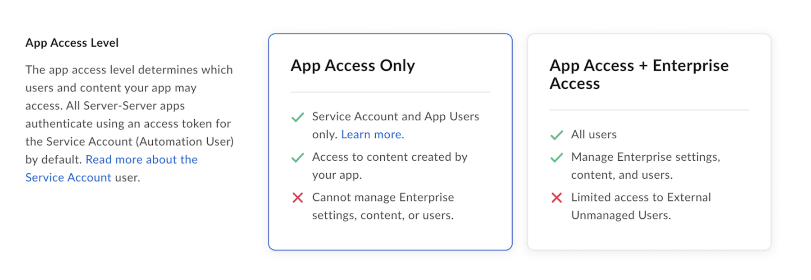

# セキュリティ

Box APIを使い始めたばかりの開発者でも、アプリケーションの[承認][auth]を担当するBox管理者でも、Boxに保存されたコンテンツを保護するためにセキュリティメカニズムを理解することは非常に重要です。

Box APIは、Boxウェブアプリと同じセキュリティの原則と制限に従います。つまり、Box APIを利用しても、コンテンツの[権限][perm]、[ウォーターフォール型のフォルダ構造][waterfall]、または管理者向けの要件を回避することはできません。

## アクセストークン

さまざまなBox APIコールの中核となるのは[アクセストークン][at]です。ユーザー名とパスワードは使用できないため、Boxサーバーにはユーザーの本人確認を行う手段が必要になります。アクセストークンの全機能には、ユーザーの権限、トークンの権限、アプリケーションの設定が含まれます。

<ImageFrame center shadow border>

</ImageFrame>

アクセストークンは認証済みのユーザーを表し、ユーザーが問題なく呼び出すことができるコンテンツを決定します。Boxウェブアプリを使用する場合と同様に、問題なく操作できるのは、アクセストークンに関連付けられたユーザーが所有するコンテンツまたはコラボレータとなっているコンテンツのみです。これは、トークンの[ダウンスコープ][downscope]によってさらに制限できます。

[アクセストークン][at]の有効期限は60分のみですが、必要に応じてそれより前に[取り消す][revoked]ことができます。アクセストークンの有効期限が切れると、OAuth 2.0アプリケーションを使用している場合、[更新トークン][rt]を別のアクセストークンと[交換][exchange]できます。更新トークンは、60日後または1回の使用後に有効期限が切れます。また、サーバー認証アプリケーションを使用している場合は、新しいアクセストークンを得るために[アクセストークンをリクエストエンドポイント][gettoken]を呼び出す必要があります。セキュリティ上の理由により、Boxでは有効期間の長いアクセストークンを許可していません。

<Message type="tip">

404エラーが発生する理由がわからない場合は、まず、現在のユーザーを取得エンドポイントを使用して、アクセストークンに関連付けられているユーザーを確認することをお勧めします。

</Message>

##  スコープ 

<ImageFrame center shadow border>

</ImageFrame>

[スコープ][scopes]は、アプリケーションの作成時に[開発者コンソール][dc]で構成されます。スコープにより、150を超えるエンドポイントのうち、アプリケーションが問題なく呼び出せるものが決まります。

スコープはユーザーの権限と連動しているため、書き込みスコープを付与しても、ユーザーは、Box Enterpriseのすべてのコンテンツに自動的にアクセスできるわけではありません。つまり、認証済みユーザーは、アクセス権限を持つコンテンツに対する書き込み呼び出しを実行したときに、成功を示すAPIレスポンスを受け取ることができます。

たとえば、ユーザーの管理およびグループの管理のスコープだけが有効になっているアプリケーションを考えてみましょう。このアプリケーションのアクセストークンがフォルダの情報を取得するAPIコールを実行しようとすると、関連付けられているユーザーがそのフォルダを所有している場合でも、403エラーが返されます。これは、この操作を実行するには読み取りスコープが必要なためです。このアプリケーションのアクセストークンには、ユーザーおよびグループに関連したAPIコールに対してのみ、成功を示すレスポンスが返されます。

## 制限されたエンドポイント

適切な[権限][coadminperm]を付与された管理者または共同管理者のみが問題なく使用できるAPIエンドポイントがいくつかあります。原則として、管理者または共同管理者だけがBox管理コンソールで実行できる操作の場合、その操作のAPIコールを完了するには、これらのユーザーのいずれかに関連付けられたアクセストークンが必要になります。これについては、必要に応じて、特定のエンドポイントに関するAPI[リファレンス][reference]のドキュメントを参照してください。

管理者に制限されたエンドポイントの一部を以下に示します。

* [ユーザー][users]の作成、削除、またはその情報の取得
* [グループ][groups]の作成、削除、または変更
* ユーザーまたは企業の[イベント][events]の表示

企業でBox GovernanceやBox Shieldなどのアドオン製品を購入している場合は、以下のように、管理者ユーザーのアクセストークンでのみ使用できるエンドポイントが他にもあります。

* [セキュリティ分類][sc]の操作
* [リーガルホールドポリシー][lh]と[割り当て][lha]の操作
* [リテンションポリシー][retention]と[割り当て][rassign]の操作

## アプリケーションアクセス

<ImageFrame center shadow border>

</ImageFrame>

サーバー認証 ([JWT][jwt]使用) または[クライアント資格情報許可][ccg]を利用するアプリケーションのアプリケーションアクセスは、[開発者コンソール][dc]でのみ構成できます。この設定により、アプリケーションで使用できる[ユーザーのタイプ][usertypes]が決まります。\[**アプリアクセスのみ**] と \[**アプリ + Enterpriseアクセス**] という2つのオプションがあります。

Box管理コンソールでこれらのアプリケーションのいずれかを[承認][auth]すると、そのアプリケーションを表す[サービスアカウント][serviceaccount] (`AutomationUser_xxxx_@boxdevedition.com`) が自動的に生成されます。このアカウントは管理者に似たユーザーで、APIを介してしかアクセスできません。その後、このユーザーを使用して、[App User][appusers]と呼ばれる、アプリケーションのユーザーを作成することができます。サービスアカウントとApp Userしか操作する必要がないアプリケーションの場合は、\[**アプリアクセスのみ**] を選択します。[管理対象ユーザー][mu]とその既存のBoxコンテンツを操作する必要があるアプリケーションの場合は、\[アプリ + Enterpriseアクセス] を選択します。

たとえば、読み取り/書き込みスコープと \[アプリアクセスのみ] が指定されたJWTアプリケーションが管理コンソールで適切に[承認][auth]されているとします。管理対象ユーザーがアクセストークンを取得し、自分が所有するフォルダに対してAPIコールを実行すると、「Cannot obtain token based on the enterprise configuration for your app (アプリに対するEnterprise設定に基づきトークンを取得できません)」というメッセージとともに400エラーが返されます。ユーザーにコンテンツへのアクセス権限があり、適切なスコープが有効になっていて、アプリが承認されていても、選択したアプリケーションアクセスで許可されるのは、アプリケーションによるサービスアカウントとApp Userの操作のみです。

## Enterprise設定と承認

Box APIに関して言えば、注意すべきEnterprise設定がいくつかあります。

<ImageFrame center shadow border>

</ImageFrame>

カスタムアプリケーションは、公開アプリケーションと未公開アプリケーションという2つのカテゴリに分類されます。公開アプリケーションは、[Box App Center][appcenter]にあります。Box管理者は、公開アプリケーションと未公開アプリケーションをデフォルトで有効にすることによって、承認なしで使用できるようにするかどうかを決定できます。これらの設定のステータスにより、使用するアプリケーションを問題なく[承認][auth]するために必要な操作が決まります。

<ImageFrame center shadow border>

![管理コンソールの \[アプリ\] タブ](images/jwt_apps_cam.png)

</ImageFrame>

上記の設定に関係なく、[JWT][jwt]または[クライアント資格情報許可][ccg]を利用するアプリケーションを企業で使用するために、管理者はBox管理コンソールでそのアプリケーションを明示的に[承認][auth]する必要があります。承認は特定時点でのスナップショットです。つまり、開発者が開発者コンソールに再度アクセスして構成を変更した場合、管理者は、生成されたアクセストークンにその変更を反映するためにアプリケーションを再承認する必要があります。

\[**デフォルトで未公開アプリを無効にする**] の設定をオンにした場合、管理者は、認証方法として[OAuth 2.0][oauth]を利用しているアプリケーションを明示的に[有効にする][auth]必要もあります。

また、この設定をオンにした場合は、サーバー認証アプリの有効化も必要になります。

<!-- i18n-enable localize-links -->

[perm]: https://support.box.com/hc/ja/articles/360044196413-コラボレータの権限レベルについて

[waterfall]: https://support.box.com/hc/ja/articles/360043697254-フォルダの権限について

<!-- i18n-disable localize-links -->

[downscope]: g://authentication/tokens/downscope

[at]: g://authentication/tokens

[revoked]: e://post-oauth2-revoke

[rt]: g://authentication/tokens/refresh

[gettoken]: e://post-oauth2-token

[exchange]: e://reference/post-oauth2-token--refresh/

<!-- i18n-enable localize-links -->

[coadminperm]: https://support.box.com/hc/ja/articles/360044194393-共同管理者権限の付与と変更

[reference]: https://ja.developer.box.com/reference/

[dc]: https://app.box.com/developers/console

<!-- i18n-disable localize-links -->

[scopes]: g://api-calls/permissions-and-errors/scopes

[users]: e://resources/user

[groups]: e://resources/group

[events]: e://resources/event

[sc]: e://resources/classification

[lh]: e://resources/legal-hold-policy

[lha]: e://resources/legal-hold-policy-assignment

[retention]: e://resources/retention-policies

[rassign]: e://resources/retention-policy-assignment

[jwt]: g://authentication/jwt

[usertypes]: page://platform/user-types

[serviceaccount]: page://platform/user-types/#service-account

[appusers]: page://platform/user-types/#app-user

[mu]: page://platform/user-types/#managed-users

[auth]: g://authorization/custom-app-approval

[oauth]: g://authentication/oauth2

[jwt]: g://authentication/jwt

[ccg]: g://authentication/client-credentials

<!-- i18n-enable localize-links -->

[appcenter]: https://app.box.com/services

<!-- i18n-disable localize-links -->

[auth]: g://authorization
