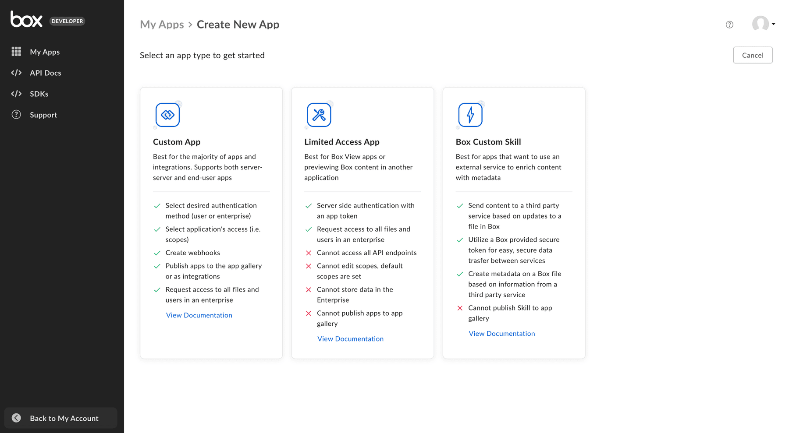
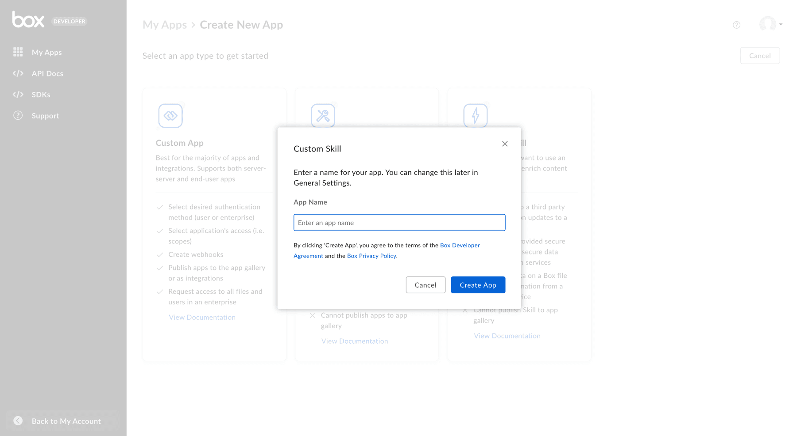
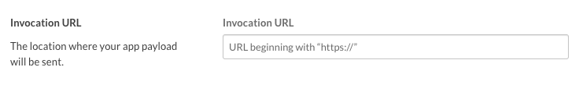
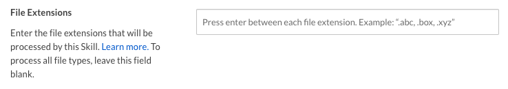

# 設定

カスタムスキルの設定は、複数の手順からなるプロセスです。

## 前提条件

OAuth 2.0認証を使用してカスタムアプリを設定するには、Box Enterpriseアカウントから[開発者コンソール][devconsole]にアクセスできることを確認する必要があります。または、[Developerアカウント][devaccount]にサインアップすることもできます。

## アプリの作成手順

### 1. 開発者コンソールにログインする

Boxにログインし、[開発者コンソール][devconsole]に移動して、\[**アプリの新規作成**] を選択します。

### 2. カスタムスキルを作成する

アプリケーションの種類のリストから \[**Box Custom Skill**] を選択します。次の手順を促すモーダルが表示されます。

<ImageFrame border>

</ImageFrame>

### 3. 名前を入力する

最後に、アプリケーションの一意の名前を選択し、\[**アプリの作成**] をクリックします。

<ImageFrame border width="600" center>

</ImageFrame>

## 承認

スキルの使用を開始するには、スキルをトリガーするフォルダを選択しておく必要があります。

<CTA to="g://authorization/custom-skill-approval">

カスタムスキルの承認の詳細を確認する

</CTA>

## 基本的な構成

フォルダでカスタムスキルを有効にするには、いくつかの追加構成を完了しておく必要があります。

### 呼び出しURL

選択したフォルダにファイルがアップロード、コピー、または移動されるたびに、スキルからリモートURLにペイロードが送信されます。このURLは呼び出しURLと呼ばれます。

呼び出しURLには、サーバー、開発マシン、またはサーバーレス関数を表す任意のHTTPエンドポイントを指定できます。唯一の要件は、そのURLが公開されていて、Boxサーバーからアクセスできることです。そのため、`localhost`は有効なアドレスではありません。

呼び出しURLを設定するには、[開発者コンソール][devconsole]の \[**構成**] タブに移動し、\[呼び出しURL] セクションまで下にスクロールします。

<ImageFrame border width="600" center>

</ImageFrame>

セキュアなHTTPSアドレスを入力し、フォームを保存します。これで、呼び出しURLを構成できました。

### ファイル拡張子

デフォルトでは、フォルダ内の任意のファイルの種類に対してカスタムスキルがトリガーされます。選択したファイル拡張子だけがスキルをトリガーするよう指定するには、[開発者コンソール][devconsole]の \[**構成**] タブに移動し、\[**ファイル拡張子**] セクションまで下にスクロールします。

<ImageFrame border width="600" center>

</ImageFrame>

[devconsole]: https://app.box.com/developers/console

[devaccount]: https://account.box.com/signup/n/developer
