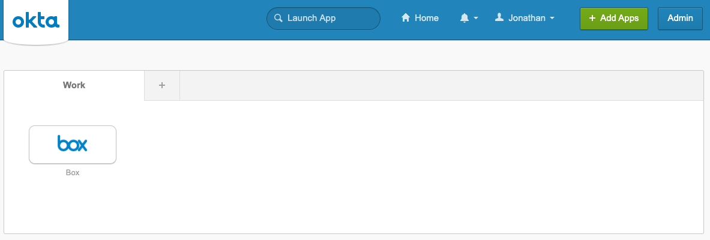
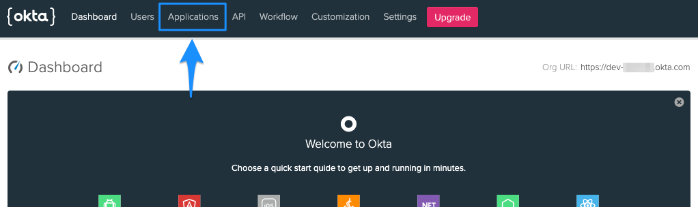
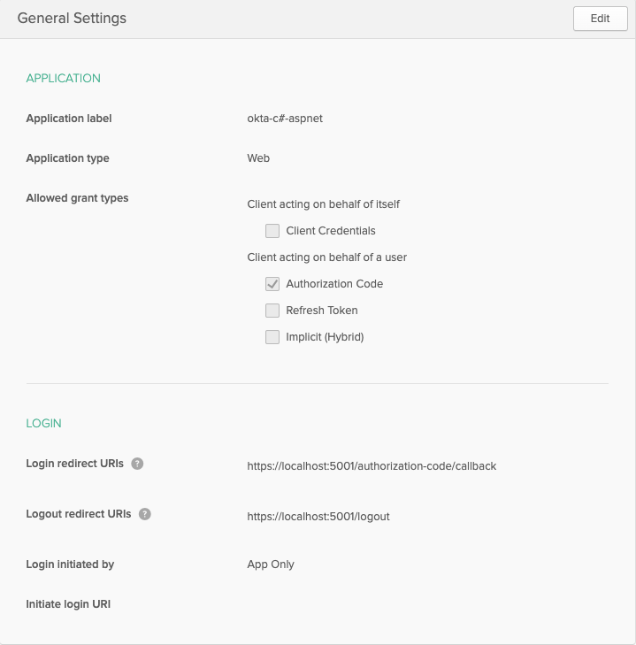

# Oktaの構成

OktaとBoxの統合における次の手順では、Oktaアプリケーションとユーザーを作成して構成した後、アプリケーション内でOktaに接続するために必要となるいくつかの情報を抽出します。

<ImageFrame noborder center shadow>


</ImageFrame>

このチュートリアルでは、空のアプリケーションとユーザーダッシュボードから開始します。これは、準備が整っている可能性のある既存のインストールへの悪影響を避け、インスタンスへの管理者権限を確保するためです。

## Oktaアプリケーションの作成

まず[Oktaの開発者向けサイト][okta-dev]で、新しい開発者アカウントにサインアップします。すでにアカウントを持っている場合は個人アカウントでログインします。

既存のアカウントでログインした場合は、Oktaのダッシュボードが表示されるので、右上の\[**Admin (管理)**]ボタンをクリックします。

<ImageFrame noborder center shadow>



</ImageFrame>

新しい開発者アカウントを作成した場合は、管理ダッシュボードにリダイレクトされます。

管理パネルが表示されたら、上部の\[**Applications (アプリケーション)**]オプションをクリックします。

<ImageFrame noborder center shadow>



</ImageFrame>

アプリケーションページで\[**Add Application (アプリケーションの追加)**]ボタンをクリックします。アプリケーションの種類として\[**Web (ウェブ)**]を選択し、\[**Next (次へ)**]ボタンをクリックします。

<ImageFrame noborder center shadow>


</ImageFrame>

Oktaは、アプリケーションの承認とユーザーの認証それぞれに、[OAuth 2][oauth2]と[OpenID Connect][openid-connect] (OIDC)の両方を使用します。OpenID Connectの統合では、多数の一般的な言語フレームワーク内で組み込みのOIDCコネクタを使用でき、コールバックルートの処理、ログインおよびログアウト方法の提供、アプリケーションへのルートの保護によってアプリケーションとユーザーの管理が簡略化されます。

この初回の統合を簡略化するために、言語とフレームワークのOIDCコネクタにデフォルトのコールバックルートと設定を使用します。どの統合の種類を選択するかによって、構成設定が若干変わります。

以下の構成設定を使用して、アプリケーションの詳細を入力します。

<Choice option="programming.platform" value="node" color="none">

* 名前: 任意
* 基本URI: `http://localhost:3000/`
* ログインリダイレクトURI: `http://localhost:3000/authorization-code/callback`
* ログアウトリダイレクトURI: `http://localhost:3000/logout`
* 使用できる許可タイプ: \[**Authorization Code (承認コード)**]のみを選択

<ImageFrame noborder center shadow>


</ImageFrame>

</Choice>

<Choice option="programming.platform" value="java" color="none">

* 名前: 任意
* 基本URI: `http://localhost:8080/`
* ログインリダイレクトURI: `http://localhost:8080/authorization-code/callback`
* ログアウトリダイレクトURI: `http://localhost:8080/logout`
* 使用できる許可タイプ: \[**Authorization Code (承認コード)**]のみを選択

<ImageFrame noborder center shadow>


</ImageFrame>

</Choice>

<Choice option="programming.platform" value="python" color="none">

* 名前: 任意
* 基本URI: `http://127.0.0.1:5000/`
* ログインリダイレクトURI: `http://127.0.0.1:5000/oidc/callback`
* ログアウトリダイレクトURI: `http://127.0.0.1:5000/logout`
* 使用できる許可タイプ: \[**Authorization Code (承認コード)**]のみを選択

<ImageFrame noborder center shadow>


</ImageFrame>

</Choice>

<Choice option="programming.platform" value="cs" color="none">

* 名前: 任意
* 基本URI: `https://localhost:5001/`
* ログインリダイレクトURI: `https://localhost:5001/authorization-code/callback`
* ログアウトリダイレクトURI: `https://localhost:5001/logout`
* 使用できる許可タイプ: \[**Authorization Code (承認コード)**]のみを選択

<ImageFrame noborder center shadow>



</ImageFrame>

</Choice>

<Choice option="programming.platform" unset color="none">

<Message danger>

# 前の手順が完了していません

最初に、手順1でお好みの言語/フレームワークを選択してください。

</Message>

</Choice>

\[**Done (完了)**]ボタンをクリックしてアプリケーションを作成し、アプリケーションの一般設定に移動します。

## アプリケーション資格情報のコピー

次に、1つ前の手順で設定した構成ファイルを使用して、ファイル内にOktaのアプリケーション組織とアプリの詳細を追加します。

Oktaアプリケーションの情報はほとんどが一般設定ページにありますが、Okta組織を後方参照するために構成URIで使用されている`Org URL`は例外です。`Org URL`を取得するには、Okta管理コンソールのダッシュボードに移動します。`Org URL`は画面の右上隅に表示されます。

前の手順で選択した言語とフレームワークに応じて、適切な構成ファイルを設定します。

<ImageFrame noborder center shadow>


</ImageFrame>

<Choice option="programming.platform" value="node" color="none">

* 任意のエディタで、ローカルアプリケーションディレクトリ内の`config.json`を開きます。
* 以下の行項目を、Oktaの構成情報で適宜更新します。
  * `oktaClientId`: アプリケーションの一般設定の\[**Client Credentials (クライアント資格情報)**]セクションから取得。
  * `oktaClientSecret`: アプリケーションの一般設定の\[**Client Credentials (クライアント資格情報)**]セクションから取得。
  * `oktaOrgUrl`: 管理ダッシュボードのメインページで右上から取得。
* ファイルを保存します。

`config.json`ファイルは次のようになります。

<!-- markdownlint-disable line-length -->

```js
const oktaClientId = exports.oktaClientId = '0oa48567frkg5KW4x6';
const oktaClientSecret = exports.oktaClientSecret = 'cugDJy2ERfIQHDXv-j2134DfTTes-Sa3';
const oktaOrgUrl = exports.oktaOrgUrl = 'YOURDOMAIN.okta.com';
const oktaBaseUrl = exports.oktaBaseUrl = 'http://localhost:3000';
const oktaRedirect = exports.oktaRedirect = '/authorization-code/callback';
```

<!-- markdownlint-enable line-length -->

</Choice>

<Choice option="programming.platform" value="java" color="none">

* `/src/main/resources/application.properties`ファイルを開き、以下の行を更新します。
  * `okta.oauth2.issuer`: 管理ダッシュボードのメインページの右上から取得したOrg URLの後に`/oauth2/default`を付けたもの。たとえばOrg URLが`https://dev-123456.okta.com`の場合、この発行者文字列は`https://dev-123456.okta.com/oauth2/default`になります。
  * `okta.oauth2.clientId`: アプリケーションの一般設定の\[**Client Credentials (クライアント資格情報)**]セクションから取得。
  * `okta.oauth2.clientSecret`: アプリケーションの一般設定の\[**Client Credentials (クライアント資格情報)**]セクションから取得。
* ファイルを保存します。

`/src/main/resources/application.properties`ファイルは次のようになります。

```java
okta.oauth2.redirect-uri=/authorization-code/callback
okta.oauth2.issuer=https://YOURDOMAIN.okta.com/oauth2/default
okta.oauth2.clientId=0oa48567frkg5KW4x6
okta.oauth2.clientSecret=cugDJy2ERfIQHDXv-j2134DfTTes-Sa3
security.oauth2.sso.loginPath=/authorization-code/callback
```

</Choice>

<Choice option="programming.platform" value="python" color="none">

Python/Flaskの統合では、組織とアプリの標準的な構成情報に加え、追加の認証トークンが必要です。

認証トークンを作成するには、次の手順に従います。

* Oktaの管理ダッシュボードの\[**API**] -> \[**Token (トークン)**]セクションに移動します。
* \[**Create Token (トークンの作成)**]ボタンをクリックします。
* トークンの名前を入力し、\[**Create (作成)**]をクリックします。
* 生成されたトークンをコピーします。

次に、ローカルのアプリケーション構成ファイルを更新します。

* 任意のエディタで、ローカルアプリケーションディレクトリ内の`config.py`を開きます。
* 以下の行項目を、Oktaの構成情報で適宜更新します。
  * `okta_client_secret`: アプリケーションの一般設定の\[**Client Credentials (クライアント資格情報)**]セクションから取得。
  * `okta_org_url`: 管理ダッシュボードのメインページで右上から取得。
  * `okta_auth_token`: 上記で作成したトークン。
* ファイルを保存します。

`config.py`ファイルは次のようになります。

```python
okta_client_id = '0oa48567frkg5KW4x6'
okta_client_secret = 'cugDJy2ERfIQHDXv-j2134DfTTes-Sa3'
okta_org_url = 'http://YOURDOMAIN.okta.com'
okta_auth_token = '01KkTQTRfs1yKLr4Ojy26iqoIjK_4fHyq132Dr5T'
okta_callback_route = '/oidc/callback'
```

最後に、Flask構成ファイルを更新します。

* 任意のエディタで、ローカルアプリケーションディレクトリ内の`client_secrets.json`を開きます。
* 以下の行項目を、Oktaの構成情報で適宜更新します。
  * `client_id`: アプリケーションの一般設定の\[**Client Credentials (クライアント資格情報)**]セクションから取得。
  * `client_secret`: アプリケーションの一般設定の\[**Client Credentials (クライアント資格情報)**]セクションから取得。
  * `auth_uri`: 管理ダッシュボードのメインページの右上から取得したOrg URLの後に`/oauth2/default/v1/authorize`を付けたもの。たとえばOrg URLが`https://dev-123456.okta.com`の場合、この発行者文字列は`https://dev-123456.okta.com/oauth2/default/v1/authorize`になります。
  * `token_uri`: 管理ダッシュボードのメインページの右上から取得したOrg URLの後に`/oauth2/default/v1/token`を付けたもの。たとえばOrg URLが`https://dev-123456.okta.com`の場合、この発行者文字列は`https://dev-123456.okta.com/oauth2/default/v1/token`になります。
  * `issuer`: 管理ダッシュボードのメインページの右上から取得したOrg URLの後に`/oauth2/default`を付けたもの。たとえばOrg URLが`https://dev-123456.okta.com`の場合、この発行者文字列は`https://dev-123456.okta.com/oauth2/default`になります。
  * `userinfo_uri`: 管理ダッシュボードのメインページの右上から取得したOrg URLの後に`/oauth2/default/userinfo`を付けたもの。たとえばOrg URLが`https://dev-123456.okta.com`の場合、この発行者文字列は`https://dev-123456.okta.com/oauth2/default/userinfo`になります。
* ファイルを保存します。

`client_secrets.json`ファイルは次のようになります。

<!-- markdownlint-disable line-length -->

```js
{
  "web": {
    "client_id": "0oa48567frkg5KW4x6",
    "client_secret": "cugDJy2ERfIQHDXv-j2134DfTTes-Sa3",
    "auth_uri": "https://YOURDOMAIN.okta.com/oauth2/default/v1/authorize",
    "token_uri": "https://YOURDOMAIN.okta.com/oauth2/default/v1/token",
    "issuer": "https://YOURDOMAIN.okta.com/oauth2/default",
    "userinfo_uri": "https://YOURDOMAIN.okta.com/oauth2/default/userinfo",
    "redirect_uris": [
      "http://127.0.0.1:5000/oidc/callback"
    ]
  }
}
```

<!-- markdownlint-enable line-length -->

</Choice>

<Choice option="programming.platform" value="cs" color="none">

* 任意のエディタで、ローカルアプリケーションディレクトリ内の`Startup.cs`を開きます。
* `ConfigureServices`メソッド内の以下の行項目を、Oktaの構成情報で適宜更新します。
  * `OktaDomain`: 管理ダッシュボードのメインページで右上から取得。
  * `ClientId`: アプリケーションの一般設定の\[**Client Credentials (クライアント資格情報)**]セクションから取得。
  * `ClientSecret`: アプリケーションの一般設定の\[**Client Credentials (クライアント資格情報)**]セクションから取得。
* ファイルを保存します。

`ConfigureServices`メソッドは次のようになります。

<!-- markdownlint-disable line-length -->

```dotnet
services.AddControllersWithViews();
services.AddAuthentication(options =>
{
  options.DefaultAuthenticateScheme = CookieAuthenticationDefaults.AuthenticationScheme;
  options.DefaultSignInScheme = CookieAuthenticationDefaults.AuthenticationScheme;
  options.DefaultChallengeScheme = OktaDefaults.MvcAuthenticationScheme;
})
.AddCookie()
.AddOktaMvc(new OktaMvcOptions
{
  OktaDomain = "https://YOURDOMAIN.okta.com",
  ClientId = "0oa48567frkg5KW4x6",
  ClientSecret = "cugDJy2ERfIQHDXv-j2134DfTTes-Sa3"
});
```

<!-- markdownlint-enable line-length -->

</Choice>

<Choice option="programming.platform" unset color="none">

<Message danger>

# 前の手順が完了していません

最初に、手順1でお好みの言語/フレームワークを選択してください。

</Message>

</Choice>

## ユーザーの作成

Oktaの設定における最後の手順では、アプリケーションへのログインに使用するテストユーザーを作成します。

1. Oktaの管理ダッシュボードの\[**Users (ユーザー)**]セクションに移動します。
2. \[**Add Person (ユーザーの追加)**]ボタンをクリックします。
3. 適切なユーザー情報をすべて入力します。パスワードには\[**Set by admin (管理者が設定)**]を選択し、ユーザーのパスワードを入力します。また、\[**User must change password on first login (ユーザーは初回ログイン時にパスワードの変更が必要)**]オプションの選択を解除します。ログインにはユーザー名とパスワードを使用します。これらの設定はテスト目的のみで使用されるため、ユーザーの作成とセキュリティのベストプラクティスではありません。
4. \[**Save (保存)**]ボタンをクリックしてユーザーを作成します。

## まとめ

* Oktaアプリケーションを作成しました。
* ローカルアプリケーションでOktaの構成情報を更新しました。
* Oktaのテストユーザーを作成しました。

<Observe option="programming.platform" value="node,java,python">

<Next>

Oktaアプリを作成し、ユーザー/ローカル構成を設定しました

</Next>

</Observe>

[okta-dev]: https://developer.okta.com/

[oauth2]: https://oauth.net/2/

[openid-connect]: https://openid.net/
