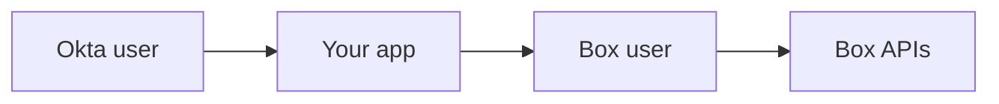

# ウェブアプリでOkta IDをBoxアプリユーザーに関連付ける

[Okta][okta]は、企業に広く採用されているアクセス管理およびIDプラットフォームです。資格情報一式と1つの安全なダッシュボードを使用して複数のアプリケーションを管理および認証するための統合された方法を提供しています。

カスタムBoxアプリケーションに接続している場合、[Okta API][okta-dev]を使用して、そのBoxアプリケーション内でユーザーの本人確認を行うためのシングルサインオンメカニズムを提供できます。これにより、統合IDシステム(Okta)とBox APIの間のエクスペリエンスが統一されます。

<ImageFrame noborder center shadow>

</ImageFrame>

## 概要

このクイックスタートガイドでは、プログラムでOktaを使用してBoxアプリケーションにログインする方法を説明します。その際、OktaユーザーにリンクされているBoxのアプリユーザーをプロビジョニングしてから、そのユーザーに代わってBox API呼び出しを実行します。

ここでは、以下の手順を説明します。

1. [アプリケーションコードをスキャフォールディング][step1]して、ログインできるウェブアプリケーションを作成します。
2. [Oktaアプリケーションを設定および構成][step2]してウェブアプリへのログインに使用できる1人目のユーザーを作成し、最終的にそのユーザーのBoxアカウントを作成します。
3. [Boxアプリケーションを設定および構成][step3]して、ウェブアプリケーションをBoxに接続できるようにします。
4. [アプリケーションのログインフローを作成][step4]して、Oktaユーザーがウェブアプリケーションにログインできるようにします。
5. Oktaユーザーが初めてウェブアプリケーションにログインするときに、[既存のBoxユーザーを検索し、必要に応じてBoxユーザーを作成][step5]します。
6. [最後にアプリケーションを実行][step6]して、フロー全体の動作を確認します。

このチュートリアルが完了すると、ブラウザに1つのメッセージが出力されます。今回Oktaユーザーが初めてアプリケーション経由でBoxにログインした場合は、関連付けられたBoxユーザーが作成され、`New user created: {{USERNAME}}`というメッセージがブラウザに出力されます。

その後このユーザーでログインを試みると、`Hello {{USERNAME}}`というメッセージがブラウザに出力されるようになります。

<Message warning>

このガイドを簡略化するため、ここでは、ウェブアプリケーションのユーザーインターフェイスは作成しません。代わりに、出力はアプリケーションコンソール/ターミナルを通じて表示されるほか、ブラウザで直接テキスト出力として表示されます。

</Message>

<Next>

開始する準備ができました

</Next>

[okta]: https://www.okta.com/

[okta-dev]: https://developer.okta.com/

[step1]: g://sso-identities-and-app-users/connect-okta-to-app-users/scaffold-application-code/

[step2]: g://sso-identities-and-app-users/connect-okta-to-app-users/configure-okta/

[step3]: g://sso-identities-and-app-users/connect-okta-to-app-users/configure-box/

[step4]: g://sso-identities-and-app-users/connect-okta-to-app-users/logging-into-app/

[step5]: g://sso-identities-and-app-users/connect-okta-to-app-users/find-or-create-box-users/

[step6]: g://sso-identities-and-app-users/connect-okta-to-app-users/run-the-app/
