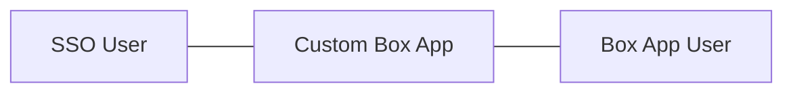

# SSOとApp User

シングルサインオン(SSO)サービスは、会社の**Identity and Access Management (IAM)**ソリューションの一環として使用されることがよくあります。SSOサービスが展開されると、ユーザーは、1つの資格情報セット(ユーザー名とパスワード)だけを使用して1回ログインすれば、複数のアプリケーションの認証を安全に行うことができます。



Boxは、会社のSSOサービスに接続可能なアプリケーションの1つです。こうしたアプリケーションをカスタムアプリに統合すれば、いずれのエンドユーザーに対しても即座にBoxユーザーがプロビジョニングされます。その際、このエンドユーザーにはBoxアカウントが用意されたことが知らされません。

<Message notice>

一般的なSSOサービスには`Okta`、`Auth0`、`Microsoft Azure AD`、`OneLogin`、`G Suite`、`Ping Identity`などがありますが、これ以外にも展開可能なサービスは多数あります。

</Message>

## SSOをアプリに接続する

プログラムによってSSOサービスをBoxアプリケーションに統合する際のフローは以下のとおりです。

```mermaid
sequenceDiagram
   participant Browser
   participant Web Server
   participant SSO Provider
   Browser->>+Web Server: User visits web app
   Web Server->>-Browser: Redirected to SSO
   Browser->>+SSO Provider: User logs in
   SSO Provider->>-Browser: Redirected back to web app
   Browser->>+Web Server: Pass SSO user details
   Web Server-->>+Box API: Find or create a new app user
   Box API-->>-Web Server: Return app user details
   Web Server->>-Browser: Display files to user
```

1. ユーザーはログアウトした状態でウェブアプリケーションやモバイルアプリケーションにアクセスします。
2. ユーザーは、通常`OAuth 2`や`OpenID Connect`を介して、ログインのためにSSOプロバイダにリダイレクトされます。
3. ログイン後、ユーザーはSSO ID資格情報と共にアプリケーションに再度リダイレクトされます。
4. アプリケーションでは、このユーザーに関連付けられたBoxアカウントが既に存在するかどうかを確認します。
5. このユーザーに既存のBoxアカウントがある場合、アプリケーションはSSO IDを使用して、Boxでそのユーザーに代わってAPI呼び出しを実行します。
6. このユーザーに関連付けられたBoxアカウントがまだない場合は、SSO IDに基づいて新しいBoxユーザーアカウントが作成されます。SSOサービスの一意のユーザーIDが新しいBoxユーザーにリンクされ、2つのアカウントの間に関連付けが作成されます。その後、この新しいBoxユーザーがBoxでそのユーザーに代わってAPI呼び出しを実行します。

<Message notice>

# BoxウェブアプリとSSO

SSOサービスをBoxアプリケーションではなくBoxウェブサイトに接続したい方のために、Boxでは、SAML 2.0を通じて[Boxウェブアプリケーション](https://www.box.com)のSSO統合をサポートするための[統合オプション][sso-support]を多数用意しています。

</Message>

[sso-support]: https://support.box.com/hc/en-us/articles/360043696514-Setting-Up-Single-Sign-On-SSO-for-your-Enterprise
