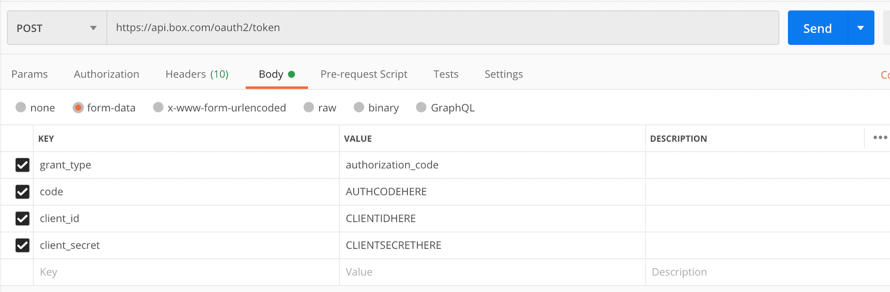

# アクセストークンの取得

すべてのAPI呼び出しでは、認証済みユーザーの本人確認のために**アクセストークン**が要求されます。セキュリティ上の理由により、アクセストークンは60分後に期限切れになります。[OAuth 2.0][oauth]を使用している場合は、提供された[更新トークン][rt]を使用して、新しいアクセストークンを取得してください。サーバー認証、[JWT][jwt]、または[クライアント資格情報許可][ccg]を使用している場合は、[トークンエンドポイント][token]に対してAPI呼び出しを実行して、新しいアクセストークンをリクエストしてください。

## OAuth 2.0

アプリケーションが認証に[OAuth 2.0][oauth]を利用している場合は、以下の手順に従って[Postman][postman]を使用してトークンのペアを取得できます。

<ImageFrame border center shadow>

</ImageFrame>

* `grant_type`は常に`authorization_code`です。
* `client_id`と`client_secret`の値は、[開発者コンソール][dc]でアプリケーションの \[**構成**] タブから取得できます。

`code`の値を取得するには、ブラウザで[承認URL][authurl]を作成してアクセスします。OAuth 2.0のフローを完了し、構成済みのリダイレクトURLにリダイレクトすると、そのURLの末尾に承認コードがあります。この承認コードの有効期間は30秒間のみであることに注意してください。つまり、有効期限が切れる前に、Postmanの指定フィールドに承認コードを入力し、\[**Send (送信)**] をクリックする必要があります。そのため、コードを取得したらすぐにAPI呼び出しを送信できるように、他の値を入力しておくことをお勧めします。

<ImageFrame border center shadow>

</ImageFrame>

[oauth]: g://authentication/oauth2

[dc]: https://app.box.com/developers/console

[authurl]: g://authentication/oauth2/without-sdk

[postman]: g://tooling/postman/install

[jwt]: g://authentication/jwt

[ccg]: g://authentication/client-credentials

[token]: e://post-oauth2-token

[rt]: g://authentication/tokens/refresh/
