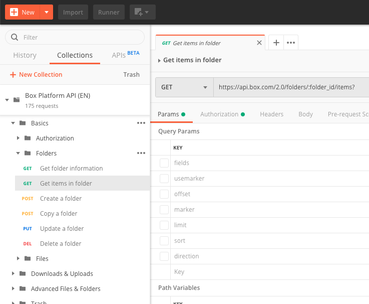

# APIコールの実行

**Box Postmanコレクション**が**Postmanアプリ**に読み込まれたら、Postmanアプリがログインユーザーに代わって**Box API**へのAPIコールを実行できるようになります。

<Message warning>

APIコールを実行するには、Box Postmanコレクションに有効な`access_token`環境変数が必要です。有効なアクセストークンを使用してPostmanアプリが設定されるように、[クイックスタート](g://tooling/postman/quick-start)ガイドに従うことをお勧めします。

</Message>

## APIリクエストの実行

APIリクエストを実行するには、Box Postmanコレクションから**リクエスト**を選択します。この例では、\[**Folders (フォルダ)**] フォルダにある \[**Get items in folder (フォルダ内の項目を取得)**] APIを使用します。

<ImageFrame border center shadow>

</ImageFrame>

デフォルトでは、このAPIエンドポイントの`folder_id`は、すべてのユーザーのルートフォルダを表す`0`に設定されています。この値は、そのまま使用することも、調べたいフォルダのフォルダIDに設定することもできます。

次に、右上にある \[**Send (送信)**] ボタンをクリックしてAPIリクエストを送信します。

<ImageFrame border center shadow>

![Postmanの \[Send\] ボタン](./quick-start/postman-send-button.png)

</ImageFrame>

このAPIコールはすぐに制御が戻り、画面の下半分にあるレスポンスの \[**Body (本文)**] タブにフォルダ内の項目のリストが表示されます。

<ImageFrame border center shadow>

</ImageFrame>

<Message warning>

# 認証エラー

この時点で、Postmanがリストではなくエラーを返す場合があります。これは多くの場合、**アクセストークン**の有効期限が切れていることを意味します。詳細については、[Postmanでのアクセストークンの更新](g://tooling/postman/refresh)に関するガイドを参照してください。

</Message>
