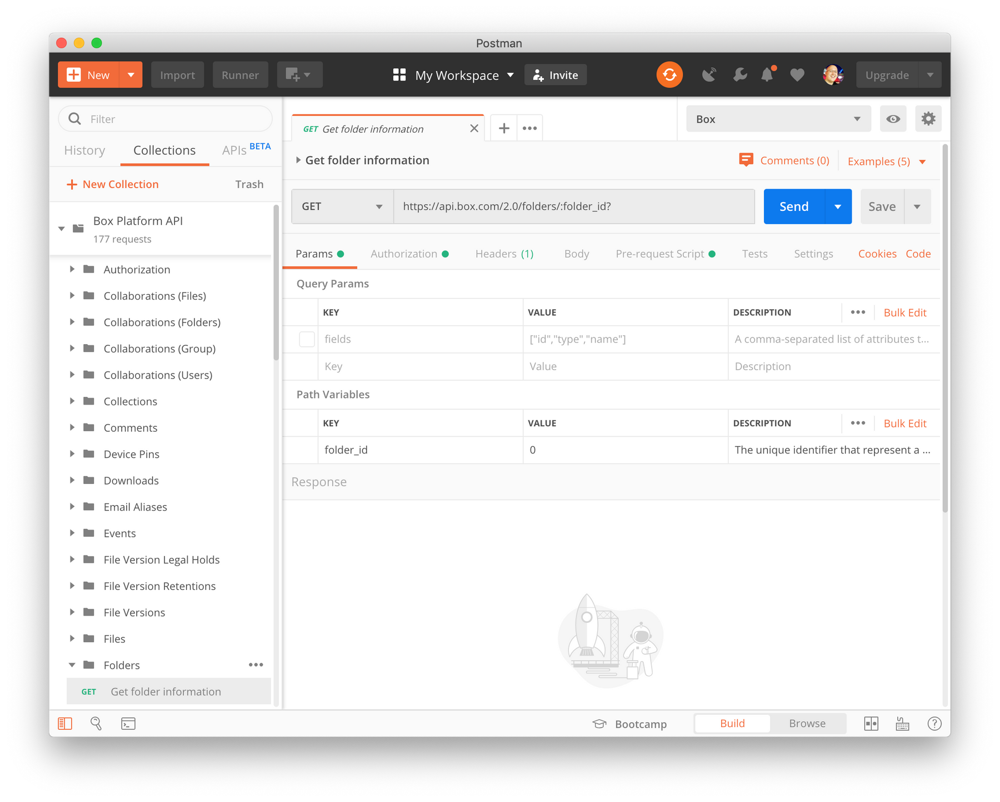

<!-- alex disable postman-postwoman -->

# Postmanのインストール

**Box Postmanコレクション**を使用するには、デバイスに[Postman][postman]アプリがインストールされている必要があります。PostmanはWindows、Mac、およびLinux環境で利用できます。

<Grid columns="4">

<Download>

 Windows (x32)

<Trigger option="postman.downloaded" value="win32">

[ダウンロード](https://dl.pstmn.io/download/latest/win32)

</Trigger>

</Download>

<Download>

 Windows (x64)

<Trigger option="postman.downloaded" value="win64">

[ダウンロード](https://dl.pstmn.io/download/latest/win64)

</Trigger>

</Download>

<Download>

 MacOS

<Trigger option="postman.downloaded" value="osx">

[ダウンロード](https://dl.pstmn.io/download/latest/osx)

</Trigger>

</Download>

<Download>

 Linux (x64)

<Trigger option="postman.downloaded" value="linux64">

[ダウンロード](https://dl.pstmn.io/download/latest/linux64)

</Trigger>

</Download>

</Grid>

次に、お使いのマシンにPostmanをインストールし、(必要に応じて) [Postmanアカウントを登録してログインします][register]。

<ImageFrame border center>

</ImageFrame>

## まとめ

* Postmanのインストールが完了
* Postmanアカウントの作成が完了(必要な場合) 
* Postmanアカウントを使用したPostmanアプリケーションへのログインが完了

<Observe option="postman.downloaded" value="win32,win64,osx,linux64">

<Next>

Postmanのインストールが完了しました

</Next>

</Observe>

[register]: https://identity.getpostman.com/signup

[postman]: https://getpostman.com
