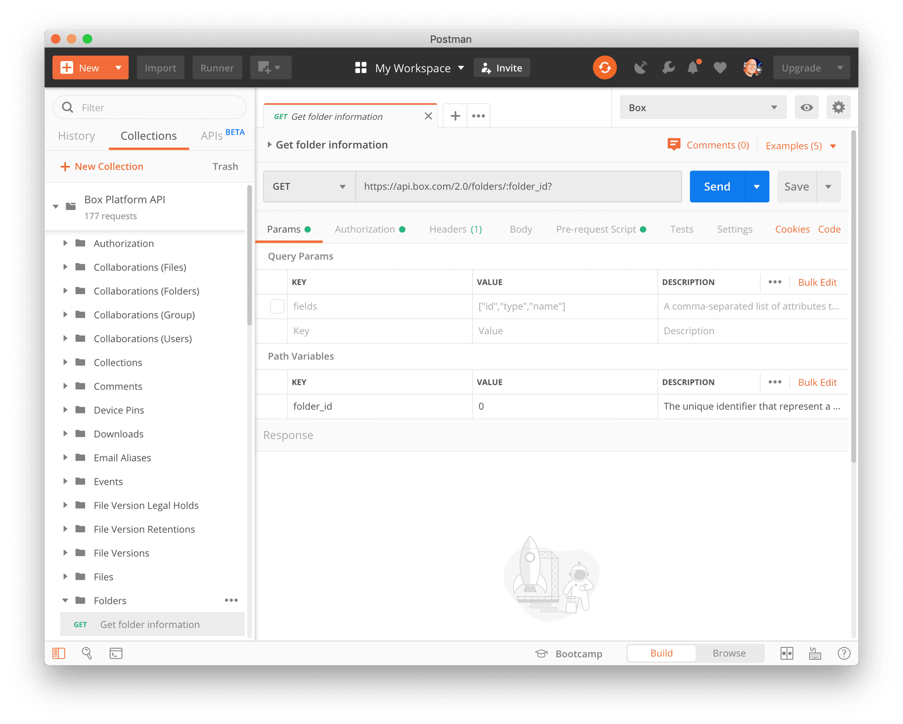

# Postmanのインストール

**Box Postmanコレクション**を使用するには、デバイスに[Postman][postman]アプリがインストールされている必要があります。PostmanはWindows、Mac、およびLinux環境で利用できます。

<Trigger option="postman.downloaded" value="win32,win64,osx,linux64">

[お使いのオペレーティングシステムに適切なバージョンのダウンロード][downloads]

</Trigger>

次に、お使いのマシンにPostmanをインストールし、(必要に応じて) [Postmanアカウントを登録してログインします][register]。

<ImageFrame border center>

</ImageFrame>

## まとめ

* Postmanのインストールが完了しました
* Postmanアカウントを作成しました (必要な場合)
* Postmanアカウントを使用してPostmanアプリケーションにログインしました。

<Observe option="postman.downloaded" value="win32,win64,osx,linux64">

<Next>

Postmanのインストールが完了しました

</Next>

</Observe>

[register]: https://identity.getpostman.com/signup

[postman]: https://getpostman.com

[downloads]: https://www.postman.com/downloads/
