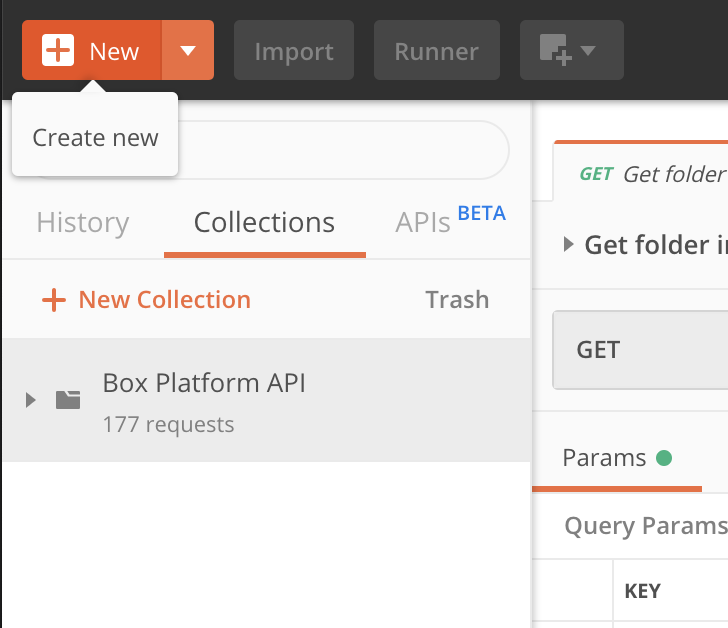

<!-- alex disable postman-postwoman -->

# Postmanコレクションの読み込み

<LoggedIn>

ログインしたら、前の手順でインストールした**Postmanアプリ**に**Box Postmanコレクション**を読み込むことができます。Postmanコレクションを読み込むと、Postman環境としてAPI資格情報も自動的に読み込まれます。

## コレクションと環境の読み込み

下のボタンをクリックすると、**Box Postmanコレクション**がPostmanアプリケーションに読み込まれます。同時に、**アクセストークン**もPostman環境に読み込まれます。

<Trigger option="postman_collection_downloaded" value>

<Postman>

</Postman>

</Trigger>

</LoggedIn>

<LoggedIn id="postman_credentials">

ログインしたら、前の手順でインストールした**Postmanアプリ**に**Box Postmanコレクション**を読み込むことができます。Postmanコレクションを読み込むと、Postman環境としてAPI資格情報も自動的に読み込まれます。

## コレクションと環境の読み込み

下のボタンをクリックすると、**Box Postmanコレクション**がPostmanアプリケーションに読み込まれます。同時に、**アクセストークン**、**更新トークン**、**クライアントID**、および**クライアント機密コード**もPostman環境に読み込まれます。

<Trigger option="postman_collection_downloaded" value>

<Postman env="postman_credentials">

</Postman>

</Trigger>

</LoggedIn>

<Choice option="postman_collection_downloaded" value color="none">

## コレクションの探索

上のボタンをクリックしたときに、Postmanアプリケーションにコレクションをインポートするよう求められました。インポートが完了すると、このコレクションはアプリ内で左側のサイドバーに表示されます。

<ImageFrame border center shadow width="600">

</ImageFrame>

コレクションをクリックして開くと、170を超えるAPIエンドポイントを探索できます。

## まとめ

* PostmanコレクションをPostmanに読み込みました
* さらにBox Postman環境をPostmanに読み込みました

</Choice>

<Choice option="postman.app_type" value="use_box" color="none">

<LoggedIn reverse>

<Message danger>

# 前の手順が完了していません

前の手順を完了し、**Boxアプリ**を選択してログインしてください。

</Message>

</LoggedIn>

</Choice>

<Choice option="postman.app_type" value="use_own" color="none">

<LoggedIn id="postman_credentials" reverse>

<Message danger>

# 前の手順が完了していません

前の手順を完了し、**Boxアプリ**を選択してログインしてください。

</Message>

</LoggedIn>

</Choice>

<Choice option="postman.app_type" unset color="none">

<LoggedIn id="postman_credentials" reverse>

<Message danger>

# 前の手順が完了していません

前の手順を完了し、**Boxアプリ**を選択してログインしてください。

</Message>

</LoggedIn>

</Choice>

<Observe option="postman_collection_downloaded" value>

<Next>

コレクションのインポートが完了しました

</Next>

</Observe>
