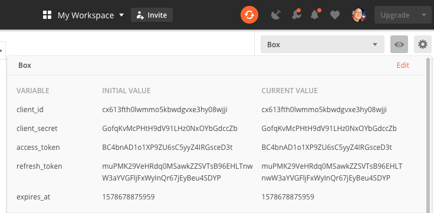
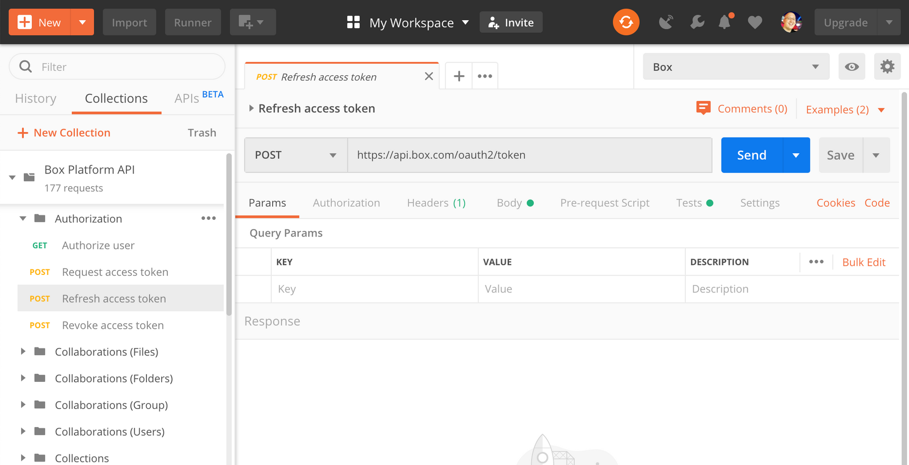
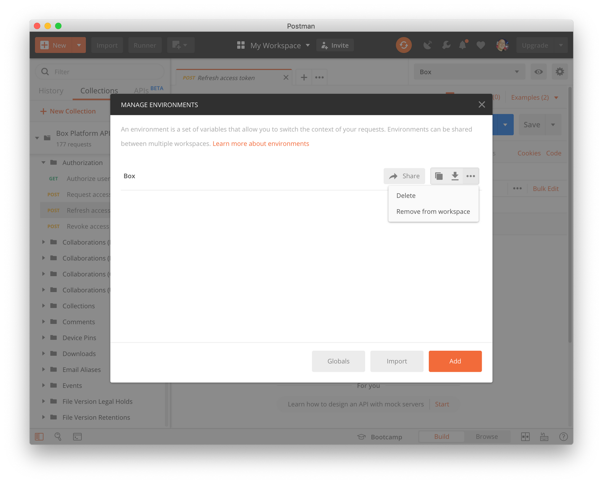

<!-- alex disable postman-postwoman -->

# アクセストークンの更新

Box APIから認証を受けるために、Postmanコレクションは**アクセストークン**を使用してAPIに対して**ユーザー**の本人確認を行います。アクセストークンは1時間で有効期限が切れるため、1時間ごとに更新する必要があります。

## 更新トークンの使用

**Postmanクイックスタート**ガイドの[手順2](g://tooling/postman/quick-start/configure-box-app)で独自の**Boxアプリ**を設定した場合、PostmanのBox環境には有効な`client_id`と`client_secret`を用意する必要があります。これらのクライアント資格情報と`refresh_token`を使用すると、`access_token`の新しい値を作成できます。

<ImageFrame border center shadow>

</ImageFrame>

アクセストークンを更新するには、Postmanコレクションの\[**Authorization**]フォルダ内で\[**Refresh access token**] API呼び出しを選択します。

<ImageFrame border center shadow>

</ImageFrame>

次に、\[**Send**]ボタンをクリックして新しい`access_token`をリクエストします。

<ImageFrame border center shadow>

![Postmanの\[Send\]ボタン](./quick-start/postman-send-button.png)

</ImageFrame>

このAPI呼び出しが終了すると、環境に`access_token`と`refresh_token`の新しい値が作成され、その他のAPI呼び出しを実行できるようになります。

<Message warning>

更新トークンは1回のみ有効で、60日以内に使用する必要があります。60日以内に使用すれば、新しい更新トークンが新しいアクセストークンとともに作成され、そこから再び60日の有効期間が始まります。

更新トークンは60日以内に使用されなければ期限切れになります。その後は、[クイックスタート](g://tooling/postman/quick-start)ガイドの手順を再度実行して、新しい更新トークンとアクセストークンをリクエストする必要があります。

</Message>

## アクセストークンの自動更新

Postmanコレクションは自動的に期限切れの`access_token`値を検出し、`refresh_token`を使用して新しい値をリクエストできます。この機能は、デフォルトで有効になっていますが、`enable_auto_refresh_access_token` Postman環境変数を`false`に設定することで無効にできます。

この値を設定するには、Box Postman環境変数の右上にある編集ボタンをクリックします。

<ImageFrame border center shadow>

</ImageFrame>

テーブルで`enable_auto_refresh_access_token`変数の行を見つけて、\[**Current Value**]を`true`に設定します。次に、\[**Update**]をクリックして変更を保存します。

その後、API呼び出しを実行するたびに、**Postmanコレクション**は`access_token`の有効期限が切れているかどうかを確認し、目的のAPI呼び出しを行う前に自動的に更新しようとします。

## Postmanコレクションの再認証

[クイックスタート](g://tooling/postman/quick-start)ガイドの手順を再び実行することで、Postmanコレクションの再認証が必要になる場合があります。そのよくある理由として、Postmanコレクションを使用しないまま60日が経過し、`refresh_token`の有効期限が切れたことが挙げられます。

再認証するためには、まず古い**Box Postman環境**を削除します。これには、右上の小さな**歯車**アイコンをクリックし、リストからその環境を選択します。

<ImageFrame border center shadow>

</ImageFrame>

\[**Delete**]を選択して環境を削除します。その後、Postman[クイックスタート](g://tooling/postman/quick-start)ガイドの手順を再び最初から実行します。

<Message warning>

**Box Postmanコレクション**の2回目のインポート時には、Postmanアプリで、新しいコレクションをコピーとしてインポートするか、古いコレクションを置き換えるかを確認される場合があります。APIに対してこれまでに行ったカスタム設定を保持するため、コピーとしてインポートすることをお勧めします。

</Message>
