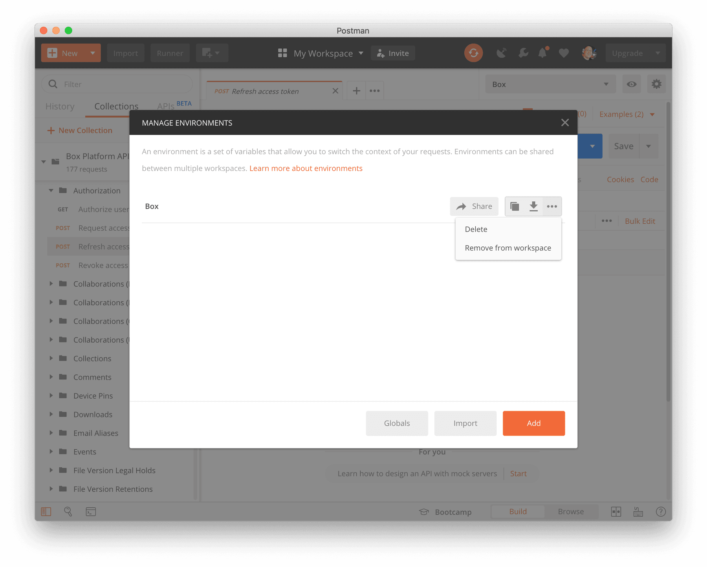

<!-- alex disable postman-postwoman -->

# Refresh an Access Token

To authenticate to the Box API the Postman collection will use an **Access
Token** to identify you, the **User** to the API. Access tokens expire after 1
hour and therefore need to be refreshed every hour.

## Using a Refresh Token

If you set up your own **Box App** in [step
2](g://tooling/postman/quick-start/configure-box-app) of the **Postman Quick
Start** guide then your Box environment in Postman should include a valid
`client_id` and `client_secret`. These client credentials and the
`refresh_token` can be used to create a new value for the `access_token`.

<ImageFrame border center shadow>

</ImageFrame>

To refresh the access token, select the **Refresh access token** API call within
the **Authorization** folder of the Postman collection.

<ImageFrame border center shadow>

</ImageFrame>

Next, hit the **Send** button to request a new `access_token`.

<ImageFrame border center shadow>

</ImageFrame>

At the end of this API call, your environment should have a new `access_token`
and `refresh_token` value, and you should be able to make any of the other API
calls.

<Message warning>

Refresh tokens are only valid once and need to be used within 60 days. If used
within 60 days, a new one is created together with a new access token and the
60 day period starts again.

A refresh token expires if not used within 60 days, after which a new refresh token
and access token need to be requested by going through the [Quick
Start](g://tooling/postman/quick-start) guide again.

</Message>

## Automatically refreshing an access token

The Postman collection can automatically detect an expired `access_token` value
and request a new one by using the `refresh_token`. By default this feature is
enabled but it can be turned off by setting the `enable_auto_refresh_access_token`
Postman environment variable to `false`.

To set this value, hit the edit button in the top right of your Box Postman
environment variables.

<ImageFrame border center shadow>

</ImageFrame>

Find the row in the table for the `enable_auto_refresh_access_token` variable
and set the **Current Value** to `true`. Next, click **Update** to save your
changes.

From now on, any time you make any API call the **Postman collection** will
check if your `access_token` has expired and try to refresh it automatically
before making your desired API call.

## Re-authenticating your Postman collection

In some cases you might need to re-authenticate your Postman collection by going
through the [Quick Start](g://tooling/postman/quick-start) guide again. A common
reason for this is because you haven't used the Postman collection in over 60
days and your `refresh_token` has expired.

To re-authenticate, first remove your old **Box Postman environment**. To do so,
click the little **gear** icon in the top right and select your environment from
the list.

<ImageFrame border center shadow>

</ImageFrame>

Select **Delete** to delete the environment. Then, restart the Postman [Quick
Start](g://tooling/postman/quick-start) guide again from the start.

<Message warning>

When re-importing the **Box Postman Collection** for a second time the Postman
app might ask you to import the new collection as a copy or replace the old
one. We recommend importing it as a copy in order to preserve any custom
configuration you might have made to any of the APIs.

</Message>