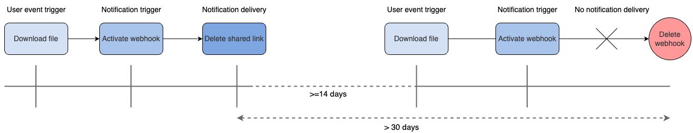

# Webhookの削除

Webhookは、[開発者コンソール][console]またはAPIを使用して削除できます。

## 開発者コンソール

Webhookを削除するには、以下の手順に従います。

1. [開発者コンソール][console]で、\[**Webhook**] タブに移動します。
2. WebhookのIDをクリックして、削除するWebhookを選択します。
3. \[**削除**] ボタンをクリックします。
4. 警告メッセージの下に表示される \[**削除**] をクリックして、操作を確定します。

## API

ファイルやフォルダからWebhookを削除するには、WebhookのIDを指定して[Webhookを削除][delete]エンドポイントを使用する必要があります。この値は、[すべてのWebhookのリストを取得][list]エンドポイントを使用して取得できます。

<Samples id="delete_webhooks_id">

</Samples>

## Webhookの自動削除

[この][delete]エンドポイントを使用していなくても、Webhookが削除される場合があります。

Webhookは以下の理由で削除される可能性があります。

* Boxアプリケーションを削除すると、そのアプリケーションに関連付けられているすべてのWebhookが自動的に削除されます。
* Webhookに関連付けられているアクティブなアクセストークンをすべて削除すると、そのWebhookが自動的に削除されます。これには、開発者トークンとパスワードが含まれます。
* 最後に成功した通知が設定したURLに配信されてから30日が経過し、最後に通知の配信が成功した日からユーザーが最後にイベントをトリガーした日までの期間が14日を超えた場合。

    ユーザーがファイルをダウンロードするシナリオを見てみましょう。この操作により、Webhookがトリガーされ、設定したURLを使用して共有リンクを削除します。次の図では、このシナリオを表し、Webhookが削除されるタイミングを示しています。

    

  * **ユーザーイベントトリガー**: ユーザーがイベント (例: ファイルのダウンロード) を開始したタイミング。
  * **通知トリガー**: ファイルがダウンロードされたことを示す通知がWebhookに送信されたタイミング。
  * **最終の通知配信**: Webhookが特定のURLにメッセージ (共有リンクの削除など) を送信したタイミング。

これらのすべてのケースで、Boxは`WEBHOOK.DELETED`というイベント名を含むWebhookペイロードを通知URLに送信します。ペイロードの本文には以下の追加情報が含まれます。

```json
"additional_info": {
  "reason": "auto_cleanup"
}

```

[delete]: e://delete-webhooks-id

[list]: e://get-webhooks

[console]: https://app.box.com/developers/console
