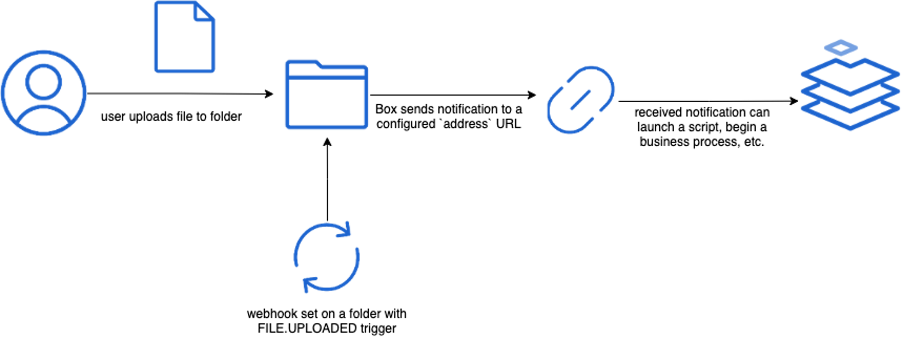

# V2 Webhook

## フロー

<ImageFrame center width="400" shadow border>



</ImageFrame>

イベントによってファイルまたはフォルダのWebhookがトリガーされると、Webhookの作成時に指定した`address`に対してHTTP呼び出しが実行されます。この呼び出しのペイロードには、いくつかのリクエストヘッダーとJSON本文が含まれます。

## ペイロードヘッダー

Webhookによって送信されたペイロードには、以下のBox固有のヘッダーが含まれます。

| ヘッダー                      | 説明                                                                                           |
| ------------------------- | -------------------------------------------------------------------------------------------- |
| `BOX-DELIVERY-ID`         | 配信されたWebhookペイロードを識別する、Boxによって割り当てられた一意のID。BoxがWebhookを再試行すると、このIDは変わりますが、ペイロード本文のIDは変わりません。 |
| `BOX-DELIVERY-TIMESTAMP`  | ペイロードの送信日時を識別するRFC-3339タイムスタンプ。                                                              |
| `BOX-SIGNATURE-PRIMARY`   | このWebhook用に設定されたプライマリ署名キーを使用して作成された[署名][verify_sigs]。                                        |
| `BOX-SIGNATURE-SECONDARY` | このWebhook用に設定されたセカンダリ署名キーを使用して作成された[署名][verify_sigs]。                                        |
| `BOX-SIGNATURE-VERSION`   | 値は常に`1`。                                                                                     |
| `BOX-SIGNATURE-ALGORITHM` | 値は常に`HmacSHA256`。                                                                            |

例:

```shell
BOX-DELIVERY-ID:          673a081b-bb4b-4d45-b4f1-4131a29c1d07
BOX-DELIVERY-TIMESTAMP:   2016-07-11T10:10:33-07:00
BOX-SIGNATURE-PRIMARY:    isCeDp7mLR41/MjcSEFLag9bWmpJkgmN80Je4VIESdo=
BOX-SIGNATURE-SECONDARY:  1UbiiKS7/2o5vNIlyMh7e5QGCHq8lflWFgEF+YWBugI=
BOX-SIGNATURE-VERSION:    1
BOX-SIGNATURE-ALGORITHM:  HmacSHA256
USER-AGENT:               Box-WH-Client/0.1

```

<Message type="notice">

Webhookペイロードの[設定][setup_sigs]と[署名の検証][verify_sigs]を行うことをお勧めします。

</Message>

<Message type="warning">

HTTPヘッダー名では大文字と小文字が区別されません。クライアントでは、すべてのヘッダーの名前を標準化された小文字または大文字の形式に変換してから、ヘッダーの値を確認する必要があります。

</Message>

## ペイロード本文

Webhookペイロードの本文は、Webhookをトリガーしたファイルまたはフォルダ (ターゲット)、およびトリガーされたイベントを記述するJSONオブジェクトです。

| フィールド        | 説明                                                                                   |
| ------------ | ------------------------------------------------------------------------------------ |
| `type`       | 値は常に`webhook_event`。                                                                 |
| `id`         | イベントを識別する、Boxによって割り当てられた一意のID。BoxがWebhookを再試行しても、このIDは変わりませんが、ヘッダーのIDは呼び出しのたびに変わります。 |
| `created_at` | イベントがトリガーされた日時。                                                                      |
| `trigger`    | イベントをトリガーしたアクションの名前 (例: `FILE.UPLOADED`)。                                            |
| `webhook`    | イベントがトリガーされたWebhook ID。                                                              |
| `created_by` | イベントをトリガーしたユーザー。                                                                     |
| `source`     | イベントをトリガーした項目 (例: ターゲットフォルダにアップロードされたファイル)。                                          |

例:

```json
{
  "type": "webhook_event",
  "id": "eb0c4e06-751f-442c-86f8-fd5bb404dbec",
  "created_at": "2016-07-11T10:10:32-07:00",
  "trigger": "FILE.UPLOADED",
  "webhook": {
    "id": "53",
    "type": "webhook"
  },
  "created_by": {
    "type": "user",
    "id": "226067247",
    "name": "John Q. Developer",
    "login": "johnq@dev.name"
  },
  "source": {
    "id": "73835521473",
    "type": "file",
    "file_version": {
      "type": "file_version",
      "id": "78096737033",
      "sha1": "2c61623e86bee78e6ab444af456bccc7a1164095"
    },
    "sequence_id": "0",
    "etag": "0",
    "sha1": "2c61623e86bee78e6ab444af456bccc7a1164095",
    "name": "Test-Image-3.png",
    "description": "",
    "size": 26458,
    "path_collection": {
      "total_count": 4,
      "entries": [
        {
          "type": "folder",
          "id": "0",
          "sequence_id": null,
          "etag": null,
          "name": "All Files"
        },
        {
          "type": "folder",
          "id": "2614853901",
          "sequence_id": "4",
          "etag": "4",
          "name": "Testing"
        },
        {
          "type": "folder",
          "id": "8290186265",
          "sequence_id": "0",
          "etag": "0",
          "name": "Webhooks Base"
        },
        {
          "type": "folder",
          "id": "8290188973",
          "sequence_id": "0",
          "etag": "0",
          "name": "Webhooks"
        }
      ]
    },
    "created_at": "2016-07-11T10:10:32-07:00",
    "modified_at": "2016-07-11T10:10:32-07:00",
    "trashed_at": null,
    "purged_at": null,
    "content_created_at": "2016-06-08T11:14:04-07:00",
    "content_modified_at": "2016-06-08T11:14:04-07:00",
    "created_by": {
      "type": "user",
      "id": "226067247",
      "name": "John Q. Developer",
      "login": "johnq@dev.name"
    },
    "modified_by": {
      "type": "user",
      "id": "226067247",
      "name": "John Q. Developer",
      "login": "johnq@dev.name"
    },
    "owned_by": {
      "type": "user",
      "id": "226067247",
      "name": "John Q. Developer",
      "login": "johnq@dev.name"
    },
    "shared_link": null,
    "parent": {
      "type": "folder",
      "id": "8290188973",
      "sequence_id": "0",
      "etag": "0",
      "name": "Webhooks"
    },
    "item_status": "active"
  },
  "additional_info": []
}

```

## 再試行

<!--alex ignore failed-->

Boxがペイロードを送信してから30秒以内に、`200`から`299`の範囲のHTTPステータスコードを含むレスポンスが表示されない場合、Webhookペイロードの配信は失敗します。

<!--alex ignore failure-->

Webhookの配信が失敗した場合、Boxはこれを最大10回まで再送信します。1回目の再試行は失敗の5分後に実行し、それ以降は、送信先サーバーに負荷がかからないよう、指数バックオフ戦略を使用します。指数バックオフ戦略に基づき、Boxは再試行ごとに待機時間を増やします。

<Message type="notice">

BoxはWebhook配信を最大10回再試行します。この回数は今後変更される可能性があります。

</Message>

[setup_sigs]: g://webhooks/v2/signatures-v2

[verify_sigs]: g://webhooks/v2/signatures-v2
