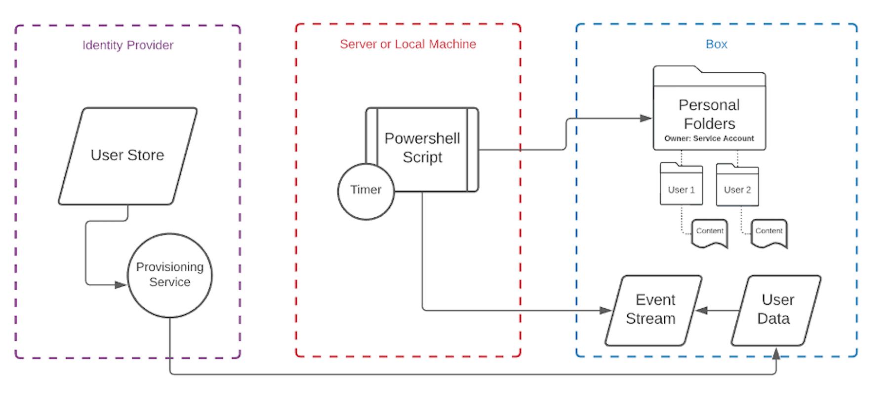
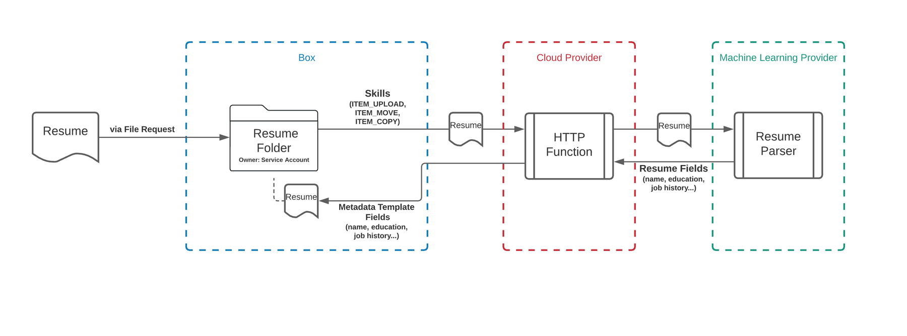

# アーキテクチャパターン

コードを書く前に、アプリケーションの視覚的なレプリゼンテーションを作成することをお勧めします。以下に示すアーキテクチャパターンは汎用的なものであり、すべての可能性を網羅しているわけではありません。

<Message type="tip">

アプリケーションアーキテクチャに関するサポートをご希望の場合は、Box Consultingサービスの購入について、お客様のアカウントチームにお問い合わせください。

</Message>

## 管理タスク

<ImageFrame center shadow border>

</ImageFrame>

コンポーネント:

* PowerShellスクリプトを実行しているサーバーまたはローカルマシン
* ユーザープロビジョニング/プロビジョニング解除サービスがあるIDプロバイダ
* 各ユーザーの個人用フォルダが含まれている、[サービスアカウント][sa]の所有フォルダ
* [イベントストリーム][events]を監視し、個人用フォルダで各ユーザーを作成/コラボレーションする、時間に基づくPowerShellスクリプト

## 保管庫ポータル

<ImageFrame center shadow border>

</ImageFrame>

コンポーネント:

* ユーザーがBox以外のブランド設定された環境でコラボレーションできるようにするカスタムポータル
* ポータルが導入されているウェブサーバーにユーザーを分散させるロードバランサ
* ユーザーは、IDプロバイダで管理されている資格情報を使ってログイン可能。その後、この資格情報は、データサーバー内のBoxからの[App User][au]情報にマッピングされます。
* 他のサイトデータはデータサーバーに保存

## Box Skill

<ImageFrame center shadow border>

</ImageFrame>

この例では、外部ユーザーが[ファイルリクエスト][fr]を介して履歴書をアップロードします。

[Box Skill][skill]は、特定のフォルダでのアップロード/移動/コピー操作を監視するように設定されています。イベントが発生すると、ファイルは、任意の機械学習サービスで処理するためにクラウドプロバイダに送信されます。処理が済むと、情報は[メタデータとしてファイルに再度保存][metadata]されます。このメタデータは、その後、別のプロセスで使用したり、後で参照したりすることができます。

[usermodel]: page://platform/appendix/user-models

[auth]: g://authentication

[apptype]: g://applications/app-types/select

[events]: e://resources/event

[userevents]: g://events/user-events/for-user

[sa]: page://platform/user-types/#service-account

<!-- i18n-enable localize-links -->

[fr]: https://support.box.com/hc/ja/articles/360045304813-ファイルリクエストを使用してコンテンツを取得する

<!-- i18n-disable localize-links -->

[skill]: g://applications/app-types/custom-skills

[au]: page://platform/user-types/#app-user

[metadata]: e://post-files-id-metadata-global-boxSkillsCards
