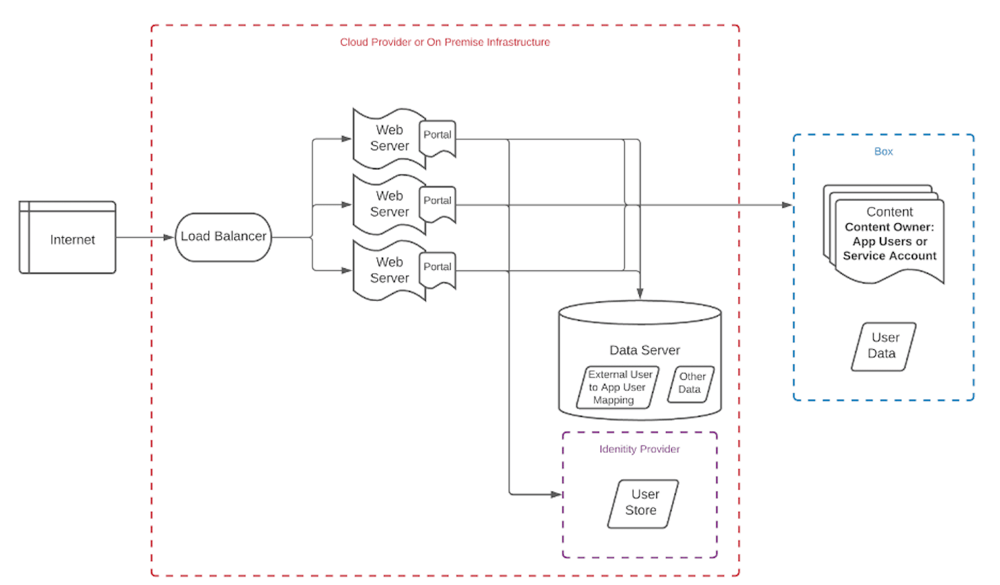

# Architecture Patterns

We recommend creating a visual representation for your application before
writing any code. The architecture patterns shown below are generic and do not
represent an exhaustive list of possibilities.

<Message type='tip'>

Would you like assistance with application architecture?
Contact your account team to purchase Box Consulting services.

</Message>

## Administrative tasks

<ImageFrame center shadow border>

</ImageFrame>

Components:

- A server or local machine running a PowerShell script
- An identity provider with a user provisioning/deprovisioning service
- A [Service Account][sa] owned folder containing a personal folder for each
  user
- A PowerShell script based on a time that monitors the [event stream][events]
  and creates/collaborates each user on their personal folder

## Vault Portal

<ImageFrame center shadow border>

</ImageFrame>

Components:

- A custom portal allowing users to collaborate in a non-Box branded environment
- A load balancer distributing users to a web server with the deployed portal
- Users can login using credentials maintained in an identity provider, which
are then mapped to [App User][au] information from Box within a data server.
- Other site data is stored on the data server

## Box Skill

<ImageFrame center shadow border>

</ImageFrame>

In this example, external users upload their resumes via a [file request][fr].

A [Box Skill][skill] is set to monitor any upload/move/copy actions in a
specific folder. When an event occurs, the file is sent to a cloud provider to
be processed by any machine learning service. Once it is processed, information
is [saved back to the file as metadata][metadata]. This metadata can then be
used in another process or for future reference.

[usermodel]:page://platform/appendix/user-models
[auth]: g://authentication
[apptype]: g://applications/select
[events]: e://resources/event
[userevents]: g://events/user-events/for-user
[sa]: page://platform/user-types/#service-account
<!-- i18n-enable localize-links -->

[fr]: https://support.box.com/hc/en-us/articles/360045304813-Using-File-Request-to-get-Content-from-Anyone
<!-- i18n-disable localize-links -->

[skill]: g://applications/custom-skills
[au]: page://platform/user-types/#app-user
[metadata]: e://post-files-id-metadata-global-boxSkillsCards