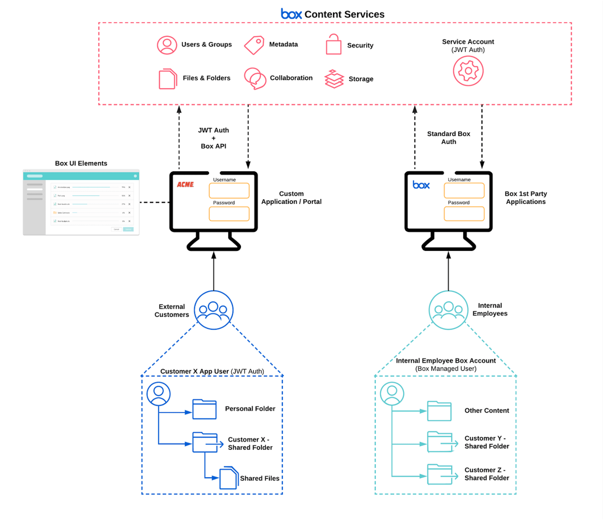

# User Models

Once you confirm your [use case][usecase] is a good fit for Box Platform and you
have a solid understanding of the [types of users][usertypes] involved, you can
select a user model to begin [application architecture][architect].

## Classic

In this model, the application has internal and external users. The external
users share or collaborate on content with internal users who use the Box web
application.

<ImageFrame center shadow border>

</ImageFrame>

- **Internal User Type**: [Managed Users][mu]
- **External User Type**: [App Users][appu]
- **Content Owned By**: Application [Service Account][sa] or [Managed Users][mu]
- **Examples**: Vault Portals, Document Submissions, Field Worker Applications

Benefits of this user model:

1. Removes the need to build additional functionality for internal users
2. Allows App Users to be mapped to your own identity system like `Auth0`
3. Allows reporting on all actions to meet to meet security and compliance
  requirements

## App User

In this model, the application has internal and external users who all leverage
the same custom UI.

<ImageFrame center shadow border>

</ImageFrame>

- **Internal User Type**: [App Users][appu]
- **External User Type**: [App Users][appu]
- **Content Owned By**: [App Users][appu]
- **Examples**: Vault Portals, Document Submissions, Field Worker Applications

Benefits of this user model:

1. Allows for a custom experience for internal and external users
2. Separates managed user and application content by allowing managed users to
  have separate App User accounts
3. Allows App Users to be mapped to your own identity system like `Auth0`
4. Allows reporting on all actions to meet to meet security and compliance
  requirements or tracking in other systems

## Service Account

In this model, the application has internal and external users, but the user
object already exists. This model also works well when users are transient
in nature, but the content must persist.

<ImageFrame center shadow border>

</ImageFrame>

- **Internal User Type**: [Managed Users][mu]
- **External User Type**: Managed by your customer’s applications
- **Content Owned By**: Application [Service Account][sa]
- **Examples**: Wealth Management Portal, Insurance Claim Workflow

Benefits of this user model:

1. Useful when the App User model would complicate existing applications
2. Useful when there is not a good 1:1 end user/app user mapping, such as users
  mapped as groups
3. Permissions are easier to manage, since the Service Account owns all content
4. Ability to implement a token exchange to ensure that broad scoped access to
  the Service Account does not occur

## System to system

In this model, no user content normally needs to be handled.

<ImageFrame center shadow border>

</ImageFrame>

- **External User Type**: N/A
- **Internal User Type**: N/A
- **Content Owned By**: Application [Service Account][sa]
- **Examples**: Back Office Applications, Integrations, User Provisioning,
 Folder Auto-Creation

Benefits of this user model:

1. Useful when user construct isn’t needed (e.g. departmental or company owned
 content that transcends user ownership)
2. Allows for complete control of permission assignment to backend services
  since the Service Account can be granted elevated privileges

[usecase]: page://platform/use-cases
[usertypes]: page://platform/user-types
[architect]: page://platform/appendix/architecture-patterns
[mu]: page://platform/user-types/#managed-users
[appu]: page://platform/user-types/#app-user
[sa]: page://platform/user-types/#service-account