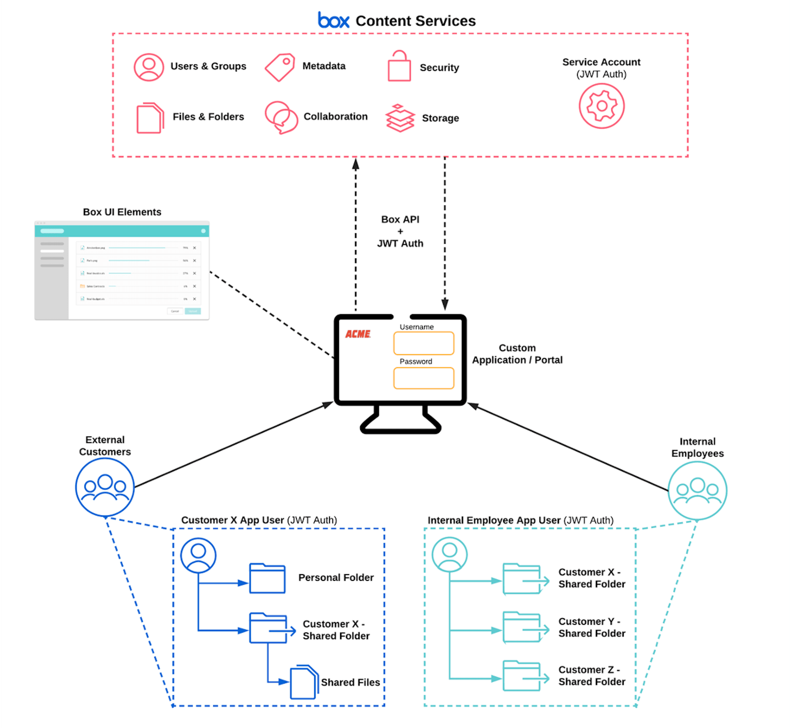
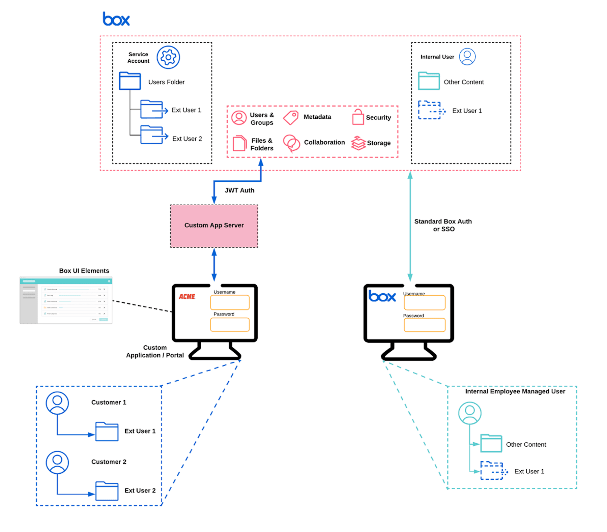
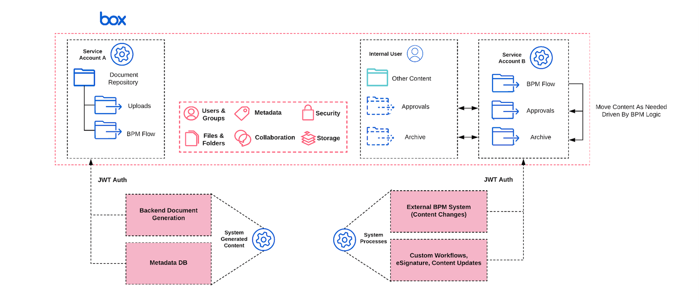

# ユーザーモデル

[ユースケース][usecase]がBox Platformに適していることを確認し、関与する[ユーザーのタイプ][usertypes]をしっかりと理解したら、[アプリケーションアーキテクチャ][architect]を開始するためのユーザーモデルを選択できます。

## 従来型

このモデルでは、アプリケーションに内部ユーザーと外部ユーザーが存在します。外部ユーザーは、Boxウェブアプリを使用する内部ユーザーとコンテンツの共有やコラボレーションを行います。

<ImageFrame center shadow border>

</ImageFrame>

* **内部ユーザーのタイプ**: [管理対象ユーザー][mu]
* **外部ユーザーのタイプ**: [App User][appu]
* **コンテンツの所有者**: アプリケーション[サービスアカウント][sa]または[管理対象ユーザー][mu]
* **例**: 保管庫ポータル、ドキュメント提出、フィールドワーカーアプリケーション

このユーザーモデルのメリット:

1. 内部ユーザーのために追加の機能を開発する必要がない
2. App Userを独自のIDシステム (`Auth0`など) にマッピングできる
3. セキュリティおよびコンプライアンスの要件を満たすために、すべての処理のレポートを作成できる

## App User

このモデルでは、アプリケーションに内部ユーザーと外部ユーザーが存在し、全員が同じカスタムUIを利用しています。

<ImageFrame center shadow border>

</ImageFrame>

* **内部ユーザーのタイプ**: [App User][appu]
* **外部ユーザーのタイプ**: [App User][appu]
* **コンテンツの所有者**: [App User][appu]
* **例**: 保管庫ポータル、ドキュメント提出、フィールドワーカーアプリケーション

このユーザーモデルのメリット:

1. 内部ユーザーと外部ユーザーにカスタムエクスペリエンスを提供できる
2. 管理対象ユーザーが個別のApp Userアカウントを所有できるようにすることで、管理対象ユーザーとアプリケーションコンテンツが切り離される
3. App Userを独自のIDシステム (`Auth0`など) にマッピングできる
4. セキュリティおよびコンプライアンスの要件を満たすためにすべての処理のレポートを作成したり、他のシステムで追跡したりできる

## サービスアカウント

このモデルでは、アプリケーションに内部ユーザーと外部ユーザーが存在しますが、ユーザーオブジェクトがすでに存在します。このモデルは、ユーザーが一時的なユーザーでもコンテンツは保持する必要がある場合にもうまく機能します。

<ImageFrame center shadow border>

</ImageFrame>

* **内部ユーザーのタイプ**: [管理対象ユーザー][mu]
* **外部ユーザーのタイプ**: 顧客のアプリケーションによって管理されている
* **コンテンツの所有者**: アプリケーション[サービスアカウント][sa]
* **例**: 資産管理ポータル、保険金請求ワークフロー

このユーザーモデルのメリット:

1. App Userモデルを使用すると既存のアプリケーションによる処理が複雑になる場合に便利
2. エンドユーザーとApp Userが1対1でマッピングされていない場合 (ユーザーがグループとしてマッピングされている場合など) に便利
3. サービスアカウントがすべてのコンテンツを所有するため、権限を管理しやすい
4. サービスアカウントへのアクセス範囲を制限するように、トークン交換を実装できる

## システム対システム

このモデルでは、通常、ユーザーコンテンツを処理する必要がありません。

<ImageFrame center shadow border>

</ImageFrame>

* **外部ユーザーのタイプ**: 該当なし
* **内部ユーザーのタイプ**: 該当なし
* **コンテンツの所有者**: アプリケーション[サービスアカウント][sa]
* **例**: バックオフィスアプリケーション、統合、ユーザープロビジョニング、フォルダの自動作成

このユーザーモデルのメリット:

1. ユーザーを作成する必要がない場合に便利 (たとえば、個々のユーザーではなく、部門や会社がコンテンツを所有する場合)
2. サービスアカウントの権限を昇格させることができるため、バックエンドサービスに対する権限の割り当てを徹底的に制御できる

[usecase]: page://platform/use-cases

[usertypes]: page://platform/user-types

[architect]: page://platform/appendix/architecture-patterns

[mu]: page://platform/user-types/#managed-users

[appu]: page://platform/user-types/#app-user

[sa]: page://platform/user-types/#service-account
