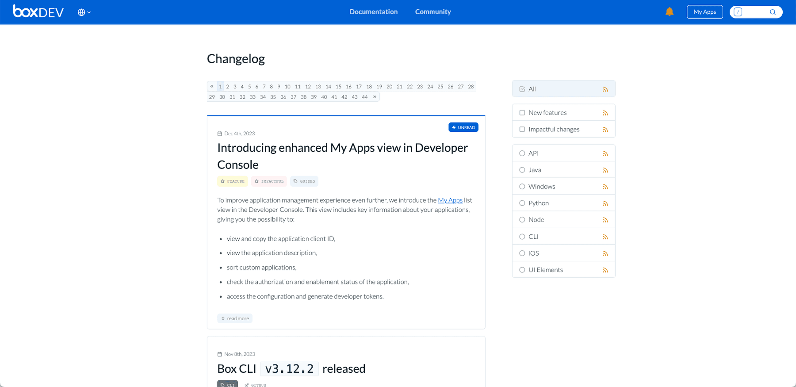
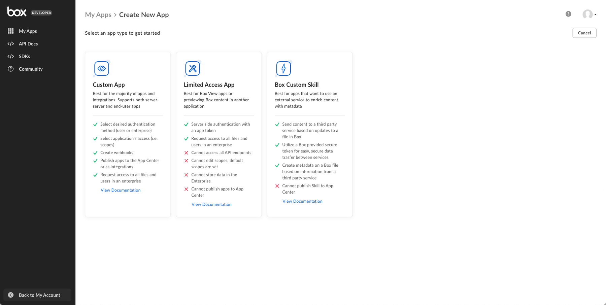

# Box Platformの基礎

<!-- INSERT VIDEO HERE LATER -->

## Boxとは

[Box][box]とは、個人や企業がどこからでもドキュメントやファイルの保存、アクセス、コラボレーションを実行できるようにする、クラウドベースのコンテンツ管理およびファイル共有のプラットフォームです。安全なファイルストレージ、リアルタイムのコラボレーション、各種生産性ツールとの統合といった機能を提供し、チームの効率性やデータのアクセス性を向上させます。セキュリティと使い勝手の良いインターフェースに重点を置いていることで知られるBoxは、デジタル資産の管理や組織内のコラボレーションの促進に広く利用されています。

## Box Platformとは

[Box Platform][platform]は、Boxが提供する一連のツールとAPIです。開発者はこれを使用して、Boxのクラウドコンテンツ管理システムの機能を独自のアプリケーションやサービスに統合し、カスタマイズすることができます。企業や開発者は、データとアクセス権限の制御を維持しながらファイルストレージ、共有、コラボレーションなどの機能を利用して、安全かつ拡張性の高いコンテンツ中心のアプリケーションを構築できます。Box Platformを使用することで、開発者は、生産性の向上とコンテンツ管理ワークフローの効率化を実現する独自のソリューションを作成できます。

## アプリケーションの作成方法

[Box API][api]を使用するには、まずBoxでアプリケーションを作成する必要があります。このアプリケーションは、プラットフォームに対して実行されるAPIコールのゲートウェイとして機能します。このタスクを実行するには、Box DeveloperドキュメントポータルとBox開発者コンソールという2つのウェブサイトを使用できます。これらについて、もう少し詳しく見てみましょう。

### Box Developerドキュメントポータル

Box Developerドキュメントポータルとは、現在ご覧になっているこのウェブサイトです。これは、Box上にソリューションを作成する開発者向けの総合的なリソースで、アプリケーションを作成したりAPIコールを実行したりする際に開発者コンソールと一緒に使用する必要があります。多くのガイド、OpenAPIの詳細な仕様、クイックスタート、サンプルコードなどがこのページ内に掲載されています。

<ImageFrame center>

</ImageFrame>

このサイトは頻繁に更新され、最新の更新情報は[変更ログ][change]に掲載されています。

<ImageFrame center>

</ImageFrame>

### Box開発者コンソール

[Box開発者コンソール][dc]は、開発者がBoxと統合された独自のアプリケーションを管理するためのツールやリソースが用意されているインタラクティブなインターフェースです。ここでは、アプリの作成、構成、監視が可能となり、これらのアプリとBox Platformの関係についてインサイトと制御が示されます。

<ImageFrame center>

</ImageFrame>

コンソールで初めてアプリケーションを作成すると、メインのBoxウェブアプリの左下にボタンが表示されるようになります。これ以降は、このボタンを使ってコンソールにアクセスできます。

<ImageFrame center>

</ImageFrame>

## Box Platformの概念

以降の詳細セクションでは、さまざまなトピックについてさらに詳しく説明します。ただし、いくつかの用語と概念を大まかに知っておく必要があります。

### ユーザータイプ

Box Platformで開発を行う際に注意すべき[ユーザータイプ][ut]がいくつかあります。ユーザータイプには、管理者権限を持つユーザー (管理者ユーザーや共同管理者ユーザーなど) と管理者権限を持たないユーザー (管理対象ユーザーまたは外部ユーザー) があります。さらに、サービスアカウントとApp Userに分類される、Platform専用のユーザーもあります。各ユーザータイプには、Box環境内での特定のロールとアクセスレベルが割り当てられており、アプリケーションやコンテンツの操作方法に影響します。基本的には、メインのBoxウェブアプリからコンテンツにアクセスできるユーザーは、APIを使用してコンテンツにアクセスすることもできます。

### アプリケーションの種類

開発者コンソールで作成できるアプリケーションには、主に、カスタムアプリ、アクセス制限付きアプリ、カスタムスキルという3種類があります。また、サードパーティの統合やウェブアプリ統合も作成できます。

<ImageFrame center>

</ImageFrame>

### 認証方法

選択したアプリケーションの種類に応じて、[アクセストークン][at]を取得するために使用できる5種類の認証方法のいずれかを使用できます。アクセストークンは、アプリケーションであるゲートウェイを通過してBoxに対するAPIコールを成功させるための鍵となります。

<ImageFrame center>

</ImageFrame>

<Next>

次の手順

</Next>

[box]: https://www.box.com

[platform]: https://www.box.com/platform

[apptypes]: g://applications/app-types/select/

[authmethods]: g://authentication/select/

[api]: https://developer.box.com/reference/

[change]: page://changelog

[dc]: https://app.box.com/developers/console

[at]: g://authentication/tokens/

<!-- i18n-enable localize-links -->

[ut]: https://support.box.com/hc/en-us/articles/4636533822483-Box-User-Types

<!-- i18n-disable localize-links -->
