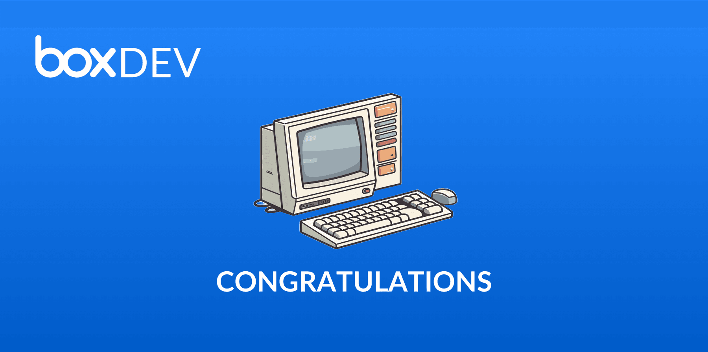

# 開発の開始

ここまでBox Platformのさまざまな構成要素について詳しく学んできました。これでいよいよ開発を開始できます。[Box開発者コンソール][devconsole]にアクセスして着手しましょう。

<ImageFrame center>

</ImageFrame>

その他のトピックをお探しの場合は、ぜひ以下を確認してください。

* [アーキテクチャパターン][arch_patterns]: このページでは、よく目にするインフラストラクチャのパターンについて説明します。
* [ユーザーモデル][user_models]: このページでは、このシリーズで前述したユーザータイプの使用方法について説明します。
* [一般的な値の確認][common_values]: このページでは、ユーザーIDなどの情報を確認する方法について説明します。
* [エラー][errors]: このページでは、表示される可能性のあるすべてのエラーコードを列挙しています。

[devconsole]: https://cloud.app.box.com/developers/console

[arch_patterns]: page://platform/appendix/architecture-patterns/

[user_models]: page://platform/appendix//user-models/

[common_values]: page://platform/appendix/locating-values/

[errors]: g://api-calls/permissions-and-errors/common-errors/
