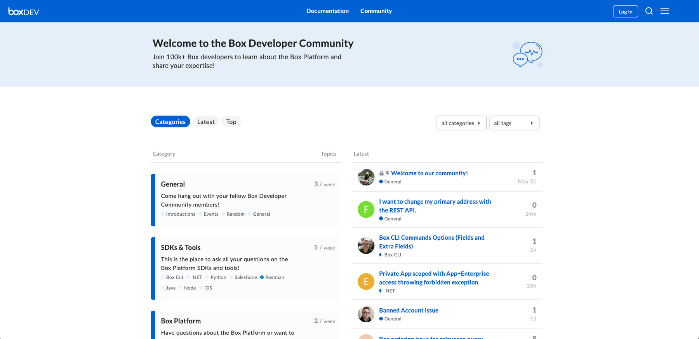

# サポート

Box Developer Relationsチームは、できる限り開発者の皆様をサポートしたいと考えています。開発者への定期的な聞き取り調査以外に、以下のようなBoxへの問い合わせ方法も用意しています。

## Developer Forum (英語のみ)

Boxは最近、Box Developer Communityをリニューアルしました。開発者同士がつながり、開発の問題について質問することがさらに容易になりました。また、ご自身の成功体験も共有していただけます。[今すぐご参加ください][forum]。

<ImageFrame center>

</ImageFrame>

## Box開発者向けブログ

その他の更新情報、チュートリアル、お知らせについては、[Box開発者向けブログ][blog]をご確認ください。

<Next>

次の手順

</Next>

[samples]: g://cli/scripts

<!-- i18n-enable localize-links -->

[forum]: https://community.box.com/

[blog]: https://medium.com/box-developer-japan-blog

[twitter]: https://twitter.com/BoxPlatform

<!-- i18n-disable localize-links -->
