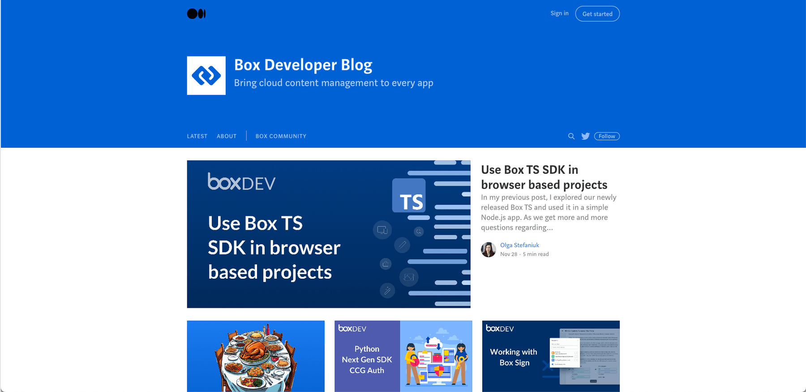

# サポート

Box Developer Relationsチームは、できる限り開発者の皆様をサポートしたいと考えています。開発者への定期的な聞き取り調査以外に、以下のようなBoxへの問い合わせ方法も用意しています。

## Developer Forum (英語のみ)

Boxは最近、Box Developer Communityをリニューアルしました。開発者同士がつながり、開発の問題について質問することがさらに容易になりました。また、ご自身の成功体験も共有していただけます。[今すぐご参加ください][forum]。

<ImageFrame center>

</ImageFrame>

## Mediumブログ

Boxと一部のパートナー企業は、定期的にBoxの[Mediumブログ][medium]でチュートリアルやお知らせを公開しています。通常は毎週火曜日にコンテンツをリリースしますが、それより頻度が高くなることもあります。コンテンツのご要望がありましたら、ぜひDeveloper Forumまで英語でお寄せください。

<ImageFrame center>

</ImageFrame>

## Box PlatformのTwitter

Developerドキュメントの変更ログと同様に、Box Platformの更新情報や新規ブログを投稿しています。[Box Platform][twitter]でフォローできます。

<ImageFrame center>

</ImageFrame>

<Next>

次の手順

</Next>

[samples]: g://cli/scripts/

<!-- i18n-enable localize-links -->

[forum]: https://forum.box.com/

[medium]: https://medium.com/box-developer-japan-blog

[twitter]: https://twitter.com/BoxPlatform

<!-- i18n-disable localize-links -->
