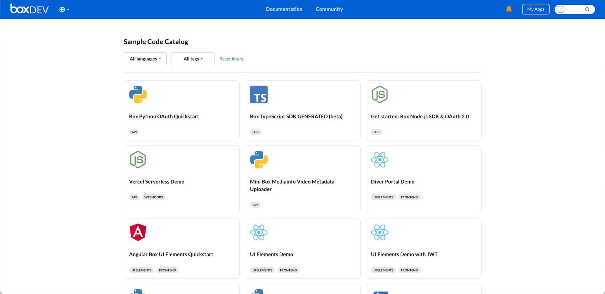
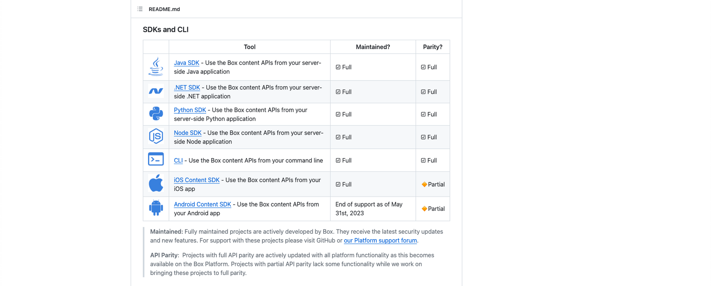

# ツール

Boxには、開発をスムーズに開始できるようにする[ツール][tooling]がいくつか用意されています。以下をご確認ください。

## サンプルコードカタログ

[サンプルコードカタログ][sample_code]は、当社がBox Developerドキュメントポータルでリリースした最新のツールです。これは、複数の場所からコードサンプルリポジトリを集めて、1か所で閲覧できるように統合したものです。ここでは、言語やタスクでフィルタをかけることができます。リストは定期的に更新しているため、最新のコードを入手できます。

<ImageFrame center>

</ImageFrame>

## Box CLI

Boxコマンドラインインターフェース (CLI) は、ターミナルウィンドウまたはコマンドプロンプトからBox APIに対してリクエストを行うためのツールです。設定には5分もかからず、APIに直接アクセスできます。Boxでは、管理の自動化タスクを短時間で開始するための一連の[サンプルスクリプト][samples]も提供しています。

<YouTube id="whxT3Bdx3E0">

</YouTube>

## SDK

Boxは、[SDKライブラリ][sdk]で複数のプログラミング言語をサポートしています。認証や再試行ロジックなどがライブラリによって自動的に処理されるため、ソリューションを作成する際はSDKを使用することを強くお勧めします。さらに、APIリファレンスのページには、サイト内のすべての言語のサンプルが直接掲載されていますが、各GitHubリポジトリにも、その言語のサンプルがすべて掲載されたドキュメントセクションがあります。

<ImageFrame center>

</ImageFrame>

## Postmanコレクション

ソフトウェア開発の業界標準であるPostmanは、リアルタイムテストとコードサンプルを提供して、開発者が短期間でAPIを習得できるようサポートしています。BoxのPostmanコレクションについては、[Postmanのウェブサイト][postman]を参照してください。また、下のYouTube動画もご確認ください。

<Youtube id="aEILZ_tukLg">

</Youtube>

<Next>

次の手順

</Next>

[samples]: g://cli/scripts/

[sdk]: page://sdks-and-tools/

[file]: e://get-files-id/

[tooling]: g://tooling/

<!-- i18n-enable localize-links -->

[sample_code]: https://ja.developer.box.com/sample-code/

[postman]: https://www.postman.com/boxdev

<!-- i18n-disable localize-links -->
