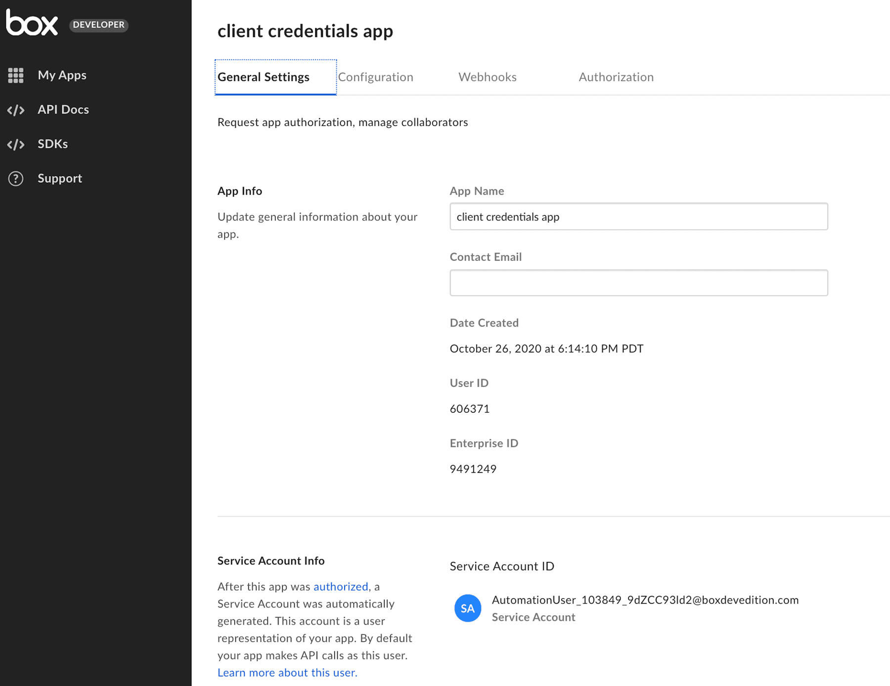

# ユーザータイプ

アプリケーションの計画と開発で重要なのは、関与するユーザーのタイプを把握することです。ユーザーのタイプには、主に、管理対象ユーザー (内部および外部)、管理者、サービスアカウント、App Userの4つがあります。それぞれの違いを詳しく見ていきましょう。

<Message>

# 自分のアプリケーションで使用するユーザーのタイプ

アプリケーションがどのタイプのユーザーとして認証されるかは、作成したアプリケーションの種類と、アクセストークンの作成で使用した認証の種類によって決まります。

</Message>

## 管理者または共同管理者ユーザー

Box管理者とは、主要なBoxアカウント管理者です。管理者は、管理者権限が同等かより厳しく制限されている共同管理者を追加することができます。管理者と共同管理者は、管理コンソールで直接、セキュリティ設定を編集、削除、適用したり、ユーザーに対してレポートを実行したりできます。

## 管理対象ユーザー

各Box Enterpriseには、一意のEnterprise IDが割り当てられます。管理対象ユーザーとは、1つのEnterprise IDに属しているすべてのユーザーのことです。管理対象ユーザーは、標準のBoxライセンスを購入しており、例外もありますがほとんどの場合に同じメールドメインを共有します。

<Message>

# 管理者ユーザーとしてログイン

アプリケーションの中には、正しく動作するために管理者だけが持つ権限を必要とし、管理者にログインを要求するものがあります。

この一例として、Enterprise Eventを監視し、不審なイベントに対して措置を講じるセキュリティアプリケーションがあります。イベントエンドポイントを使用できるのは、レポートへのアクセス権限を持つ管理者または共同管理者のみです。

</Message>

## 外部ユーザー

外部で管理されているユーザー (外部ユーザー) とは、別のEnterprise IDに属している管理対象ユーザーです。外部ユーザーによく遭遇するのは、外部ユーザーが、アプリケーションの企業の管理対象ユーザーが所有するコンテンツでコラボレーションしている場合や、OAuth 2.0アプリケーションを承認する場合です。外部ユーザーは各自Boxアカウントを所有していますが、管理コンソールで管理することができません。

## サービスアカウント

サービスアカウントにより、開発者は、サーバー側のBoxとの統合にプログラムによる認証メカニズムを使用できます。つまり、アプリケーションはBoxに対してサービスとして認証を受けることができ、これがサービスアカウントユーザーで表されます。その後、サービスアカウントを使用して、App Userと呼ばれるアプリケーション固有のユーザーを他に作成できます。App Userについては、以下で詳しく説明します。

<ImageFrame center>

</ImageFrame>

### 作成

サーバー認証を利用するアプリケーションが管理コンソールで[承認][auth]されるとすぐに、一意のBoxサービスアカウントが自動的に生成されます。その時点から、そのサービスアカウントはBox Enterprise内のアプリケーションを表します。すべてのBoxアカウントにはメールアドレスが必要なため、Boxによって割り当てられます。これは常に`AutomationUser_AppServiceID_RandomString@boxdevedition.com`形式になります (例: `AutomationUser_123456_6jCo6Pqwo@boxdevedition.com`)。サービスアカウントが自動化ユーザーと呼ばれることがあるのはこのためです。

アンダースコアで囲まれた数字もアプリケーションに固有であり、サービスIDと呼ばれます。[開発者コンソール][dc]でサービスIDを見つけるには、アプリケーションのタイルをクリックし、URLを確認します。たとえば、`https://example.app.box.com/developers/console/app/123456`というURLの場合、このアプリケーションは、上記の例で示したサービスアカウントに対応していることがわかります。

デフォルトでは、ほとんどのサービスアカウントに10 GBのストレージが割り当てられます。これは、サービスアカウントが管理コンソールの \[**ユーザー設定**] タブにある \[**新規ユーザーの初期設定**] で設定されたストレージ割り当てに従うためです。この容量は、企業がこの設定を更新したかどうかによって異なる場合があります。サービスアカウントに割り当てられているストレージの容量をアカウント作成後に更新するには、[ユーザーを更新][updateuser]エンドポイントに対するAPIコールを実行し、`space_amount`本文パラメータを使用して目的の値 (バイト単位) を渡します。

サービスアカウントが生成されると、[開発者コンソール][dc]の \[一般設定] タブにセクションが自動的に追加され、メールアドレスが表示されます。

<ImageFrame center>

</ImageFrame>

アプリケーションが管理コンソールで承認される前に、ユーザーがサービスアカウントアクセストークンを使用してAPIコールを実行しようとすると、次のエラーメッセージが表示されます: `"error": "unauthorized_client"` `"error_description": "This app is not authorized by the enterprise"`

### ユースケース

* _ディストリビューションの公開_: 認証されているかどうかに関係なく、ファイルをアップロードし、多数のユーザーと共有します。
* _オンプレミスのシステムとデバイス_: オンプレミスシステムや接続されたデバイスからプログラムによってコンテンツを取り込みます。
* _コンテンツの移行と監視_: コンテンツをオンプレミスからクラウドへ移動したり、クラウドプロバイダ間で移動したりします。
* _イベント監視_: 社内のイベントを監視して、アクションに基づいてコンプライアンス順守を確保したり、ワークフローをトリガーしたりします。
* _コンテンツのアーカイブ_: 最低限しかアクセスされないコンテンツを格納します。

### 権限

サービスアカウントアクセストークンで問題なく操作できるエンドポイントは、[開発者コンソール][dc]で構成されたアプリケーション[スコープ][scopes]によって決まります。付与されているスコープによっては、サービスアカウントが管理者アクションを実行できる場合があります。

<Message type="warning">

# 管理者の承認

適切な[スコープ][scopes]が有効になっている場合、サービスアカウントは多くの管理者アクションを実行できます。そのため、JWTアプリケーションを社内で使用できるようにするには、事前に明示的な[管理者による承認][auth]が必要です。

</Message>

### UIでのアクセス

管理コンソールの[コンテンツマネージャ][cm]からサービスアカウントとしてログインできるのは、プライマリ管理者のみです。これには、コンテンツマネージャの検索バーを使用してアプリケーションの名前を見つけ、その名前を右クリックして \[ユーザーのアカウントにログイン] を選択します。

サービスアカウントは、Boxの共同管理者の権限を持っていると考えることができます。共同管理者がお互いを管理できないのと同じように、共同管理者がサービスアカウントユーザーとしてログインすることはできません。

サービスアカウントは、現在、管理コンソールの \[ユーザーとグループ] タブに表示されていません。

### フォルダツリーとコラボレーション

サービスアカウントは、アプリケーションをEnterprise内のユーザーとして表すため、独自のフォルダツリーとコンテンツ所有権の機能が用意されています。最初は、所有するコンテンツやコラボレーションするコンテンツがないため、このフォルダツリーはデフォルトで空になっています。これは、新しくプロビジョニングしたBoxアカウントの \[すべてのファイル] ページに最初にアクセスしたときと似ています。

既存のコンテンツでのコラボレーションにサービスアカウントを追加するには、他のユーザーの場合と同様、割り当てられたメールアドレスを使用してサービスアカウントを招待します。[APIを使用して][collabapi]コラボレーションを追加する場合は、すでにコンテンツへのアクセス権があり、コラボレータを招待するための適切なコラボレーション権限を持っているユーザーのアクセストークンを使用する必要があります。また、サービスアカウントのユーザーIDも使用します。このユーザーIDは、サービスアカウントのアクセストークンを使用して[現在のユーザーを取得エンドポイント][getuser]を呼び出したときに返されます。

<Message type="notice">

コラボレーションを追加する際に覚えやすくなるよう、サービスアカウントにメールエイリアスを割り当てることができます。

</Message>

### Box View

サービスアカウントは、[開発者コンソール][dc]でアクセス制限付きアプリを作成したときにも自動的に生成されます。このサービスアカウントには、カスタムアプリに関連付けられたサービスアカウントにはない追加の制限がいくつかあります。

* アクセス制限付きアプリ内で使用されるコンテンツはすべて、このサービスアカウントがアップロードおよび所有する必要がある
* このサービスアカウントは、他のユーザーの情報やコンテンツにアクセスできない
* このサービスアカウントは、タイプを問わず新しいユーザーを作成することも管理することもできない
* このサービスアカウントは、コンテンツのプレビューに関連するAPIのサブセットにしかアクセスできない

## App User

App Userは、API経由でしかアクセスできません (つまり、ログイン資格情報を持っていません)。これは、サービスアカウントによって作成できるため、サーバー間認証を利用するアプリケーションのみに適用できます。App Userは、その作成に使用されたアプリケーションに関連付けられています。また、そのアプリケーション以外でのコンテンツのコラボレーションは可能ですが、このユーザー自体を別のアプリケーション下に移動することはできません。

### 作成

App Userを作成するには、サービスアカウントアクセストークンを使用して、[ユーザーを作成エンドポイント][createuser]を呼び出します。`is_platform_access_only`本文パラメータはtrueに設定する必要があります。そうしないと、代わりに管理対象ユーザーが作成されます。

すべてのBoxアカウントにはメールアドレスが必要なため、Boxによって割り当てられます。これは常に`AppUser_AppServiceID_RandomString@boxdevedition.com`形式になります (例: `AppUser_1234567_LOCqkWI79A@boxdevedition.com`)。

アンダースコアで囲まれた数字もアプリケーションに固有であり、サービスIDと呼ばれます。[開発者コンソール][dc]でサービスIDを見つけるには、アプリケーションのタイルをクリックし、URLを確認します。たとえば、`https://exampl.app.box.com/developers/console/app/1234567`というURLの場合、このアプリケーションは、上記の例のApp Userに対応していることがわかります。

### ユースケース

App Userは、既存のBoxアカウントを持っているかどうかに関係なく、BoxのPlatformの機能を、任意のユーザーにサービスを提供するアプリケーションに拡張します。App Userは、独自のユーザー認証を管理しつつもデータを一意のBoxユーザーアカウントに保存しようとするアプリケーションでよく使用されます。

* _顧客ポータル_: 顧客や患者がログインして、企業の従業員が提供する情報にアクセスしたり、自分の機密文書を保存および取得したりできるウェブサイトまたはアプリケーション。
* _ベンダーポータル_: 企業がマーケティング用販促品、価格表、製品情報、販売契約書、その他のドキュメントを含む資料をベンダーに提供するためのコンテンツ配布サイト。Boxのグループと権限モデルにより、企業はパートナーの基準や層に基づいてパートナー向けのコンテンツを編成できます。
* _ブランドの顧客向けアプリケーション_: エンドユーザーに代わってApp Userを作成できるため、企業は、権限、監査、レポートなどのシームレスな顧客向け機能を構築できます。これは、金融サービスや医療などの規制産業にとって特に有用です。さらに、Boxの[レポート機能][events]によって取得したユーザーベースのデータにより、開発者は分析ツールを活用して、ユーザーの行動についてより理解を深めることができます。

### 権限

App Userは、コラボレータとして明示的に追加されない限り、サービスアカウントのフォルダツリー内のコンテンツを表示することも操作することもできません。また、App Userはログイン資格情報を持っていないため、カスタムアプリケーション以外でコンテンツにアクセスすることはできません。

### UIでのアクセス

App Userには、管理コンソールの [\[ユーザーとグループ\] タブ][uag-tab]からアクセスできます。これらのユーザーにフィルタをかけるには、表示オプションボタン > \[ロール] > \[App User] を使用します。

<ImageFrame center>

</ImageFrame>

管理コンソールの[コンテンツマネージャ][cm]からもApp Userにアクセスできます。

### フォルダツリーとコラボレーション

各App Userには、独自のフォルダツリーとコンテンツ所有権の機能があります。最初は、所有するコンテンツやコラボレーションしているコンテンツがないため、このフォルダツリーはデフォルトで空になっています。これは、新しくプロビジョニングしたBoxアカウントの \[すべてのファイル] ページに初めてアクセスしたときと似ています。

既存のコンテンツでのコラボレーションにApp Userを追加するには、他のユーザーの場合と同様、割り当てられたメールアドレスを使用してApp Userを招待します。[APIを使用して][collabapi]コラボレーションを追加する場合は、すでにコンテンツへのアクセス権があり、コラボレータを招待するための適切なコラボレーション権限を持っているユーザーのアクセストークンを使用する必要があります。

## As-User

アプリケーションの認証方法としてOAuth 2.0、JWT、またはCCGを使用している場合、いわゆる`as-user`コールを行うことができます。つまり、Box APIへの最初の接続を自分自身またはサービスアカウントとして作成した場合でも、それ以降のコールを別のユーザーになりすまして行うことができます。これは、フォルダの再編成や従業員のプロビジョニングなどの管理タスクを自動化するのに便利です。`as-user`コールを行うには、開発者コンソールでアプリケーションを作成する際に適切なスコープを追加する必要があります。たとえば、OAuth 2.0カスタムアプリでは、次の切り替えをオンにする必要があります。

<ImageFrame center>

</ImageFrame>

<Next>

次の手順

</Next>

[dc]: https://app.box.com/developers/console

[auth]: g://authorization/custom-app-approval/

[scopes]: g://api-calls/permissions-and-errors/scopes/

[collabapi]: e://post-collaborations/

[getuser]: e://get-users-me/

[updateuser]: e://put-users-id/

[createuser]: e://post-users

[events]: e://get-events/

<!-- i18n-enable localize-links -->

[cm]: https://support.box.com/hc/ja/articles/360044197333-コンテンツマネージャの使用

[uag-tab]: https://support.box.com/hc/ja/articles/360043695714-管理コンソールガイド

<!-- i18n-disable localize-links -->
