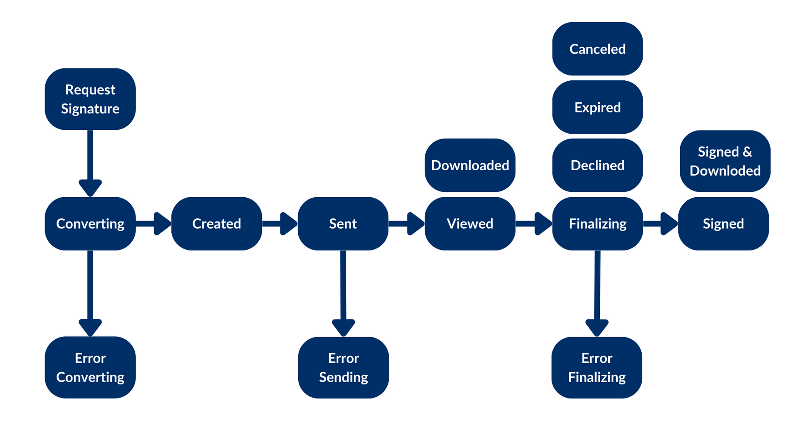

# 最初のリクエスト

Boxに保存されているドキュメントがあり、署名をもらうために顧客に送信することを想像してみてください。少なくとも、アプリでは、署名対象のドキュメント、署名済みドキュメントの保存先、署名者のメールアドレスを認識する必要があります。

## 署名リクエストの作成

署名リクエストの作成には、Box Sign APIまたは使用可能ないずれかのSDKを使用できます。次の例を参照してください。

<Tabs>

<Tab title="cURL">

```curl
curl --location 'https://api.box.com/2.0/sign_requests' \
    --header 'Content-Type: application/json' \
    --header 'Authorization: Bearer <access token>' \
    --data-raw '{
      "is_document_preparation_needed": true,
      "parent_folder": {
        "id": "234102987614",
        "type": "folder"
      },
      "source_files": [
        {
          "id": "1355143830404",
          "type": "file"
        }
      ],
      "signers": [
        {
          "email": "signer@example.com",
          "role": "signer"
        }
      ]
    }'

```

</Tab>

<Tab title="Pythonの次世代SDK">

```python
def sign_doc_single(
    client: Client,
    document_id: str,
    destination_folder_id: str,
    signer_email: str,
    prep_needed: bool = False,
) -> SignRequest:
    # Sign request params
    source_file = FileBase(id=document_id, type=FileBaseTypeField.FILE)
    destination_folder = FolderMini(
        id=destination_folder_id, type=FolderBaseTypeField.FOLDER
    )
    signer = SignRequestCreateSigner(signer_email)
    # sign document
    sign_request = client.sign_requests.create_sign_request(
        signers=[signer],
        parent_folder=destination_folder,
        source_files=[source_file],
        is_document_preparation_needed=prep_needed,
    )

    return sign_request

def main():
    conf = ConfigOAuth()
    client = get_client_oauth(conf)

    # Simple sign a pdf request with preparation
    sign_pdf_prep = sign_doc_single(
        client, SIMPLE_PDF, SIGN_DOCS_FOLDER, SIGNER_A, True
    )

    if sign_pdf_prep.prepare_url is not None:
        open_browser(sign_pdf_prep.prepare_url)

```

</Tab>

</Tabs>

この結果、ドキュメント準備のURL (簡略化されています) を含む署名リクエストが作成されます。

<Tabs>

<Tab title="cURL">

```json
{
  "is_document_preparation_needed": true,
  "signers": [
    {
      "email": "requester@example.com",
      "role": "final_copy_reader",
    },
    {
      "email": "signer@example.com",
      "role": "signer",
    }
  ],
  "id": "348decab-48a8-4f2c-9436-8967afebf7bb",
  "prepare_url": "https://app.box.com/sign/document/xyz-abc-123/.../prepare_doc/",
  "source_files": [
    {
      "id": "1355143830404",
      "type": "file",
    }
  ],
  "parent_folder": {
    "id": "234102987614",
    "type": "folder",
  },
  "name": "Simple-PDF.pdf",
  "type": "sign-request",
  "status": "converting",
  "sign_files": {
    "files": [
      {
        "id": "1381301154812",
        "type": "file",
      }
    ],
    "is_ready_for_download": true
  },
  "template_id": null
}

```

</Tab>

<Tab title="Pythonの次世代SDK">

```YAML
Simple sign request with prep: xyz-abc-123
  Status: converting
  Signers: signer@example.com
Prepare url: https://app.box.com/sign/document/xyz-abc-123/.../prepare_doc/

```

</Tab>

</Tabs>

## 署名リクエストのステータスの確認

署名リクエストの作成は非同期処理であり、エラーが発生する可能性があります。アプリケーションでは、処理を進める前にリクエストのステータスを確認し、エラーがあれば処理する必要があります。

署名リクエストのステータスを以下に示します。



* `converting`: 署名リクエストが送信された後、ファイルが署名プロセスのために`.pdf`に変換されている。
* `error_converting`: ファイルを`.pdf`に変換中に問題が発生した。
* `created`: `document_preparation_is_needed`が`true`に設定されているが、`prepare_url`がまだアクセスされていない。
* `sent`: リクエストが正常に送信されたが、どの署名者も対応していない。
* `error_sending`: リクエストの送信中に問題が発生した。
* `viewed`: 最初 (または唯一) の署名者が署名用メールの \[**ドキュメントをレビュー**] をクリックするか、署名用URLにアクセスした。
* `downloaded`: 署名者がドキュメントをダウンロードした。
* `signed`: すべての署名者がリクエストの処理を完了した。
* `signed and downloaded`: 署名者がドキュメントに署名してダウンロードした。
* `declined`: いずれかの署名者がリクエストを拒否した。
* `cancelled`: リクエストがUIまたはAPIを介してキャンセルされた。
* `expired`: 署名が未完了、不十分のまま、有効期限が過ぎた。
* `finalizing`: すべての署名者がリクエストに署名済みでも、署名された最終的なドキュメントと署名ログがまだ生成されていない。
* `error_finalizing`: `finalizing`フェーズが正常に完了しなかった。

## ドキュメントの準備

技術的なユースケースによっては、ドキュメントの準備が必要になる場合があります。この具体的な例では、PDFに署名していますが、Box Signエンジンは、署名フィールドやその他の入力データの配置場所を認識しません。そのため、`is_document_preparation_needed`フラグを使用しました。

準備のURLが存在する場合、アプリケーションはそのURLをブラウザで開く必要があります。そこで、リクエスト送信者は、署名者がドキュメントでの作業を完了するために必要な署名フィールドやその他の入力データを追加できます。

ドキュメントが準備できたら、リクエスト送信者は署名リクエストを署名者に送信できます。

この準備手順は必須ではありません。詳細については、[技術的なユースケース][technical-use-cases]を参照してください。

## 署名リクエストの完了

署名者には、署名リクエストへのリンクが記載されたメールがBoxから届きます。署名者はリンクをクリックしてドキュメントに署名できます。

処理が完了すると、メタデータを含む署名ログと署名済みドキュメントの両方が保存先フォルダに格納されます。

これで、最初の署名リクエストを正常に作成できました。

<Message type="notice">

これは、Box Signの基本的なユースケースを示しています。`create`メソッドには、署名リクエストのカスタマイズに使用できる多くのオプションがあります。

詳細については、[リクエストのオプション][request-options]と[技術的なユースケース][technical-use-cases]のセクションを確認してください。

</Message>

[request-options]: page://sign/request-options

[technical-use-cases]: page://sign/technical-use-cases
