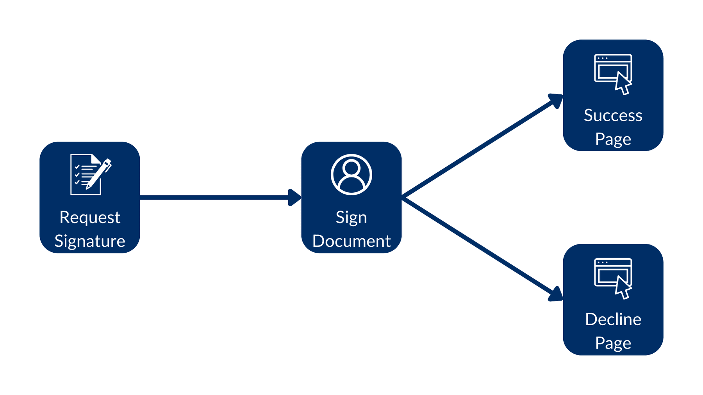

# リダイレクトURL

ドキュメントに署名した後に、会社ではユーザーをお礼のページやオンボーディングページのような特定のウェブページにリダイレクトしたい場合もよくあります。このような要件をサポートする機能は2つあります。

署名者が署名プロセスを完了したときに、その署名者をウェブページにリダイレクトできます。署名者が署名リクエストを拒否した場合も同様です。

`redirect_url`パラメータと`decline_redirect_url`パラメータを渡すことで、これらのページをカスタマイズできます。



例:

<Tabs>

<Tab title="cURL">

```curl
curl --location 'https://api.box.com/2.0/sign_requests' \
    --header 'Content-Type: application/json' \
    --header 'Authorization: Bearer ej...3t' \
    --data-raw '{
      "is_document_preparation_needed": true,
      "redirect_url": "https://forum.box.com/",
      "declined_redirect_url": "https://developer.box.com/",
      "parent_folder": {
        "id": "234102987614",
        "type": "folder"
      },
      "source_files": [
        {
          "id": "1358047520478",
          "type": "file"
        }
      ],
      "signers": [
        {
          "email": "signer@example.com",
          "role": "signer"
        }
      ]
    }'

```

</Tab>

<Tab title="Pythonの次世代SDK">

```python
def sign_doc_single_more_options(
    ...

    redirect_url: str = None,
    declined_redirect_url: str = None,
) -> SignRequest:
    ...

    # sign document
    sign_request = client.sign_requests.create_sign_request(
        ...

        redirect_url=redirect_url,
        declined_redirect_url=declined_redirect_url,
    )

    return sign_request

def main():
    ...

    # Sign with redirects
    sign_with_redirects = sign_doc_single_more_options(
        client,
        SIMPLE_PDF,
        SIGN_DOCS_FOLDER,
        SIGNER_A,
        prep_needed=False,
        redirect_url="https://forum.box.com/",
        declined_redirect_url="https://developer.box.com/",
    )
    check_sign_request(sign_with_redirects)

```

</Tab>

</Tabs>

署名した場合、フォーラムページにリダイレクトされます。拒否した場合は、開発者向けのページにリダイレクトされます。
