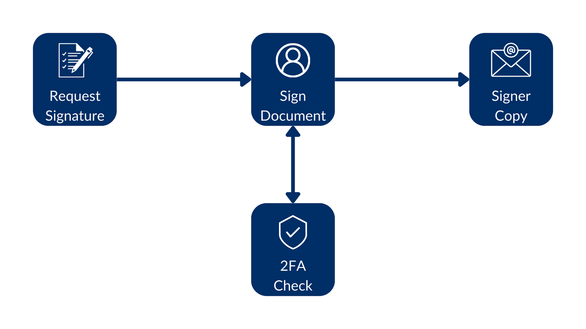
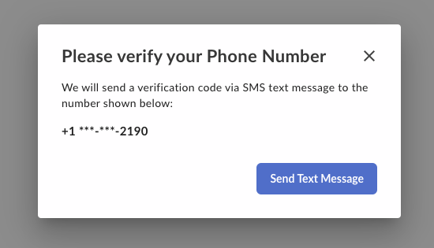

# セキュリティの強化 (2要素認証)

ドキュメントへの署名手順で署名者に対してパスワードや電話認証を要求することで、署名リクエストの[セキュリティレベルを高める][2FA]ことを想像してみてください。



## 電話認証

`is_phone_verification_required_to_view`パラメータを渡すことにより、署名リクエストを完了するために携帯電話から2要素認証を使用するよう署名者に要求することができます。

例:

<Tabs>

<Tab title="cURL">

```curl
curl --location 'https://api.box.com/2.0/sign_requests' \
    --header 'Content-Type: application/json' \
    --header 'Authorization: Bearer ej...3t' \
    --data-raw '{
      "is_document_preparation_needed": true,
      "parent_folder": {
        "id": "234102987614",
        "type": "folder"
      },
      "source_files": [
        {
          "id": "1358047520478",
          "type": "file"
        }
      ],
      "signers": [
        {
          "email": "verify@example.com",
          "role": "signer",
          "verification_phone_number": "+15551232190"
        }
      ]
    }'

```

</Tab>

<Tab title="Pythonの次世代SDK">

```python
def sign_doc_verify_phone(
    client: Client,
    document_id: str,
    destination_folder_id: str,
    signer_email: str,
    signer_phone: str,
) -> SignRequest:

    # Sign request params
    source_file = FileBase(id=document_id, type=FileBaseTypeField.FILE)
    destination_folder = FolderMini(
        id=destination_folder_id, type=FolderBaseTypeField.FOLDER
    )

    signer = SignRequestCreateSigner(
        email=signer_email,
        verification_phone_number=signer_phone,
    )

    # sign document
    sign_request = client.sign_requests.create_sign_request(
        signers=[signer],
        parent_folder=destination_folder,
        source_files=[source_file],
        is_phone_verification_required_to_view=True,
    )

    return sign_request

def main():
    ...

    # Sign with phone verification
    sign_with_phone_verification = sign_doc_verify_phone(
        client,
        SIMPLE_PDF,
        SIGN_DOCS_FOLDER,
        SIGNER_A,
        SIGNER_A_PHONE,
    )
    check_sign_request(sign_with_phone_verification)

```

</Tab>

</Tabs>

署名者が署名リクエストを完了しようとすると、電話認証を求めるポップアップが表示されます。



その後、署名者はSMSで送信されたコードを入力するよう求められます。


<Message size="small">

この確認は最後の手順として行われるため、署名者がドキュメントにアクセスできなくなることはありません。

</Message>

## パスワード認証

`signer`オブジェクトに`password`パラメータを渡すことにより、署名リクエストを開くためにパスワードを使用するよう署名者に要求することができます。次に例を示します。

<Tabs>

<Tab title="cURL">

```curl
curl --location 'https://api.box.com/2.0/sign_requests' \
    --header 'Content-Type: application/json' \
    --header 'Authorization: Bearer ej...3t' \
    --data-raw '{
      "is_document_preparation_needed": true,
      "parent_folder": {
        "id": "234102987614",
        "type": "folder"
      },
      "source_files": [
        {
          "id": "1358047520478",
          "type": "file"
        }
      ],
      "signers": [
        {
          "email": "verify@example.com",
          "role": "signer",
          "password": "1234"
        }
      ]
    }'

```

</Tab>

<Tab title="Pythonの次世代SDK">

```python
def sign_doc_verify_password(
    client: Client,
    document_id: str,
    destination_folder_id: str,
    signer_email: str,
    signer_password: str,
) -> SignRequest:

    # Sign request params
    source_file = FileBase(id=document_id, type=FileBaseTypeField.FILE)
    destination_folder = FolderMini(
        id=destination_folder_id, type=FolderBaseTypeField.FOLDER
    )

    # signer
    signer = SignRequestCreateSigner(
        email=signer_email,
        password=signer_password,
    )

    # sign document
    sign_request = client.sign_requests.create_sign_request(
        signers=[signer],
        parent_folder=destination_folder,
        source_files=[source_file],
    )

    return sign_request

def main():
    ...

    # Sign with phone verification
    sign_with_password_verification = sign_doc_verify_password(
        client,
        SIMPLE_PDF,
        SIGN_DOCS_FOLDER,
        SIGNER_A,
        "1234",
    )

```

</Tab>

</Tabs>

署名者が署名リクエストを開くと、次のような画面が表示されます。


<Message size="small">

パスワード認証は最初の手順で行われるため、正しいパスワードが入力されるまで、署名者はドキュメントにアクセスできません。

</Message>

[2FA]: https://support.box.com/hc/en-us/articles/4406861109907-Additional-Signer-Authentication
