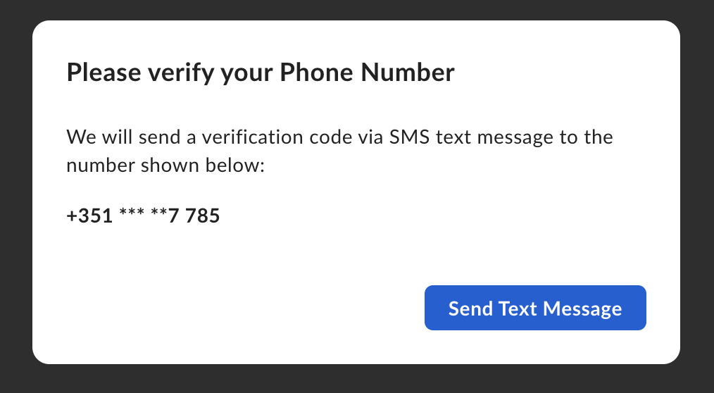
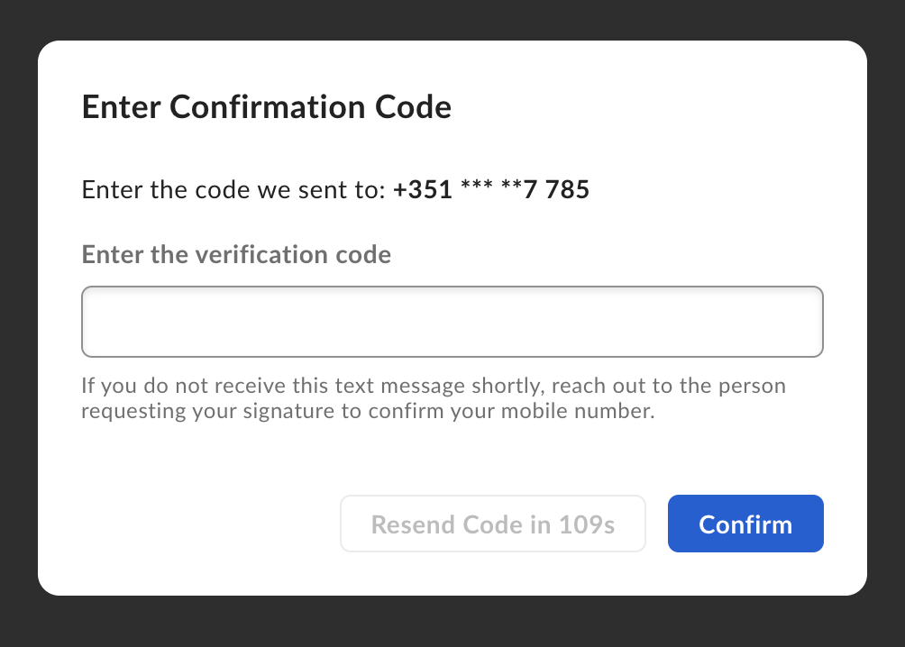

# Extra security (2FA)

Imagine you want an [additional layer of security][2FA] for your signature
requests, by requesting the signer to use a password or a phone verification
in the document signing step.


<Message type='notice'  You can add the additional layer of security in a template or when you create a signature request.  </Message>

## Phone verification

You can require the signer to use 2FA through their mobile phone to complete
the signature request by passing the `verification_phone_number` parameter on the signer along with their phone number.

For example:

<Tabs>

<Tab title='cURL'>

```curl
curl --location 'https://api.box.com/2.0/sign_requests' \
    --header 'Content-Type: application/json' \
    --header 'Authorization: Bearer ej...3t' \
    --data-raw '{
      "is_document_preparation_needed": true,
      "parent_folder": {
        "id": "234102987614",
        "type": "folder"
      },
      "source_files": [
        {
          "id": "1358047520478",
          "type": "file"
        }
      ],
      "signers": [
        {
          "email": "verify@example.com",
          "role": "signer",
          "verification_phone_number": "+15551232190"
        }
      ]
    }'
```

</Tab>

<Tab title='Python Gen SDK'>

```python
def sign_doc_verify_phone(
    client: Client,
    document_id: str,
    destination_folder_id: str,
    signer_email: str,
    signer_phone: str,
) -> SignRequest:

    # Sign request params
    source_file = FileBase(id=document_id, type=FileBaseTypeField.FILE)
    destination_folder = FolderMini(
        id=destination_folder_id, type=FolderBaseTypeField.FOLDER
    )

    signer = SignRequestCreateSigner(
        email=signer_email,
        verification_phone_number=signer_phone,
    )

    # sign document
    sign_request = client.sign_requests.create_sign_request(
        signers=[signer],
        parent_folder=destination_folder,
        source_files=[source_file],
        is_phone_verification_required_to_view=True,
    )

    return sign_request

def main():
    ...

    # Sign with phone verification
    sign_with_phone_verification = sign_doc_verify_phone(
        client,
        SIMPLE_PDF,
        SIGN_DOCS_FOLDER,
        SIGNER_A,
        SIGNER_A_PHONE,
    )
    check_sign_request(sign_with_phone_verification)
```

</Tab>

</Tabs>

When the signer tries to access the signature request a phone verification dialog pops up:



Then the signer is prompted to enter the code sent in an SMS:



## Password verification

You can require the signer to use a password to open the signature request
by passing the `password` parameter in the `signer` object. For example:

<Tabs>

<Tab title='cURL'>

```curl
curl --location 'https://api.box.com/2.0/sign_requests' \
    --header 'Content-Type: application/json' \
    --header 'Authorization: Bearer ej...3t' \
    --data-raw '{
      "is_document_preparation_needed": true,
      "parent_folder": {
        "id": "234102987614",
        "type": "folder"
      },
      "source_files": [
        {
          "id": "1358047520478",
          "type": "file"
        }
      ],
      "signers": [
        {
          "email": "verify@example.com",
          "role": "signer",
          "password": "1234"
        }
      ]
    }'
```

</Tab>

<Tab title='Python Gen SDK'>

```python
def sign_doc_verify_password(
    client: Client,
    document_id: str,
    destination_folder_id: str,
    signer_email: str,
    signer_password: str,
) -> SignRequest:

    # Sign request params
    source_file = FileBase(id=document_id, type=FileBaseTypeField.FILE)
    destination_folder = FolderMini(
        id=destination_folder_id, type=FolderBaseTypeField.FOLDER
    )

    # signer
    signer = SignRequestCreateSigner(
        email=signer_email,
        password=signer_password,
    )

    # sign document
    sign_request = client.sign_requests.create_sign_request(
        signers=[signer],
        parent_folder=destination_folder,
        source_files=[source_file],
    )

    return sign_request

def main():
    ...

    # Sign with phone verification
    sign_with_password_verification = sign_doc_verify_password(
        client,
        SIMPLE_PDF,
        SIGN_DOCS_FOLDER,
        SIGNER_A,
        "1234",
    )
```

</Tab>

</Tabs>

Once the signer opens the signature request they should see something like this:


<Message  size='small'>

As the password verification is done on the first step, it prevents the
signer from accessing the document until the correct password is provided.

</Message>

[2FA]: https://support.box.com/hc/en-us/articles/4406861109907-Additional-Signer-Authentication