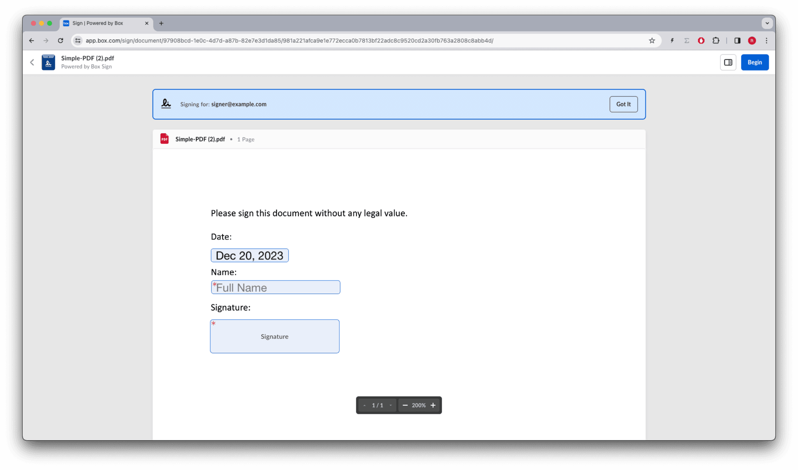
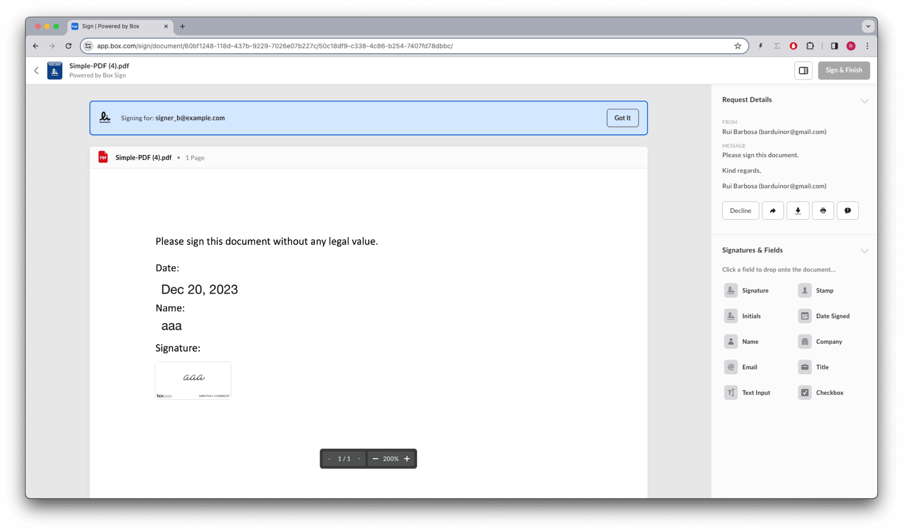

# 対面での署名

営業担当者が顧客と対面していて、サービスへの加入や購入の確認など、即座に署名が必要になったときに、アプリケーションを使用する場合を考えてみましょう。

この場合、営業担当者はアプリケーションを使用して署名リクエストを作成した後、顧客にデバイスを手渡してドキュメントに署名してもらうことで、すぐに取引を成立させることができます。

Boxウェブアプリを使用して、例えばテンプレートからこの作業を行うことは非常に簡単です。署名者が署名済みドキュメントのコピーを受信できるように署名者 (複数可) のメールアドレスを設定し、対面での署名というフラグを設定します。リクエストを送信するとすぐに、Signのインターフェースが開き、最初の署名者に署名をリクエストし、その後、2番目の署名者、3番目の署名者のように続きます。

アプリケーション内でこれを使用するには、署名者ごとに`is_in_person`フラグを`true`に設定して署名リクエストを作成する必要があります。

ただし、アプリケーションではSignのインターフェースを署名者に表示する必要があるため、埋め込みURLが返されるように`embed_url_external_user_id`を使用してから、ブラウザウィンドウを開くか、iframeを使用して署名インターフェースを表示する必要があります。


## 対面での署名リクエストの作成

例として、1人の署名者を設定したテンプレートを使用します。

<Tabs>

<Tab title="cURL">

```curl
curl --location 'https://api.box.com/2.0/sign_requests' \
    --header 'Content-Type: application/json' \
    --header 'Authorization: Bearer Le...Cb' \
    --data-raw '{
      "template_id": "ee9a689e-96b6-4076-92a0-b9b765eb09ca",
      "parent_folder": {
        "id": "234102987614",
        "type": "folder"
      },
      "signers": [
        {
          "email": "signer@example.com",
          "role": "signer",
          "is_in_person": true,
          "embed_url_external_user_id": "1234"
        }
      ]
    }'

```

</Tab>

<Tab title="Pythonの次世代SDK">

```python
def sign_doc_in_person(
    client: Client,
    document_id: str,
    destination_folder_id: str,
    signer_email: str,
    signer_embed_url_id: str,
) -> SignRequest:
    # Sign request params
    source_file = FileBase(id=document_id, type=FileBaseTypeField.FILE)
    destination_folder = FolderMini(
        id=destination_folder_id, type=FolderBaseTypeField.FOLDER
    )

    signer = SignRequestCreateSigner(
        email=signer_email,
        embed_url_external_user_id=signer_embed_url_id,
        is_in_person=True,
    )

    # sign document
    sign_request = client.sign_requests.create_sign_request(
        signers=[signer],
        parent_folder=destination_folder,
        source_files=[source_file],
    )

    return sign_request

def main():
    """Simple script to demonstrate how to use the Box SDK"""
    conf = ConfigOAuth()
    client = get_client_oauth(conf)
    # Sign with phone verification
    sign_with_embed_url = sign_doc_embed_url(
        client,
        SIMPLE_PDF,
        SIGN_DOCS_FOLDER,
        SIGNER_A,
        SIGNER_A_EXTERNAL_ID,
    )
    check_sign_request(sign_with_embed_url)

```

</Tab>

</Tabs>

結果は次のとおりです (簡略化されています)。

<Tabs>

<Tab title="cURL">

```json
{
  "signers": [
    {
      "email": "sender@example.com",
      "role": "final_copy_reader",
      "is_in_person": false,
    },
    {
      "email": "signer@example.com",
      "role": "signer",
      "is_in_person": true,
      "embed_url_external_user_id": "1234",
      "embed_url": "https://app.box.com/sign/document/...",
      "iframeable_embed_url": "https://app.box.com/embed/sign/document/..."
    }
  ],
  "id": "a9159d31-d2fb-4e88-9306-02c00de013d1",
  "parent_folder": {
    "id": "234102987614",
    "type": "folder",
    "name": "signed docs"
  },
  "name": "Simple-PDF (1).pdf",
  "type": "sign-request",
  "status": "created",
  "template_id": "ee9a689e-96b6-4076-92a0-b9b765eb09ca"
}

```

</Tab>

<Tab title="Pythonの次世代SDK">

```yaml
Simple sign request: a9159d31-d2fb-4e88-9306-02c00de013d1
  Status: created
  Signers: 2
    final_copy_reader: sender@example.com
    signer: signer@example.com
    embed_url: https://app.box.com/sign/document/...
    iframeable_embed_url: https://app.box.com/embed/sign/document/...
  Prepare url: None

```

</Tab>

</Tabs>

レスポンスの`embed_url`と`iframeable_embed_url`に注目してください。埋め込みURLを参照すると、署名インターフェースが表示されます。



署名が完了すると、署名者には署名済みドキュメントのコピーがメールで送信されます。

## 複数の署名者による対面での署名

署名者に`is_in_person`というフラグが設定されている限り、リクエストに含まれるすべての署名者に署名インターフェースが繰り返されます。

たとえば、リクエストに2人目の署名者を追加する場合は、次のようになります。

<Tabs>

<Tab title="cURL">

```curl
curl --location 'https://api.box.com/2.0/sign_requests' \
    --header 'Content-Type: application/json' \
    --header 'Authorization: Bearer Le...Cb' \
    --data-raw '{
      "template_id": "ee9a689e-96b6-4076-92a0-b9b765eb09ca",
      "parent_folder": {
        "id": "234102987614",
        "type": "folder"
      },
      "signers": [
        {
          "email": "signer_a@example.com",
          "role": "signer",
          "is_in_person": true,
          "embed_url_external_user_id": "1234"
        },
        {
          "email": "signer_b@example.com",
          "role": "signer",
          "is_in_person": true
        }
      ]
    }'

```

</Tab>

<Tab title="Pythonの次世代SDK">

```python
def sign_doc_in_person_multiple(
    client: Client,
    document_id: str,
    destination_folder_id: str,
    signer_a_email: str,
    signer_a_embed_url_id: str,
    signer_b_email: str,
) -> SignRequest:
    # Sign request params
    source_file = FileBase(id=document_id, type=FileBaseTypeField.FILE)
    destination_folder = FolderMini(
        id=destination_folder_id, type=FolderBaseTypeField.FOLDER
    )

    signer_a = SignRequestCreateSigner(
        email=signer_email,
        embed_url_external_user_id=signer_embed_url_id,
        is_in_person=True,
    )

    signer_b = SignRequestCreateSigner(
        email=signer_email,
        is_in_person=True,
    )

    # sign document
    sign_request = client.sign_requests.create_sign_request(
        signers=[signer_a, signer_b],
        parent_folder=destination_folder,
        source_files=[source_file],
    )

    return sign_request

def main():
    """Simple script to demonstrate how to use the Box SDK"""
    conf = ConfigOAuth()
    client = get_client_oauth(conf)
    # Sign with phone verification
    sign_with_embed_url = sign_doc_embed_url(
        client,
        SIMPLE_PDF,
        SIGN_DOCS_FOLDER,
        SIGNER_A,
        SIGNER_A_EXTERNAL_ID,
        SIGNER_B
    )
    check_sign_request(sign_with_embed_url)

```

</Tab>

</Tabs>

結果は次のとおりです (簡略化されています)。

<Tabs>

<Tab title="cURL">

```json
{
  "signers": [
    {
      "email": "sender@example.com",
      "role": "final_copy_reader",
      "is_in_person": false,
    },
    {
      "email": "signer_a@example.com",
      "role": "signer",
      "is_in_person": true,
      "embed_url": "https://app.box.com/sign/document/...",
      "iframeable_embed_url": "https://app.box.com/embed/sign/document/..."
    },
    {
      "email": "signer_b@example.com",
      "role": "signer",
      "is_in_person": true,
      "embed_url": null,
      "iframeable_embed_url": null
    }
  ],
  "id": "d066575f-f22b-42fc-b9e2-701468776475",
  "parent_folder": {
    "id": "234102987614",
    "type": "folder",
    "name": "signed docs"
  },
  "name": "Simple-PDF (3).pdf",
  "type": "sign-request",
  "status": "created",
  "template_id": "ee9a689e-96b6-4076-92a0-b9b765eb09ca"
}

```

</Tab>

<Tab title="Pythonの次世代SDK">

```yaml
Simple sign request: d066575f-f22b-42fc-b9e2-701468776475
  Status: created
  Signers: 3
    final_copy_reader: sender@example.com

    signer: signer_a@example.com
    embed_url: https://app.box.com/sign/document/...
    iframeable_embed_url: https://app.box.com/embed/sign/document/...

    signer: signer_b@example.com

  Prepare url: None

```

</Tab>

</Tabs>

埋め込みURLを参照すると、最初の署名者に署名インターフェースが表示されます。


最初の署名者が署名すると、署名インターフェースは自動的に2番目の署名者に切り替わります。


