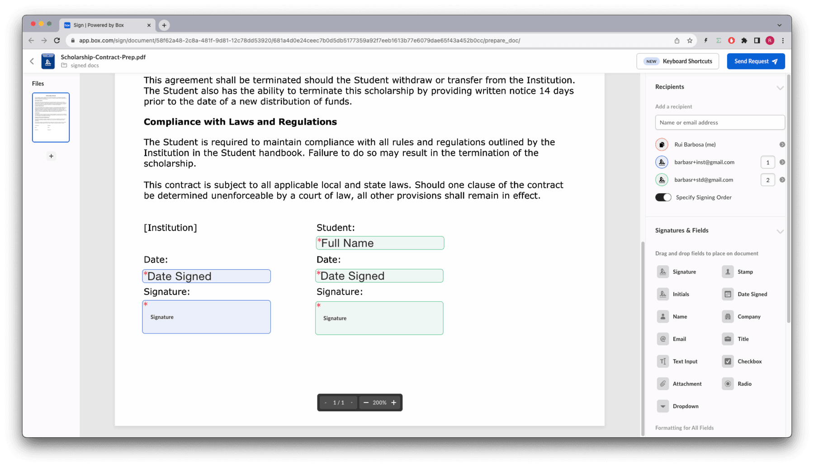

# Multiple signers and roles

## Multiple signers

What if you have a document that needs to be signed by multiple people? This is
typical of contracts between two or more entities.

Having multiple signers introduces another dimension to the sign process, the
order in which the signers need to sign the document.

If you do not specify the order, the request is sent to everyone at the same
time, and when all parties signed the document, they receive a copy with all
signatures.

If you specify the order, the send request is sent to the first signer, and
only when the first signer signs the document, the request is sent to the
second signer, and so on.

Let’s see this working with an example contract between an university and a
student for a scholarship. In this case the institution/teacher must sign the
document first.

Let create a method specific for this:

<Tabs>

<Tab title='cURL'>

```bash

curl --location 'https://api.box.com/2.0/sign_requests' \
--header 'Content-Type: application/json' \
--header 'Authorization: Bearer ej...3t'
--data-raw '{
    "is_document_preparation_needed": true,
    "parent_folder": {
        "id": "234102987614",
        "type": "folder"
    },
    "source_files": [
        {
            "id": "1358047520478",
            "type": "file"
        }
    ],
    "signers": [
        {
            "email": "institution@example.com",
            "role": "signer",
            "order":1
        },
        {
            "email": "student@example.com",
            "role": "signer",
            "order":2
        },
    ]
}'
    
```

</Tab>

<Tab title='Python Gen SDK'>

```python

def sign_contract(
    client: Client,
    document_id: str,
    destination_folder_id: str,
    institution_email: str,
    student_email: str,
    prep_needed: bool = False,
) -> SignRequest:
    """Sign contract"""

    # Sign request params
    source_file = FileBase(id=document_id, type=FileBaseTypeField.FILE)
    destination_folder = FolderMini(
        id=destination_folder_id, type=FolderBaseTypeField.FOLDER
    )

    # signers
    institution = SignRequestCreateSigner(
        email=institution_email,
        role=SignRequestCreateSignerRoleField.SIGNER,
        order=1,
    )

    student = SignRequestCreateSigner(
        email=student_email,
        role=SignRequestCreateSignerRoleField.SIGNER,
        order=2,
    )

    # create sign request
    sign_request = client.sign_requests.create_sign_request(
        signers=[institution, student],
        parent_folder=destination_folder,
        source_files=[source_file],
        is_document_preparation_needed=prep_needed,
    )

    return sign_request

def main():
    ...

    # Multiple signers
    sign_contract_multi = sign_contract(
        client,
        CONTRACT,
        SIGN_DOCS_FOLDER,
        institution_email=SIGNER_A,
        student_email=SIGNER_B,
        prep_needed=True,
    )
    if sign_contract_multi.prepare_url is not None:
        open_browser(sign_contract_multi.prepare_url)    

```

</Tab>

</Tabs>

In this particular example the document needs to be prepared, so we open the
browser to the prepare URL.

Drag the signature pad, the full name and the date to the appropriate places in
the document, and click Send Request:



Notice you now have two signers, with the order already specified. The `color`
is also important to identify which signer is which (in this case the
institution is blue and the student is green), determining which signature pad,
name and date belongs to which signer.

If you look at the signature request details, you should see something like
this:


Indicating that the first request was sent, but the second is waiting for the
first to be completed.

Go ahead and complete the sign process for both signers.

Notice that when you get the second request it is already signed by the first
signer.

## Roles

So far we have been working with the `signer` role. However there are other
roles that you can use to customize the sign process.

The available roles are, `signer`, `approver`, and `final copy reader`

From a developer perspective, this means:

- **Signer**: Any person who is allowed to add data to the document. This
includes adding a signature, initials, date, but also filling out text fields,
check boxes, and radio buttons, even if it does not include a signature.

- **Approver**: This role will be asked if they approve the signature request.
This approval happens before the preparation step, if enabled, and before the
request is sent to any of the signers. This role is useful if you need to get
approval from someone before sending the document to the signers.

- **Final copy reader**: This role does not interact with the signature
process, but will receive a copy of the signed document.

By using roles, we can be a bit more creative in our scholarship example.

Imagine that the scholarship needs to be approved by the dean and the legal
department receives a final copy of the contract.

Lets create a method for this:

<Tabs>

<Tab title='cURL'>

```bash

curl --location 'https://api.box.com/2.0/sign_requests' \
--header 'Content-Type: application/json' \
--header 'Authorization: Bearer ej...3t'
--data-raw '{
    "is_document_preparation_needed": true,
    "parent_folder": {
        "id": "234102987614",
        "type": "folder"
    },
    "source_files": [
        {
            "id": "1358047520478",
            "type": "file"
        }
    ],
    "signers": [
        {
            "email": "institution@example.com",
            "role": "signer",
            "order":1
        },
        {
            "email": "student@example.com",
            "role": "signer",
            "order":2
        },
        {
            "email": "dean@example.com",
            "role": "approver"
        },
        {
            "email": "legal@example.com",
            "role": "final_copy_reader"
        }
    ]
}'
    
```

</Tab>

<Tab title='Python Gen SDK'>

```python

def sign_contract_step(
    client: Client,
    document_id: str,
    destination_folder_id: str,
    institution_email: str,
    student_email: str,
    dean_email: str,
    legal_email: str,
) -> SignRequest:
    """Sign contract"""

    # Sign request params
    source_file = FileBase(id=document_id, type=FileBaseTypeField.FILE)
    destination_folder = FolderMini(
        id=destination_folder_id, type=FolderBaseTypeField.FOLDER
    )

    # signers
    institution = SignRequestCreateSigner(
        email=institution_email,
        role=SignRequestCreateSignerRoleField.SIGNER,
        order=1,
    )

    student = SignRequestCreateSigner(
        email=student_email,
        role=SignRequestCreateSignerRoleField.SIGNER,
        order=2,
    )

    dean = SignRequestCreateSigner(
        email=dean_email,
        role=SignRequestCreateSignerRoleField.APPROVER,
    )

    legal = SignRequestCreateSigner(
        email=legal_email,
        role=SignRequestCreateSignerRoleField.FINAL_COPY_READER,
    )

    # create sign request
    sign_request = client.sign_requests.create_sign_request(
        signers=[institution, student, dean, legal],
        parent_folder=destination_folder,
        source_files=[source_file],
        is_document_preparation_needed=True,
    )

    return sign_request

def main():
    ...
    
    # Multiple signers and steps
    sign_contract_multi_step = sign_contract_step(
        client,
        CONTRACT,
        SIGN_DOCS_FOLDER,
        institution_email=SIGNER_A,
        student_email=SIGNER_B,
        dean_email=APPROVER,
        legal_email=FINAL_COPY,
    )
    if sign_contract_multi_step.prepare_url is not None:
        open_browser(sign_contract_multi_step.prepare_url)

```

</Tab>

</Tabs>

Like before we need to prepare the document, so open the prepare URL in your
browser.

Notice in the example the institution is represented by blue in the
left, and the student by green on the right, both are signers

Neither the `approver` nor the `final copy reader` can have inputs associated
with them. If you do this, their roles will be adjusted to `signer`:


Continuing the sign process:

- First the dean approves the scholarship
- Next the institution signs the scholarship
- Next the student signs the scholarship
- Finally the legal department receives a copy of the signed document.

<Next>

Extra security

</Next>