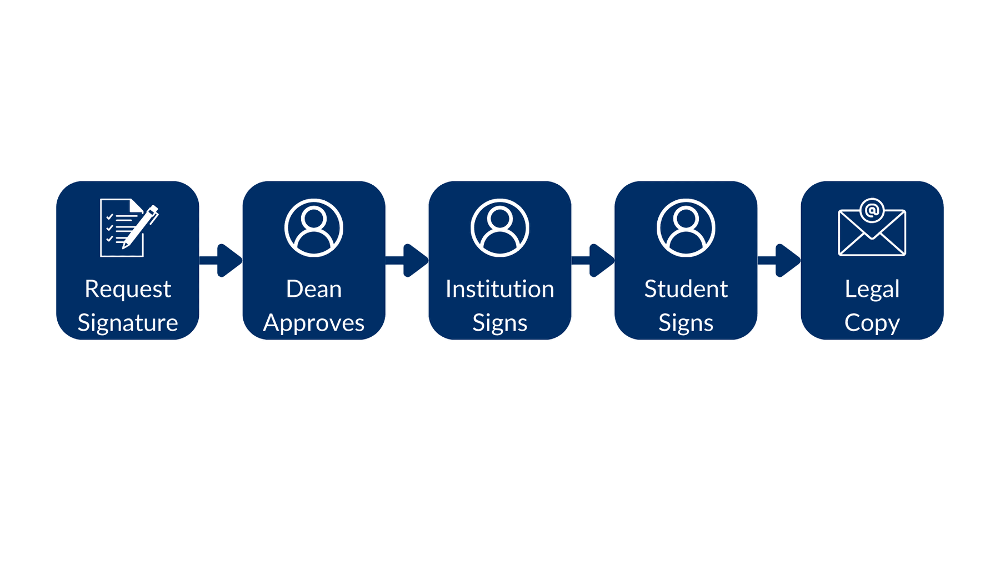
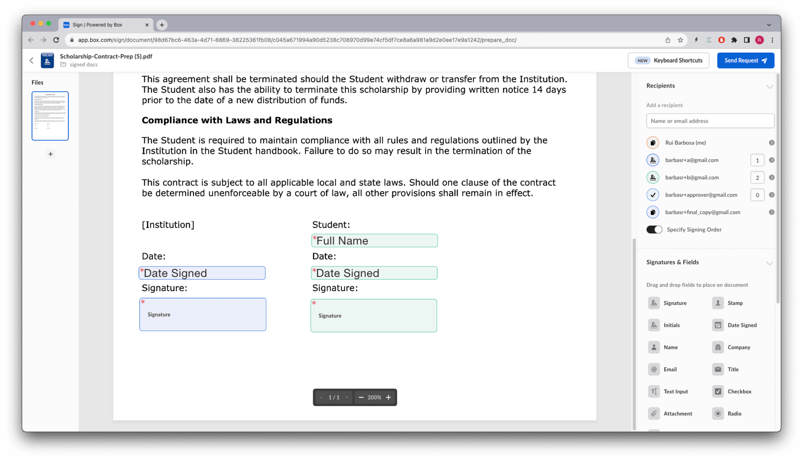

# 複数の署名者と役割

## 複数の署名者

複数の人に署名してもらう必要があるドキュメントがある場合はどうなるでしょうか。これは、2つ以上の事業体の間で結ばれる契約でよく見られます。

複数の署名者を設定すると、Box Signのプロセスには、署名者がドキュメントに署名する順序という別の要素が導入されます。

順序を指定しない場合、リクエストは全員に同時に送信されます。さらに、関係者全員がドキュメントへの署名を完了すると、各関係者は、すべての署名を含むコピーを受け取ります。

署名の順序を指定すると、署名リクエストは最初の署名者に送信されます。最初の署名者がドキュメントに署名した場合にのみ、このリクエストは2番目の署名者に送信されます (それ以降も同様)。

大学と学生の間で交わされる奨学金の契約の例を使用してこの仕組みを見てみましょう。この場合は、教育機関/教員が最初にドキュメントに署名する必要があります。

このためのメソッドを作成します。

<Tabs>

<Tab title="cURL">

```curl
curl --location 'https://api.box.com/2.0/sign_requests' \
    --header 'Content-Type: application/json' \
    --header 'Authorization: Bearer ej...3t' \
    --data-raw '{
      "is_document_preparation_needed": true,
      "parent_folder": {
        "id": "234102987614",
        "type": "folder"
      },
      "source_files": [
        {
          "id": "1358047520478",
          "type": "file"
        }
      ],
      "signers": [
        {
          "email": "institution@example.com",
          "role": "signer",
          "order": 1
        },
        {
          "email": "student@example.com",
          "role": "signer",
          "order": 2
        },
      ]
    }'

```

</Tab>

<Tab title="Pythonの次世代SDK">

```python
def sign_contract(
    client: Client,
    document_id: str,
    destination_folder_id: str,
    institution_email: str,
    student_email: str,
    prep_needed: bool = False,
) -> SignRequest:
    """Sign contract"""

    # Sign request params
    source_file = FileBase(id=document_id, type=FileBaseTypeField.FILE)
    destination_folder = FolderMini(
        id=destination_folder_id, type=FolderBaseTypeField.FOLDER
    )

    # signers
    institution = SignRequestCreateSigner(
        email=institution_email,
        role=SignRequestCreateSignerRoleField.SIGNER,
        order=1,
    )

    student = SignRequestCreateSigner(
        email=student_email,
        role=SignRequestCreateSignerRoleField.SIGNER,
        order=2,
    )

    # create sign request
    sign_request = client.sign_requests.create_sign_request(
        signers=[institution, student],
        parent_folder=destination_folder,
        source_files=[source_file],
        is_document_preparation_needed=prep_needed,
    )

    return sign_request

def main():
    ...

    # Multiple signers
    sign_contract_multi = sign_contract(
        client,
        CONTRACT,
        SIGN_DOCS_FOLDER,
        institution_email=SIGNER_A,
        student_email=SIGNER_B,
        prep_needed=True,
    )
    if sign_contract_multi.prepare_url is not None:
        open_browser(sign_contract_multi.prepare_url)

```

</Tab>

</Tabs>

この例では、ドキュメントを準備する必要があるため、ブラウザで準備のURLを開きます。

署名パッド、フルネーム、日付をドキュメント内の適切な場所にドラッグし、\[リクエストの送信] をクリックします。


この時点で2人の署名者が設定され、順序もすでに指定されていることに注目してください。また、`color`は署名者を識別するために重要で (この場合、教育機関は青、教員は緑)、どの署名者にどの署名パッド、名前、日付が属しているかを特定します。

署名リクエストの詳細を確認すると、次のように表示されます。


最初のリクエストは送信済みですが、2番目のリクエストは最初のリクエストが完了するのを待っていることを示します。

先に進み、両方の署名者の署名プロセスを完了します。

2番目のリクエストを受け取った時点で、すでに最初の署名者は署名済みであることに注意してください。

## ロール

ここまでは、役割として`signer`を使用してきましたが、署名プロセスのカスタマイズに使用できる[他の役割][roles]もあります。

使用可能な役割は、`signer`、`approver`、`final copy reader`です。

開発者の視点から見ると、これは以下を意味します。

* **signer (署名者)**: ドキュメントにデータを追加できる人。これには、署名、イニシャル、日付の追加だけでなく、署名が含まれていなくても、テキストフィールド、チェックボックス、ラジオボタンへの入力も含まれます。

* **approver (承認者)**: この役割は、署名リクエストを承認するかどうかを尋ねられます。この承認は、準備手順の前 (有効な場合) およびリクエストが署名者に送信される前に行われます。この役割は、ドキュメントを署名者に送信する前に誰かから承認を得る必要がある場合に便利です。

* **final copy reader (最終的なコピー受信者)**: この役割は、署名プロセスには関与しませんが、署名済みドキュメントのコピーを受け取ります。

役割を使用して、この奨学金の例ではもう少し工夫してみましょう。

奨学金は学部長による承認が必要であることと、法務部門が契約書の最終的なコピーを受け取ることを想像してみてください。

フローは署名リクエストで始まり、学部長による承認、教育機関による署名、学生による署名と続き、最後に、法務部門が署名済みドキュメントのコピーを受け取ります。



このためのメソッドを作成しましょう。

<Tabs>

<Tab title="cURL">

```curl
curl --location 'https://api.box.com/2.0/sign_requests' \
    --header 'Content-Type: application/json' \
    --header 'Authorization: Bearer ej...3t' \
    --data-raw '{
      "is_document_preparation_needed": true,
      "parent_folder": {
        "id": "234102987614",
        "type": "folder"
      },
      "source_files": [
        {
          "id": "1358047520478",
          "type": "file"
        }
      ],
      "signers": [
        {
          "email": "institution@example.com",
          "role": "signer",
          "order": 1
        },
        {
          "email": "student@example.com",
          "role": "signer",
          "order": 2
        },
        {
          "email": "dean@example.com",
          "role": "approver"
        },
        {
          "email": "legal@example.com",
          "role": "final_copy_reader"
        }
      ]
    }'

```

</Tab>

<Tab title="Pythonの次世代SDK">

```python
def sign_contract_step(
    client: Client,
    document_id: str,
    destination_folder_id: str,
    institution_email: str,
    student_email: str,
    dean_email: str,
    legal_email: str,
) -> SignRequest:
    """Sign contract"""

    # Sign request params
    source_file = FileBase(id=document_id, type=FileBaseTypeField.FILE)
    destination_folder = FolderMini(
        id=destination_folder_id, type=FolderBaseTypeField.FOLDER
    )

    # signers
    institution = SignRequestCreateSigner(
        email=institution_email,
        role=SignRequestCreateSignerRoleField.SIGNER,
        order=1,
    )

    student = SignRequestCreateSigner(
        email=student_email,
        role=SignRequestCreateSignerRoleField.SIGNER,
        order=2,
    )

    dean = SignRequestCreateSigner(
        email=dean_email,
        role=SignRequestCreateSignerRoleField.APPROVER,
    )

    legal = SignRequestCreateSigner(
        email=legal_email,
        role=SignRequestCreateSignerRoleField.FINAL_COPY_READER,
    )

    # create sign request
    sign_request = client.sign_requests.create_sign_request(
        signers=[institution, student, dean, legal],
        parent_folder=destination_folder,
        source_files=[source_file],
        is_document_preparation_needed=True,
    )

    return sign_request

def main():
    ...

    # Multiple signers and steps
    sign_contract_multi_step = sign_contract_step(
        client,
        CONTRACT,
        SIGN_DOCS_FOLDER,
        institution_email=SIGNER_A,
        student_email=SIGNER_B,
        dean_email=APPROVER,
        legal_email=FINAL_COPY,
    )
    if sign_contract_multi_step.prepare_url is not None:
        open_browser(sign_contract_multi_step.prepare_url)

```

</Tab>

</Tabs>

先ほどと同様、ドキュメントを準備する必要があるため、ブラウザで準備のURLを開きます。

この例では、教育機関が左側に青で示され、学生が右側に緑で示されており、どちらも署名者であることに注目してください。

`approver`にも`final copy reader`にも入力データを関連付けることはできません。関連付けると、その役割は`signer`に変更されます。



署名プロセスを続行します。

* 学部長が奨学金を承認する
* 教育機関が奨学金に署名する
* 学生が奨学金に署名する
* 法務部門が署名済みドキュメントのコピーを受け取る

[roles]: https://support.box.com/hc/en-us/articles/4404105660947-Roles-for-signers
