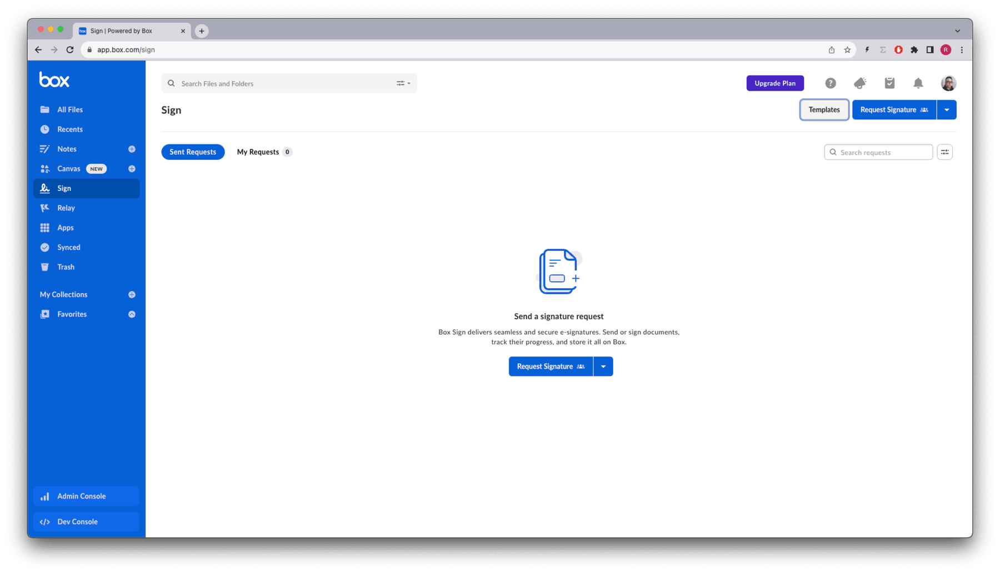
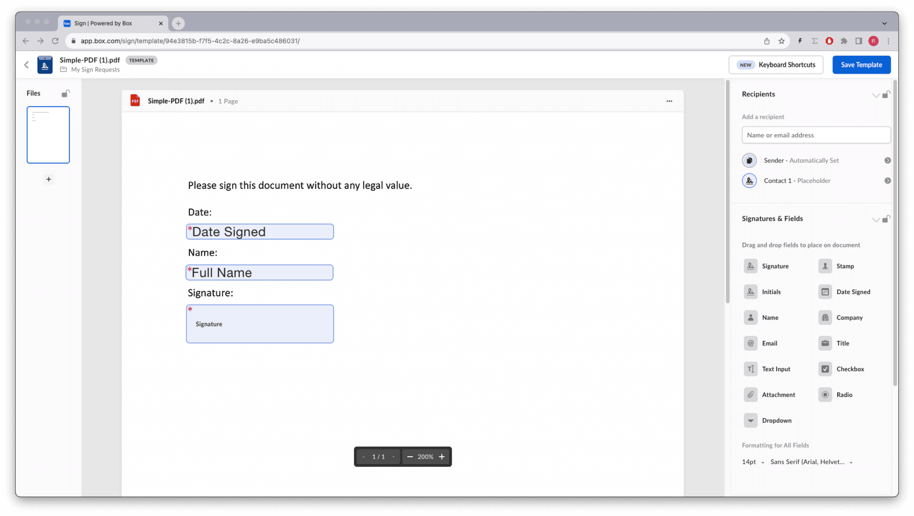
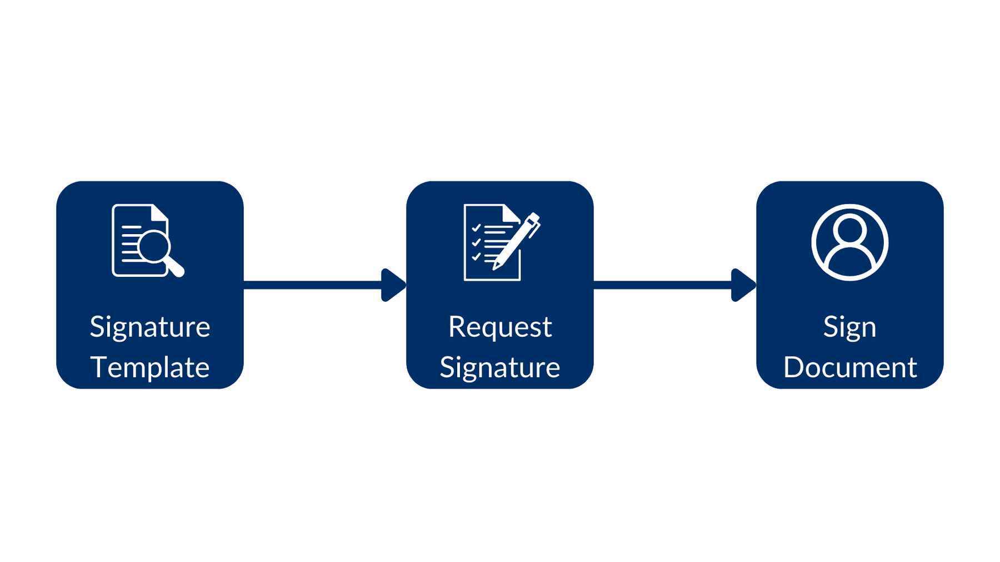
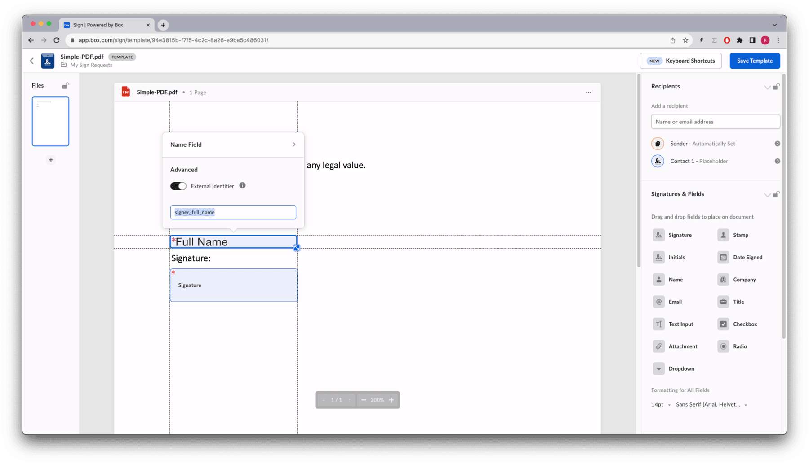

# Signing using templates

A [Box Sign template][template] is a specific type of document that not only
contains the text, but also the signature requirements and placement. It is
prepared for signing in advance, and as such can be sent directly to the signer
or signers.

Required fields include, for example, the signature pad field, the full name,
and the date.

These fields have an owner, meaning they are populated by a specific signer and
cannot be shared between them. They can be `mandatory` or `optional` , and be
pre-populated by your application. However even if pre-populated, they can
always be changed by the `signer`.

Within the Box web app, the template not only sets the signature fields, but
also the number of signers, the order in which they sign, other roles and
recipients such as `approver`, and `final_copy_recipient`, email notification
settings, and a few more options.

For a complete set of options of the signature request please refer to the
[request options][request-options] section.

These templates are exclusively created and managed in the Box Sign web app,
and can be used to create signature requests using the API or the web app.

Let's start by creating a template.

## Creating a template

From the Box app navigate to the sign menu on the left, then select templates.



Then, click on the New Template button, and choose or upload the document from
Box.


For example, drag and drop a date, a name and a signature pad to the template,
like so:



<Message type='notice'>

You can add an [extra layer of security][additional-sec] for a recipient.
It works for both a defined recipient with a pre-defined email address, and a
placeholder recipient, where the template user has to provide their email
address.

</Message>

Save the template.

## Identify the template

In order to work with templates in the Box Sign API we are going to need the
`template_id` . Consider this method to list all the templates available to the user:

<Tabs>

<Tab title='cURL'>

```curl
curl --location 'https://api.box.com/2.0/sign_templates' \
    --header 'Authorization: Bearer E9...Q0'
```

</Tab>

<Tab title='Python Gen SDK'>

```python
def sign_templates_list(client: Client):
    """List all sign templates"""
    sign_templates = client.sign_templates.get_sign_templates()
    print(f"\nSign templates: {len(sign_templates.entries)}")
    for sign_template in sign_templates.entries:
        print(f"  {sign_template.id} - {sign_template.name}")

def main():
    """Simple script to demonstrate how to use the Box SDK"""
    conf = ConfigOAuth()
    client = get_client_oauth(conf)

    user = client.users.get_user_me()
    print(f"\nHello, I'm {user.name} ({user.login}) [{user.id}]")

    sign_templates_list(client)
```

</Tab>

</Tabs>

Returns something similar to (simplified):

<Tabs>

<Tab title='cURL'>

```json
{
  "limit": 10,
  "next_marker": null,
  "prev_marker": null,
  "entries": [
    {
      "type": "sign-template",
      "id": "f2ec720d-47a6-4052-8210-9bfa8d6c349c",
      "name": "Simple-DOC.pdf",
      "parent_folder": {
        "id": "157064745449",
        "type": "folder",
        "name": "My Sign Requests"
      },
      "source_files": [
        {
          "id": "1393013714313",
          "type": "file",
        }
      ],
      "signers": [
        {
          "email": "",
          "label": "",
          "role": "final_copy_reader",
          "inputs": []
        },
        {
          "email": "",
          "label": "Signer",
          "role": "signer",
          "inputs": [
            {
              "document_tag_id": null,
              "id": "d02c8e16-5050-475e-b74b-9a952193e4f8",
              "type": "date",
              "date_value": null,
              "content_type": "date",
            },
            {
              "document_tag_id": null,
              "id": "bdcc966e-2ebf-4b3b-aaee-99d4e1161a9e",
              "type": "text",
              "text_value": null,
              "is_required": true,
              "content_type": "full_name",
            },
            {
              "document_tag_id": null,
              "id": "1a8f4cb1-5c09-46bd-96f5-0ab449f19640",
              "type": "signature",
              "text_value": null,
              "is_required": true,
              "content_type": "signature",
            }
          ]
        }
      ],
    }
  ]
}
```

</Tab>

<Tab title='Python Gen SDK'>

```yaml
Hello, I'm Rui Barbosa [18622116055]

Sign templates: 1
  94e3815b-f7f5-4c2c-8a26-e9ba5c486031 - Simple-PDF.pdf
```

</Tab>

</Tabs>

## Creating a signature request from a template

The big advantage of using templates is that we do not need to worry about
document preparation. Most of the signature options can be set in the
template itself.

This is how the flow would look like:


Using a signature template, create the signature request, and finally sign the
document.

See this example:

<Tabs>

<Tab title='cURL'>

```curl
curl --location 'https://api.box.com/2.0/sign_requests' \
    --header 'Content-Type: application/json' \
    --header 'Authorization: Bearer E9...Q0' \
    --data-raw '{
      "template_id": "f2ec720d-47a6-4052-8210-9bfa8d6c349c",
      "parent_folder": {
        "id": "234102987614",
        "type": "folder"
      },
      "signers": [
        {
          "email": "signer@example.com",
          "role": "signer"
        }
      ]
    }'
```

</Tab>

<Tab title='Python Gen SDK'>

```python
def create_sign_request(client: Client, template_id: str, signer_email: str):
    """Create sign request from template"""
    parent_folder = FolderMini(
        id=SIGN_DOCS_FOLDER, type=FolderBaseTypeField.FOLDER
    )

    signer = SignRequestCreateSigner(
        email=signer_email,
    )

    sign_request = client.sign_requests.create_sign_request(
        signers=[signer],
        parent_folder=parent_folder,
        template_id=template_id,
    )

    return sign_request

def main():
    ...

    # Create sign request from template
    sign_request = create_sign_request(client, TEMPLATE_SIMPLE, SIGNER_A)
    check_sign_request(sign_request)
```

</Tab>

</Tabs>

Resulting in (simplified):

<Tabs>

<Tab title='cURL'>

```json
{
  "signers": [
    {
      "email": "sender@example.com",
      "role": "final_copy_reader",
    },
    {
      "email": "signer@example.com",
      "role": "signer",
    }
  ],
  "id": "71e86670-5850-44cc-8b4d-9f5eab6c04de",
  "parent_folder": {
    "id": "234102987614",
    "type": "folder",
    "name": "signed docs"
  },
  "name": "Simple-DOC (1).pdf",
  "type": "sign-request",
  "status": "created",
  "sign_files": {
    "files": [
      {
        "id": "1393030489686",
        "type": "file",
        "name": "Simple-DOC (1).pdf",
      }
    ],
  },
  "template_id": "f2ec720d-47a6-4052-8210-9bfa8d6c349c"
}
```

</Tab>

<Tab title='Python Gen SDK'>

```yaml
Simple sign request: b25674a2-540b-4201-ae18-a78f05ef1a9a
  Status: created
  Signers: 2
    final_copy_reader: sender@example.com
    signer: signer@example.com
  Prepare url: None
```

</Tab>

</Tabs>

The signer receives an email from Box.com with a link to the document, and
can sign it.

<Message size='small'>

Since the template already had the signature requirements, document
preparation was not needed. Notice the date was automatically populated with
the current date.

</Message>

## Pre-populate the signature attributes

From a usability perspective, it is a good idea to pre-populate the inputs you
require from your users.

<Message size='small'>

Some inputs may be intentionally left unpopulated. For example, when your legal
department specifies that the “Yes, I agree” field must be explicitly set by
the signer.

</Message>

Using the Box app sign template editor, you can assign an `external_id` to each
of the inputs, and have the app populate them from any data source.

Let’s implement this for the name.

Go back to the template design and add an id to the name field:



Save the template.

Let’s create a new method to pre-populate the name:

<Tabs>

<Tab title='cURL'>

```curl
curl --location 'https://api.box.com/2.0/sign_requests' \
    --header 'Content-Type: application/json' \
    --header 'Authorization: Bearer E9..Q0' \
    --data-raw '{
      "template_id": "f2ec720d-47a6-4052-8210-9bfa8d6c349c",
      "parent_folder": {
        "id": "234102987614",
        "type": "folder"
      },
      "signers": [
        {
          "email": "signer@example.com",
          "role": "signer"
        }
      ],
      "prefill_tags": [
        {
          "document_tag_id": "signer_full_name",
          "text_value": "Signer A"
        }
      ]
    }'
```

</Tab>

<Tab title='Python Gen SDK'>

```python
def create_sign_request_name_default(
    client: Client, template_id: str, signer_name, signer_email: str
):
    """Create sign request from template"""
    parent_folder = FolderMini(
        id=SIGN_DOCS_FOLDER, type=FolderBaseTypeField.FOLDER
    )

    signer = SignRequestCreateSigner(
        email=signer_email,
    )

    # tags
    tag_full_name = SignRequestPrefillTag(
        document_tag_id="signer_full_name",
        text_value=signer_name,
    )

    sign_request = client.sign_requests.create_sign_request(
        signers=[signer],
        parent_folder=parent_folder,
        prefill_tags=[tag_full_name],
        template_id=template_id,
    )

    return sign_request

def main():
    ...

    # Create sign request from template with name
    sign_request_name = create_sign_request_name_default(
        client, TEMPLATE_SIMPLE, "Signer A", SIGNER_A
    )
    check_sign_request(sign_request_name)
```

Resulting in (simplified):

</Tab>

</Tabs>

<Tabs>

<Tab title='cURL'>

```json
{
  "signers": [
    {
      "email": "sender@example.com",
      "role": "final_copy_reader",
    },
    {
      "email": "signer@example.com",
      "role": "signer",
      "is_in_person": false,
    }
  ],
  "id": "6f42a041-7ed8-4e08-9958-78a97259f80d",
  "prefill_tags": [
    {
      "document_tag_id": "signer_full_name",
      "text_value": "Signer A",
    }
  ],
  "parent_folder": {
    "id": "234102987614",
    "type": "folder",
    "name": "signed docs"
  },
  "name": "Simple-DOC (2).pdf",
  "type": "sign-request",
  "status": "created",
  "sign_files": {
    "files": [
      {
        "id": "1393047116817",
        "type": "file",
        "name": "Simple-DOC (2).pdf",
      }
    ],
  },
  "template_id": "f2ec720d-47a6-4052-8210-9bfa8d6c349c"
}
```

</Tab>

<Tab title='Python Gen SDK'>

```yaml
Simple sign request: adab1740-eeba-4392-a3f5-defddc79c946
  Status: created
  Signers: 2
    final_copy_reader: sender@example.com
    signer: signer@example.com
  Prepare url: None
```

</Tab>

</Tabs>

Open the signer inbox and complete the sign request.


When the signer views the document, the `signer` can still change it.

## Get more information about a template

You've seen that you can list the templates available to a user. But you can
also get more information about a specific template.

Let’s create a method that returns basic information of a template, but details
all the signature requirements:

<Tabs>

<Tab title='cURL'>

```curl
curl --location 'https://api.box.com/2.0/sign_templates/
f2ec720d-47a6-4052-8210-9bfa8d6c349c' \
    --header 'Authorization: Bearer OL..BQ'
```

</Tab>

<Tab title='Python Gen SDK'>

```python
def sign_template_print_info(client: Client, template_id: str):
    sign_template = client.sign_templates.get_sign_template_by_id(template_id)
    print(f"\nSign template: {sign_template.id} - {sign_template.name}")
    print(f"  Signers: {len(sign_template.signers)}")
    for signer in sign_template.signers:
        print(f"    {signer.role.value}")
        if len(signer.inputs) > 0:
            print("      Tag ID\t Type\t Required")
        for input in signer.inputs:
            print(
                f"      {input.document_tag_id} {input.type.value} {input.is_required}"
            )

def main():
    ...

    # Print sign template details
    sign_template_print_info(client, TEMPLATE_SIMPLE)
```

Resulting in (simplified):

</Tab>

</Tabs>

<Tabs>

<Tab title='cURL'>

```json
{
  "type": "sign-template",
  "id": "f2ec720d-47a6-4052-8210-9bfa8d6c349c",
  "name": "Simple-DOC.pdf",
  "parent_folder": {
    "id": "234102987614",
    "type": "folder",
    "name": "signed docs"
  },
  "source_files": [
    {
      "id": "1393013714313",
      "type": "file",
    }
  ],
  "signers": [
    {
      "email": "",
      "label": "",
      "role": "final_copy_reader",
    },
    {
      "email": "",
      "label": "Signer",
      "role": "signer",
      "inputs": [
        {
          "document_tag_id": null,
          "id": "d02c8e16-5050-475e-b74b-9a952193e4f8",
          "type": "date",
          "is_required": true,
          "date_value": null,
          "content_type": "date",
        },
        {
          "document_tag_id": "signer_full_name",
          "id": "bdcc966e-2ebf-4b3b-aaee-99d4e1161a9e",
          "type": "text",
          "text_value": null,
          "is_required": true,
          "content_type": "full_name",
        },
        {
          "document_tag_id": null,
          "id": "1a8f4cb1-5c09-46bd-96f5-0ab449f19640",
          "type": "signature",
          "is_required": true,
          "content_type": "signature",
        }
      ]
    }
  ],
}
```

</Tab>

<Tab title='Python Gen SDK'>

```yaml
Sign template: 94e3815b-f7f5-4c2c-8a26-e9ba5c486031 - Simple-PDF.pdf
  Signers: 2
    final_copy_reader
    signer
      Tag ID            Type      Required
      None              date      True
      signer_full_name  text      True
      None              signature True
```

</Tab>

</Tabs>

<Message size='small'>

Notice that the `signer_full_name` is the `tag_id` we used to pre-populate the
name.

</Message>

## Summary

Templates are a form of signing structured documents where the signature
requirements are already defined and placed on the document.

This not only keeps your contract management team happy, but it also creates a
process which is consistent and requires a low level of effort from your users.

Finally if your document signature requirements have a lot of options, you can
pre-populate these from another data source and save the user some time.
Remember that the user who owns these properties can always change them.

There is no API entry point to create a template, so you will have to create
and manage them manually from the Box app, unless the document already includes
signature tags that can be used by the Box Sign engine. Take a look at our
[Structured Docs][structured-docs] section for more information.

[template]: https://support.box.com/hc/en-us/sections/21356768117651-Templates
[request-options]: page://sign/request-options
[structured-docs]: page://sign/technical-use-cases/sign-structured-docs
[additional-sec]: page://sign/request-options/extra-security