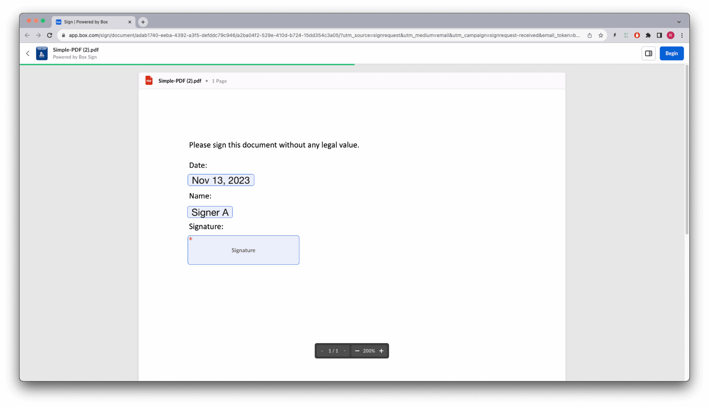

# テンプレートを使用した署名

[Box Signテンプレート][template]は、テキストだけでなく、署名の要件や配置も含む特定の種類のドキュメントです。これは署名用に事前に準備されているため、署名者 (複数可) に直接送信できます。

必須フィールドには、署名パッド、フルネーム、日付などがあります。

これらのフィールドには1人の所有者が設定されています。つまり、フィールドは特定の署名者が入力し、署名者間で共有することはできません。これらは、`mandatory`または`optional`にすることができるほか、アプリケーションによって事前入力することもできます。ただし、事前に入力されている場合でも、`signer`がいつでも変更できます。

Boxウェブアプリ内では、テンプレートによって、署名フィールドだけでなく、署名者の数、署名の順序、他の役割と受信者 (`approver`や`final_copy_recipient`など)、メール通知の設定、その他いくつかのオプションも設定されます。

署名リクエストのオプションの詳細については、[リクエストのオプション][request-options]セクションを参照してください。

これらのテンプレートは、Box Signウェブアプリでのみ作成および管理され、APIまたはウェブアプリを使用して署名リクエストを作成する際に使用できます。

最初に、テンプレートを作成しましょう。

## テンプレートの作成

Boxアプリで、左側の \[Sign] メニューに移動し、\[テンプレート] を選択します。

![Box Signで \[テンプレート\] に移動する](images/sign-template-navigate.png)

次に、\[新しいテンプレート] ボタンをクリックし、Boxからドキュメントを選択またはアップロードします。


次のように、日付、名前、署名パッドをテンプレートにドラッグアンドドロップします。


テンプレートを保存します。

## テンプレートの識別

Box Sign APIでテンプレートを使用するには、`template_id`が必要になります。ユーザーが利用できるすべてのテンプレートのリストを取得するための次のメソッドを考えてみます。

<Tabs>

<Tab title="cURL">

```curl
curl --location 'https://api.box.com/2.0/sign_templates' \
    --header 'Authorization: Bearer E9...Q0'

```

</Tab>

<Tab title="Pythonの次世代SDK">

```python
def sign_templates_list(client: Client):
    """List all sign templates"""
    sign_templates = client.sign_templates.get_sign_templates()
    print(f"\nSign templates: {len(sign_templates.entries)}")
    for sign_template in sign_templates.entries:
        print(f"  {sign_template.id} - {sign_template.name}")

def main():
    """Simple script to demonstrate how to use the Box SDK"""
    conf = ConfigOAuth()
    client = get_client_oauth(conf)

    user = client.users.get_user_me()
    print(f"\nHello, I'm {user.name} ({user.login}) [{user.id}]")

    sign_templates_list(client)

```

</Tab>

</Tabs>

次のような結果が返されます (簡略化されています)。

<Tabs>

<Tab title="cURL">

```json
{
  "limit": 10,
  "next_marker": null,
  "prev_marker": null,
  "entries": [
    {
      "type": "sign-template",
      "id": "f2ec720d-47a6-4052-8210-9bfa8d6c349c",
      "name": "Simple-DOC.pdf",
      "parent_folder": {
        "id": "157064745449",
        "type": "folder",
        "name": "My Sign Requests"
      },
      "source_files": [
        {
          "id": "1393013714313",
          "type": "file",
        }
      ],
      "signers": [
        {
          "email": "",
          "label": "",
          "role": "final_copy_reader",
          "inputs": []
        },
        {
          "email": "",
          "label": "Signer",
          "role": "signer",
          "inputs": [
            {
              "document_tag_id": null,
              "id": "d02c8e16-5050-475e-b74b-9a952193e4f8",
              "type": "date",
              "date_value": null,
              "content_type": "date",
            },
            {
              "document_tag_id": null,
              "id": "bdcc966e-2ebf-4b3b-aaee-99d4e1161a9e",
              "type": "text",
              "text_value": null,
              "is_required": true,
              "content_type": "full_name",
            },
            {
              "document_tag_id": null,
              "id": "1a8f4cb1-5c09-46bd-96f5-0ab449f19640",
              "type": "signature",
              "text_value": null,
              "is_required": true,
              "content_type": "signature",
            }
          ]
        }
      ],
    }
  ]
}

```

</Tab>

<Tab title="Pythonの次世代SDK">

```yaml
Hello, I'm Rui Barbosa [18622116055]

Sign templates: 1
  94e3815b-f7f5-4c2c-8a26-e9ba5c486031 - Simple-PDF.pdf

```

</Tab>

</Tabs>

## テンプレートからの署名リクエストの作成

テンプレートを使用する大きなメリットは、ドキュメントの準備について心配する必要がないことです。ほとんどの署名オプションはテンプレート自体で設定できます。

フローは次のようになります。


署名テンプレートを使って署名リクエストを作成し、最終的にドキュメントに署名します。

次の例を確認してください。

<Tabs>

<Tab title="cURL">

```curl
curl --location 'https://api.box.com/2.0/sign_requests' \
    --header 'Content-Type: application/json' \
    --header 'Authorization: Bearer E9...Q0' \
    --data-raw '{
      "template_id": "f2ec720d-47a6-4052-8210-9bfa8d6c349c",
      "parent_folder": {
        "id": "234102987614",
        "type": "folder"
      },
      "signers": [
        {
          "email": "signer@example.com",
          "role": "signer"
        }
      ]
    }'

```

</Tab>

<Tab title="Pythonの次世代SDK">

```python
def create_sign_request(client: Client, template_id: str, signer_email: str):
    """Create sign request from template"""
    parent_folder = FolderMini(
        id=SIGN_DOCS_FOLDER, type=FolderBaseTypeField.FOLDER
    )

    signer = SignRequestCreateSigner(
        email=signer_email,
    )

    sign_request = client.sign_requests.create_sign_request(
        signers=[signer],
        parent_folder=parent_folder,
        template_id=template_id,
    )

    return sign_request

def main():
    ...

    # Create sign request from template
    sign_request = create_sign_request(client, TEMPLATE_SIMPLE, SIGNER_A)
    check_sign_request(sign_request)

```

</Tab>

</Tabs>

結果は次のとおりです (簡略化されています)。

<Tabs>

<Tab title="cURL">

```json
{
  "signers": [
    {
      "email": "sender@example.com",
      "role": "final_copy_reader",
    },
    {
      "email": "signer@example.com",
      "role": "signer",
    }
  ],
  "id": "71e86670-5850-44cc-8b4d-9f5eab6c04de",
  "parent_folder": {
    "id": "234102987614",
    "type": "folder",
    "name": "signed docs"
  },
  "name": "Simple-DOC (1).pdf",
  "type": "sign-request",
  "status": "created",
  "sign_files": {
    "files": [
      {
        "id": "1393030489686",
        "type": "file",
        "name": "Simple-DOC (1).pdf",
      }
    ],
  },
  "template_id": "f2ec720d-47a6-4052-8210-9bfa8d6c349c"
}

```

</Tab>

<Tab title="Pythonの次世代SDK">

```yaml
Simple sign request: b25674a2-540b-4201-ae18-a78f05ef1a9a
  Status: created
  Signers: 2
    final_copy_reader: sender@example.com
    signer: signer@example.com
  Prepare url: None

```

</Tab>

</Tabs>

署名者は、ドキュメントへのリンクが記載されたメールをBox.comから受信すると、そのドキュメントに署名できます。

<Message size="small">

テンプレートにはすでに署名要件が設定されているため、ドキュメントの準備は必要ありませんでした。日付には現在の日付が自動的に入力されていることに注意してください。

</Message>

## 署名の属性の事前入力

使いやすさの観点から、ユーザーに求める入力データを事前入力することをお勧めします。

<Message size="small">

一部の入力データは意図的に入力されていない可能性があります。たとえば、法務部門では、署名者が明示的に「はい、同意します」と設定する必要があると規定している場合があります。

</Message>

BoxアプリのSignテンプレートエディタを使用すると、各入力データに`external_id`を割り当てて、アプリに任意のデータソースから入力データを入力させることができます。

これを名前に実装しましょう。

テンプレートのデザインに戻り、名前フィールドにIDを追加します。


テンプレートを保存します。

名前を事前入力する新しいメソッドを作成しましょう。

<Tabs>

<Tab title="cURL">

```curl
curl --location 'https://api.box.com/2.0/sign_requests' \
    --header 'Content-Type: application/json' \
    --header 'Authorization: Bearer E9..Q0' \
    --data-raw '{
      "template_id": "f2ec720d-47a6-4052-8210-9bfa8d6c349c",
      "parent_folder": {
        "id": "234102987614",
        "type": "folder"
      },
      "signers": [
        {
          "email": "signer@example.com",
          "role": "signer"
        }
      ],
      "prefill_tags": [
        {
          "document_tag_id": "signer_full_name",
          "text_value": "Signer A"
        }
      ]
    }'

```

</Tab>

<Tab title="Pythonの次世代SDK">

```python
def create_sign_request_name_default(
    client: Client, template_id: str, signer_name, signer_email: str
):
    """Create sign request from template"""
    parent_folder = FolderMini(
        id=SIGN_DOCS_FOLDER, type=FolderBaseTypeField.FOLDER
    )

    signer = SignRequestCreateSigner(
        email=signer_email,
    )

    # tags
    tag_full_name = SignRequestPrefillTag(
        document_tag_id="signer_full_name",
        text_value=signer_name,
    )

    sign_request = client.sign_requests.create_sign_request(
        signers=[signer],
        parent_folder=parent_folder,
        prefill_tags=[tag_full_name],
        template_id=template_id,
    )

    return sign_request

def main():
    ...

    # Create sign request from template with name
    sign_request_name = create_sign_request_name_default(
        client, TEMPLATE_SIMPLE, "Signer A", SIGNER_A
    )
    check_sign_request(sign_request_name)

```

結果は次のとおりです (簡略化されています)。

</Tab>

</Tabs>

<Tabs>

<Tab title="cURL">

```json
{
  "signers": [
    {
      "email": "sender@example.com",
      "role": "final_copy_reader",
    },
    {
      "email": "signer@example.com",
      "role": "signer",
      "is_in_person": false,
    }
  ],
  "id": "6f42a041-7ed8-4e08-9958-78a97259f80d",
  "prefill_tags": [
    {
      "document_tag_id": "signer_full_name",
      "text_value": "Signer A",
    }
  ],
  "parent_folder": {
    "id": "234102987614",
    "type": "folder",
    "name": "signed docs"
  },
  "name": "Simple-DOC (2).pdf",
  "type": "sign-request",
  "status": "created",
  "sign_files": {
    "files": [
      {
        "id": "1393047116817",
        "type": "file",
        "name": "Simple-DOC (2).pdf",
      }
    ],
  },
  "template_id": "f2ec720d-47a6-4052-8210-9bfa8d6c349c"
}

```

</Tab>

<Tab title="Pythonの次世代SDK">

```yaml
Simple sign request: adab1740-eeba-4392-a3f5-defddc79c946
  Status: created
  Signers: 2
    final_copy_reader: sender@example.com
    signer: signer@example.com
  Prepare url: None

```

</Tab>

</Tabs>

署名者の受信トレイを開き、署名リクエストを完了します。



`signer`は、ドキュメントを表示した際にその名前を変更できます。

## テンプレートに関する詳細情報の取得

ユーザーが利用できるテンプレートのリストを取得できることはわかりましたが、特定のテンプレートに関する詳細情報を取得することもできます。

テンプレートの基本情報を返すほか、署名要件をすべて列挙するメソッドを作成しましょう。

<Tabs>

<Tab title="cURL">

```curl
curl --location 'https://api.box.com/2.0/sign_templates/
f2ec720d-47a6-4052-8210-9bfa8d6c349c' \
    --header 'Authorization: Bearer OL..BQ'

```

</Tab>

<Tab title="Pythonの次世代SDK">

```python
def sign_template_print_info(client: Client, template_id: str):
    sign_template = client.sign_templates.get_sign_template_by_id(template_id)
    print(f"\nSign template: {sign_template.id} - {sign_template.name}")
    print(f"  Signers: {len(sign_template.signers)}")
    for signer in sign_template.signers:
        print(f"    {signer.role.value}")
        if len(signer.inputs) > 0:
            print("      Tag ID\t Type\t Required")
        for input in signer.inputs:
            print(
                f"      {input.document_tag_id} {input.type.value} {input.is_required}"
            )

def main():
    ...

    # Print sign template details
    sign_template_print_info(client, TEMPLATE_SIMPLE)

```

結果は次のとおりです (簡略化されています)。

</Tab>

</Tabs>

<Tabs>

<Tab title="cURL">

```json
{
  "type": "sign-template",
  "id": "f2ec720d-47a6-4052-8210-9bfa8d6c349c",
  "name": "Simple-DOC.pdf",
  "parent_folder": {
    "id": "234102987614",
    "type": "folder",
    "name": "signed docs"
  },
  "source_files": [
    {
      "id": "1393013714313",
      "type": "file",
    }
  ],
  "signers": [
    {
      "email": "",
      "label": "",
      "role": "final_copy_reader",
    },
    {
      "email": "",
      "label": "Signer",
      "role": "signer",
      "inputs": [
        {
          "document_tag_id": null,
          "id": "d02c8e16-5050-475e-b74b-9a952193e4f8",
          "type": "date",
          "is_required": true,
          "date_value": null,
          "content_type": "date",
        },
        {
          "document_tag_id": "signer_full_name",
          "id": "bdcc966e-2ebf-4b3b-aaee-99d4e1161a9e",
          "type": "text",
          "text_value": null,
          "is_required": true,
          "content_type": "full_name",
        },
        {
          "document_tag_id": null,
          "id": "1a8f4cb1-5c09-46bd-96f5-0ab449f19640",
          "type": "signature",
          "is_required": true,
          "content_type": "signature",
        }
      ]
    }
  ],
}

```

</Tab>

<Tab title="Pythonの次世代SDK">

```yaml
Sign template: 94e3815b-f7f5-4c2c-8a26-e9ba5c486031 - Simple-PDF.pdf
  Signers: 2
    final_copy_reader
    signer
      Tag ID            Type      Required
      None              date      True
      signer_full_name  text      True
      None              signature True

```

</Tab>

</Tabs>

<Message size="small">

`signer_full_name`は、名前を事前に入力するために使用した`tag_id`であることに注意してください。

</Message>

## まとめ

テンプレートは、署名用の構造化されたドキュメントの一種で、署名要件がすでに定義され、ドキュメントに配置されています。

これは、契約管理チームにとって便利なだけでなく、ユーザーの労力をあまり必要としない一貫性のあるプロセスを構築します。

さらに、ドキュメントの署名要件に多くのオプションがある場合は、別のデータソースからこれらを事前に入力して、ユーザーの時間を節約することができます。これらのプロパティを所有するユーザーはいつでもプロパティを変更できることを忘れないでください。

テンプレートを作成するためのAPIエントリポイントはないため、Box Signエンジンで使用できる署名タグがすでにドキュメントに含まれている場合を除き、Boxアプリから手動でテンプレートを作成して管理する必要があります。詳細については、[構造化されたドキュメント][structured-docs]のセクションを参照してください。

[template]: https://support.box.com/hc/en-us/sections/21356768117651-Templates

[request-options]: page://sign/request-options

[structured-docs]: page://sign/technical-use-cases/sign-structured-docs
