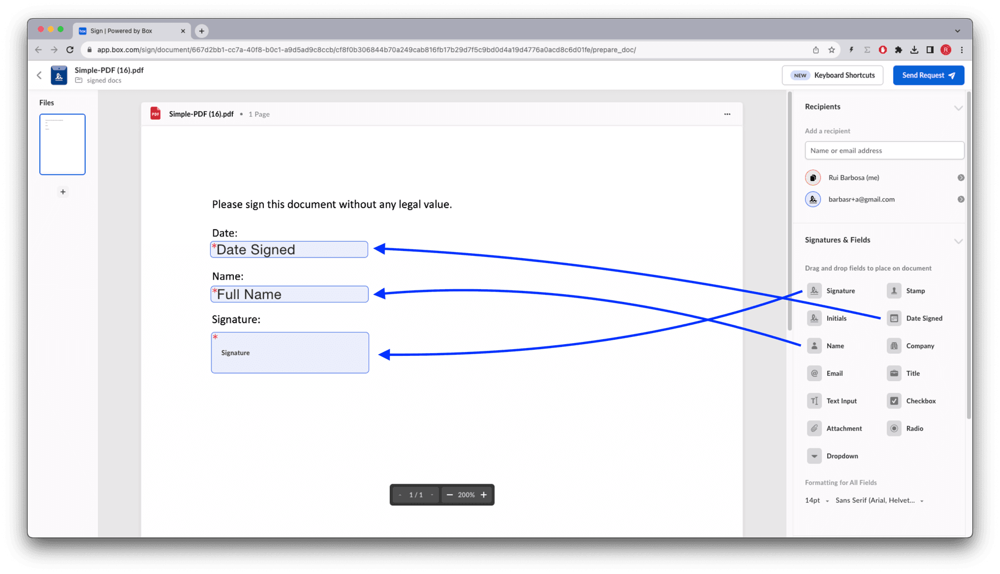
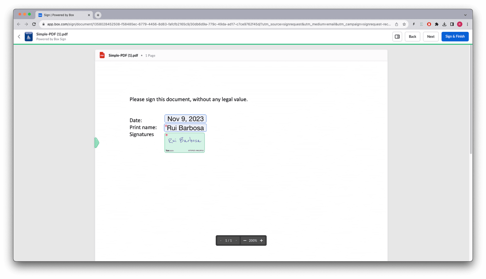

# 非構造化ドキュメントへの署名

ユーザーがドキュメントをアップロードし、誰にでもそのドキュメントへの署名を依頼できるドキュメント管理アプリを想像してみてください。この場合、アプリは、署名対象のドキュメントと署名する必要がある人を認識しますが、署名やそのプロパティ (名前、日付、イニシャルなど) を配置する場所は認識しません。

これは、[テンプレート][sign-templates]や[構造化されたドキュメント][sign-structured-docs]を使用する場合とは対照的です。これらを使用する場合、アプリは、署名プロパティの内容や場所を認識します。

このような場合、各ドキュメントに異なる構造を使用できるため、常に`is_document_preparation_needed`フラグを`true`に設定することをお勧めします。これにより、署名者がリクエストを受け取る前に、送信者は署名プロパティを選択してドキュメントに配置できるようになります。

このフローには、署名リクエストの作成、ドキュメントの準備、署名という3つのステップがあります。フローは次のようになります。


次の例を考えてみます。

<Tabs>

<Tab title="cURL">

```curl
curl --location 'https://api.box.com/2.0/sign_requests' \
    --header 'Content-Type: application/json' \
    --header 'Authorization: Bearer <access token>' \
    --data-raw '{
      "is_document_preparation_needed": true,
      "parent_folder": {
        "id": "234102987614",
        "type": "folder"
      },
      "source_files": [
        {
          "id": "1355143830404",
          "type": "file"
        }
      ],
      "signers": [
        {
          "email": "signer@example.com",
          "role": "signer"
        }
      ]
    }'

```

</Tab>

<Tab title="Pythonの次世代SDK">

```python
def sign_doc_single(
    client: Client,
    document_id: str,
    destination_folder_id: str,
    signer_email: str,
    prep_needed: bool = False,
) -> SignRequest:
    # Sign request params
    source_file = FileBase(id=document_id, type=FileBaseTypeField.FILE)
    destination_folder = FolderMini(
        id=destination_folder_id, type=FolderBaseTypeField.FOLDER
    )
    signer = SignRequestCreateSigner(signer_email)
    # sign document
    sign_request = client.sign_requests.create_sign_request(
        signers=[signer],
        parent_folder=destination_folder,
        source_files=[source_file],
        is_document_preparation_needed=prep_needed,
    )

    return sign_request

def main():
    conf = ConfigOAuth()
    client = get_client_oauth(conf)

    # Simple sign a pdf request with preparation
    sign_pdf_prep = sign_doc_single(
        client, SIMPLE_PDF, SIGN_DOCS_FOLDER, SIGNER_A, True
    )

    if sign_pdf_prep.prepare_url is not None:
        open_browser(sign_pdf_prep.prepare_url)

```

</Tab>

</Tabs>

これの結果、ドキュメント準備のURL (簡略化されています) を含む署名リクエストが作成されます。

<Tabs>

<Tab title="cURL">

```json
{
  "is_document_preparation_needed": true,
  "signers": [
    {
      "email": "requester@example.com",
      "role": "final_copy_reader",
    },
    {
      "email": "signer@example.com",
      "role": "signer",
    }
  ],
  "id": "348decab-48a8-4f2c-9436-8967afebf7bb",
  "prepare_url": "https://app.box.com/sign/document/xyz-abc-123/.../prepare_doc/",
  "source_files": [
    {
      "id": "1355143830404",
      "type": "file",
    }
  ],
  "parent_folder": {
    "id": "234102987614",
    "type": "folder",
  },
  "name": "Simple-PDF.pdf",
  "type": "sign-request",
  "status": "converting",
  "sign_files": {
    "files": [
      {
        "id": "1381301154812",
        "type": "file",
      }
    ],
    "is_ready_for_download": true
  },
  "template_id": null
}

```

</Tab>

<Tab title="Pythonの次世代SDK">

```yaml
Simple sign request with prep: xyz-abc-123
  Status: converting
  Signers: signer@example.com
Prepare url: https://app.box.com/sign/document/xyz-abc-123/.../prepare_doc/

```

</Tab>

</Tabs>

上記のスクリプトでは、ドキュメント準備のURLが署名リクエストによって生成された場合、アプリによってそのURLのためにブラウザが開くことに注意してください。その後、リクエスト送信者は、次のようにさまざまな署名プロパティを適用できます。



ドキュメントが準備できたら、リクエスト送信者は署名リクエストを署名者に送信できます。

Boxアプリに戻ると、ステータスが`In Progress`になっていることがわかります。


その後、署名リクエストへのリンクが記載されたメールがBoxから署名者に送信されます。



処理が完了すると、メタデータを含む署名ログと署名済みドキュメントの両方が保存先フォルダに格納されます。


[sign-templates]: page://sign/technical-use-cases/sign-template

[sign-structured-docs]: page://sign/technical-use-cases/sign-structured-docs
