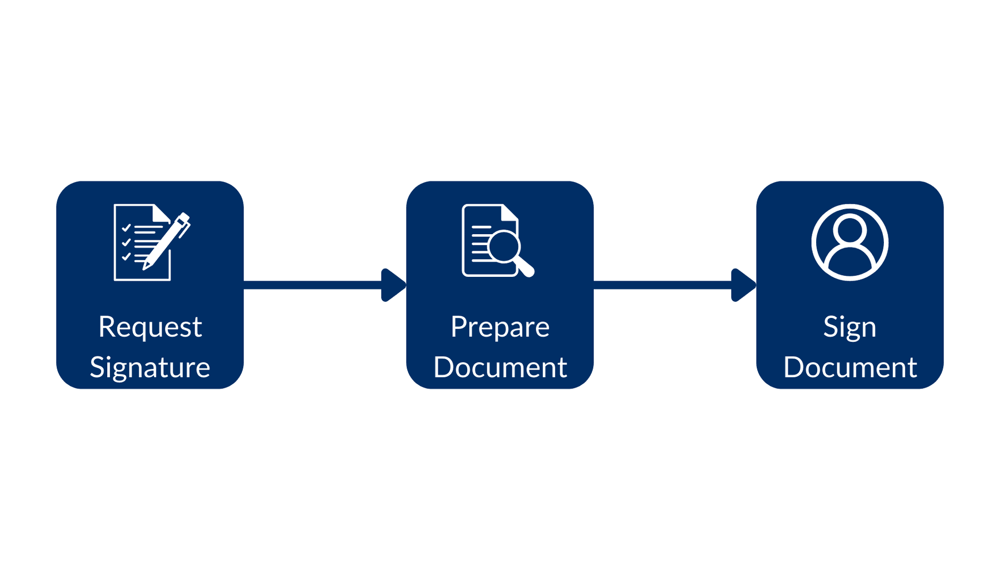
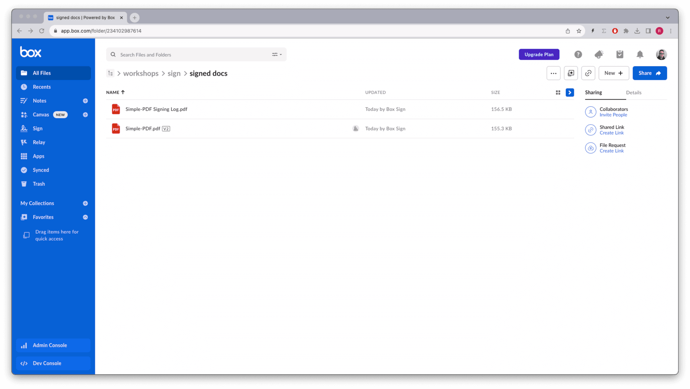

# Signing unstructured docs

Imagine a document management app, where users can upload a document and ask anyone to sign it. In this case your app will know what document to sign and who needs to sign, but it has no idea where to put the signature or its properties like name, date, initial, and so on.

This contrasts with [using templates][sign-templates] or [structured documents][structured documents] [sign-structured-docs][sign-structured-docs] where your app knows what they are, and where the signature properties go.

In these cases, and because each document can have a different structure, it is a good idea to always set the `is_document_preparation_needed` flag set to `true`, so that the sender has a chance to select and place the signature properties in the document before the signer gets the request.

There are three steps to this flow, creating the signature request, then preparing the document, and finally signing it. This is how the flow looks like:


Consider this example:

<Tabs>

<Tab title="cURL">

```bash
curl --location 'https://api.box.com/2.0/sign_requests' \
--header 'Content-Type: application/json' \
--header 'Authorization: Bearer <access token>'
--data-raw '{
    "is_document_preparation_needed": true,
    "parent_folder": {
        "id": "234102987614",
        "type": "folder"
    },
    "source_files": [
        {
            "id": "1355143830404",
            "type": "file"
        }
    ],
    "signers": [
        {
            "email": "signer@example.com",
            "role": "signer"
        }
    ]
}'

```

</Tab>

<Tab title="Python Gen SDK">

```python

def sign_doc_single(
    client: Client,
    document_id: str,
    destination_folder_id: str,
    signer_email: str,
    prep_needed: bool = False,
) -> SignRequest:
    # Sign request params
    source_file = FileBase(id=document_id, type=FileBaseTypeField.FILE)
    destination_folder = FolderMini(
        id=destination_folder_id, type=FolderBaseTypeField.FOLDER
    )
    signer = SignRequestCreateSigner(signer_email)
    # sign document
    sign_request = client.sign_requests.create_sign_request(
        signers=[signer],
        parent_folder=destination_folder,
        source_files=[source_file],
        is_document_preparation_needed=prep_needed,
    )

    return sign_request

def main():
    conf = ConfigOAuth()
    client = get_client_oauth(conf)

    # Simple sign a pdf request with preparation
    sign_pdf_prep = sign_doc_single(
        client, SIMPLE_PDF, SIGN_DOCS_FOLDER, SIGNER_A, True
    )

    if sign_pdf_prep.prepare_url is not None:
        open_browser(sign_pdf_prep.prepare_url)

```

</Tab>

</Tabs>

This results in a signature request with a prepare document URL (simplified):

<Tabs>

<Tab title="cURL">

```json

{
    "is_document_preparation_needed": true,
    "signers": [
        {
            "email": "requester@example.com",
            "role": "final_copy_reader",
        },
        {
            "email": "signer@example.com",
            "role": "signer",
        }
    ],
    "id": "348decab-48a8-4f2c-9436-8967afebf7bb",
    "prepare_url": "https://app.box.com/sign/document/xyz-abc-123/.../prepare_doc/",
    "source_files": [
        {
            "id": "1355143830404",
            "type": "file",
        }
    ],
    "parent_folder": {
        "id": "234102987614",
        "type": "folder",
    },
    "name": "Simple-PDF.pdf",
    "type": "sign-request",
    "status": "converting",
    "sign_files": {
        "files": [
            {
                "id": "1381301154812",
                "type": "file",
            }
        ],
        "is_ready_for_download": true
    },
    "template_id": null
}

```

</Tab>

<Tab title="Python Gen SDK">

```yaml

Simple sign request with prep: xyz-abc-123
  Status: converting
  Signers: signer@example.com
Prepare url: https://app.box.com/sign/document/xyz-abc-123/.../prepare_doc/

```

</Tab>

</Tabs>

Notice in the above script that, if a prepare document URL was generated by the signature request, then the app opens a browser for it. The requester can then apply the different signature properties, for example:


Once the document is prepared, the requester can send the signature request to the signer.

Back in the Box app you can see the status `In Progress`.


The signer then receives an email from Box with a link to the signature request.


When the process is completed, both a signature log containing metadata and the signed document are stored in the destination folder.



[sign-templates]: page://sign/technical-use-cases/sign-template

[sign-structured-docs]: page://sign/technical-use-cases/sign-structured-docs
